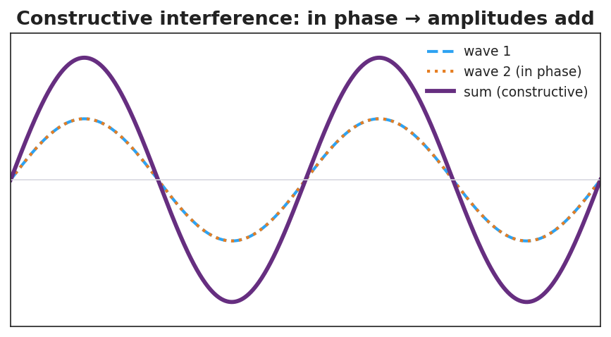
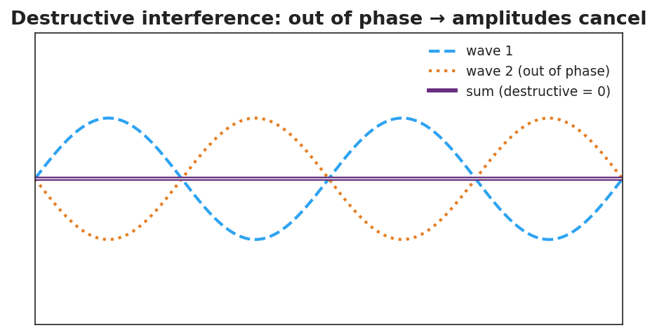

# Interference: Constructive and Destructive — Student Notes

**Unit: Waves — Lesson 05**
Name: _______________________  Date: __________  Period: ____

---

## Learning Targets

By the end of today's 42 minutes I can:

- State the principle of **superposition**.
- Distinguish **constructive interference** from **destructive interference**.
- Explain a real loud/quiet spot or noise-canceling situation.

---

## Key Vocabulary

- **superposition** — _______________________________________________
- **constructive interference** — _______________________________________________
- **destructive interference** — _______________________________________________

---

## Guided Notes

**Superposition.** When two waves overlap, the total displacement at each point is the __________ of the two waves at that point. You add them __________-by-__________.

**Constructive interference.**

- The waves are __________ phase (crest lines up with crest).
- The amplitudes __________.
- Result: a __________ wave (louder / brighter).

**Destructive interference.**

- The waves are __________ phase (crest lines up with trough).
- The amplitudes __________.
- Result: a __________ wave, or silence.

**Energy is not destroyed.** At a cancellation point the energy is __________ to the constructive (loud) regions — total energy is conserved.

---

## Worked Example

**Problem.** Two waves, each with amplitude 5 cm, overlap. Find the resulting amplitude (a) exactly in phase, (b) exactly out of phase.

**Solution.**
1. In phase: amplitudes add → 5 + 5 = __________ cm (constructive).
2. Out of phase: amplitudes cancel → 5 − 5 = __________ cm (destructive).
3. So the *same* two waves can make a big wave or __________, depending on phase.

---

## Summary

Finish the sentence (Because / But / So):

> Two speakers playing the same tone can make a spot silent
> because __________________________________________,
> but __________________________________________,
> so __________________________________________.
