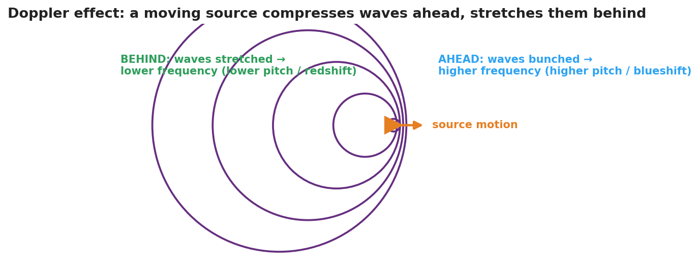

# The Doppler Effect — Student Notes

**Unit: Waves — Lesson 06**
Name: _______________________  Date: __________  Period: ____

---

## Learning Targets

By the end of today's 42 minutes I can:

- Explain the **Doppler effect** as an apparent shift caused by relative motion.
- Predict that an approaching source sounds higher and a receding source sounds lower.
- Connect light's **redshift** to evidence for an expanding universe.

---

## Key Vocabulary

- **Doppler effect** — _______________________________________________
- **frequency shift** — _______________________________________________
- **redshift** — _______________________________________________

---

## Guided Notes

**The big idea.** The source makes a __________ frequency. But if the source (or observer) is __________, the *observed* frequency changes.

**Approaching source.**

- Wavefronts ahead are __________ (bunched).
- Shorter wavelength → __________ frequency → higher pitch.
- For light: shifted toward blue (__________).

**Receding source.**

- Wavefronts behind are __________ (spread out).
- Longer wavelength → __________ frequency → lower pitch.
- For light: shifted toward red (__________).

**Important:** the wave **speed** does not change — only the observed __________ and __________ change.

**Connection to astronomy (HS-ESS1-2).** Distant galaxies show __________, so they are moving __________ from us — evidence the universe is __________.

---

## Worked Example

**Problem.** You stand on a corner. A fire truck with a constant 700 Hz siren drives toward you, then away.

**Solution.**
1. As it approaches, the wavelengths bunch up, so you hear a frequency __________ than 700 Hz.
2. As it recedes, the wavelengths stretch, so you hear a frequency __________ than 700 Hz.
3. The driver always hears __________ Hz, because there is no relative motion between the driver and the siren.

---

## Summary

Finish the sentence (Because / But / So):

> A passing siren drops in pitch
> because __________________________________________,
> but __________________________________________,
> so __________________________________________.
