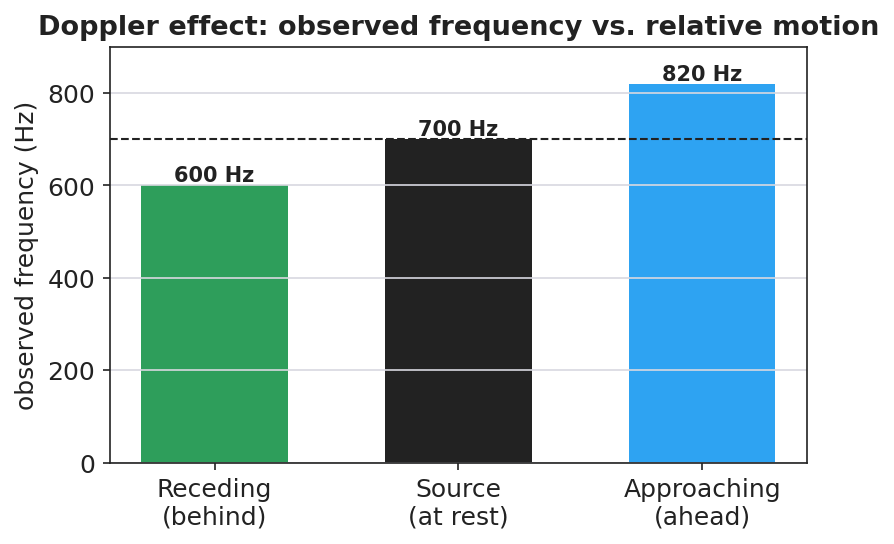

# The Doppler Effect — Teacher Guide

## Cover

**Unit: Waves — Lesson 06: The Doppler Effect**
East Meadow Schools × Valley Stream Central High School District
Strategy chips: HOCHMAN

---

## Curated Resources (from East Meadow Scope & Sequence)

### NYSSLS Standards

**HS-PS4-1.** "Use mathematical representations to support a claim regarding relationships among the frequency, wavelength, and speed of waves traveling in various media. *(Cause and Effect)*"

The Doppler effect is a Cause-and-Effect consequence of v = f·λ: relative motion between source and observer compresses or stretches the wavelength, so the *observed* frequency shifts. **Connection to HS-ESS1-2** ("Construct an explanation of the Big Bang theory based on astronomical evidence of light spectra…"): the same physics gives **redshift**, the evidence that distant galaxies are receding and the universe is expanding.

### Phenomenon

- An ambulance siren drops in pitch the instant it passes you; a race car "neeee-yowwm": <https://www.youtube.com/watch?v=imoxDcn2Sgo>
- Astronomers' redshift: light from receding galaxies is shifted toward longer (redder) wavelengths.

### Javalab / Labs

- Javalab *Doppler Effect* — drag a moving source and watch the wavefronts bunch ahead and stretch behind: <https://javalab.org/en/doppler_effect_en/>

### Assessments

- Javalab observer task: students place observers ahead of and behind a moving source and report which hears a higher frequency. Exit ticket below serves as the formative check.

---

## Lesson Overview

| | |
|---|---|
| **Duration** | 42 minutes (1 period) |
| **NYSSLS link** | HS-PS4-1 (core); connects to HS-ESS1-2 (redshift / expanding universe) |
| **CCC focus** | Cause and Effect — relative motion of source/observer *causes* a shift in the observed frequency and wavelength. |
| **Strategy chips** | HOCHMAN |
| **Materials** | A buzzer or phone playing a steady tone on a string to whirl safely (or video); devices for Javalab; whiteboards. |
| **Safety** | If whirling a buzzer, clear a wide circle and use a secure string. |
| **Prior knowledge** | Lessons 01–03 — frequency, wavelength, v = f·λ; wavefront idea. |

**Lesson objectives — students can:**

- Explain that the Doppler effect is an *apparent* frequency shift caused by relative motion of source and observer.
- Predict that an approaching source sounds higher-pitched and a receding source sounds lower-pitched.
- Connect the light version (blueshift/redshift) to evidence for an expanding universe.

---

## Phase 1 · Engage *(0 – 12 min)*

### 0–3 min · Opening Connection (SEL)

Quick check-in: *"Name a sound that tells you something is coming or going — a siren, footsteps, a train."* One sentence each. This primes the source-in-motion idea.

### 3–8 min · Phenomenon hook — the passing siren

**Teacher actions.** Play the ambulance clip. Ask students to listen for the exact moment the pitch changes. Whirl a buzzer on a string (or show the video) so they hear it live: higher as it swings toward them, lower as it swings away.

**Sample teacher language:**

> "The driver of that ambulance hears one steady pitch the whole time. But you, standing on the curb, hear it drop the instant it passes. The siren didn't change — so what did?"

**Anticipated student responses:**

- "It gets lower after it passes." — exactly; capture approaching-vs-receding.
- "The sound stretches out." — excellent; this is the wavelength idea.
- "It's moving toward you then away." — yes; relative motion.

### 8–12 min · Notice & Wonder + Turn-and-Talk #1

Capture columns. Then:

> "Turn to your partner: if the siren makes the same pitch the whole time, why do *you* hear it change?"

Target: because the source is moving, the waves reaching you are bunched (approaching) or stretched (receding).

### Bridge to Phase 2

Initial model sentence: "The pitch you hear changes because the moving source ______ the waves in front and ______ the waves behind."

---

## Phase 2 · Explore *(12 – 32 min)*

### 12–17 min · Initial Model (silent / individual)

Prompt:

> *"Draw a source sitting still, making circular wavefronts. Then draw the same source moving to the right. Show what happens to the spacing of the wavefronts ahead of it and behind it."*

### 17–32 min · Investigation — Javalab Doppler + wavefront sketching

Pairs at Javalab:

1. **Stationary source.** Watch the evenly spaced circular wavefronts. Note the wavelength everywhere is the same.
2. **Moving source.** Set the source moving. Compare the wavelength *ahead* of it vs. *behind* it.
3. **Place observers.** One observer ahead, one behind. Which hears more wavefronts per second (higher frequency)?
4. **Light version.** Read the sim's note (or teacher's) that light does the same: toward you = blueshift, away = redshift.

Use this figure to anchor the bunching/stretching pattern:

The bar chart below quantifies the same idea for a 700 Hz source: an observer ahead hears a higher frequency, an observer behind hears a lower one:

### Teacher facilitation during Explore

- **What to look for** — pairs stating that the *wavelength* changes ahead/behind, and connecting shorter wavelength to higher frequency (via v = f·λ).
- **What to resist** — don't name "Doppler effect," "frequency shift," or "redshift" yet; let "bunched/stretched" and "higher/lower" emerge.
- **What to redirect** — students who think the source's own pitch changes should re-watch the moving observer vs. the source's frame.

---

## Phase 3 · Explain *(32 – 37 min)*

### 32–35 min · Turn-and-Talk #2 + class consensus

> "Why does an approaching source sound higher and a receding source sound lower?"

Target consensus:

> "When the source moves toward you, each new wavefront is emitted a little closer, so the wavelength is shorter and the frequency you receive is higher. When it moves away, the wavelengths stretch and the frequency is lower."

### 35–37 min · Vocabulary introduction (≤ 3 terms) + the HOCHMAN sentence

**Sample teacher language:**

> "This apparent change in observed frequency due to relative motion is the **Doppler effect**. The change itself is a **frequency shift**. For light, a source moving away stretches the wavelength toward the red end — a **redshift** — which is exactly how astronomers know distant galaxies are racing away from us."

**HOCHMAN Because/But/So expansion** (model aloud, then students write):

> "A passing siren drops in pitch **because** the moving source compresses the wavelengths ahead and stretches them behind, **but** the source itself never changes its frequency, **so** only the *observed* frequency shifts as the source approaches and then recedes."

### Discussion prompts to deploy here

- "A star's light is redshifted. Is it moving toward us or away from us?"
  - *Sample student response:* "Away — the wavelengths are stretched (longer/redder), so it's receding."
- "Does the Doppler effect change the speed of the wave in the medium?"
  - *Sample student response:* "No — the speed is set by the medium; only the observed wavelength and frequency change."

---

## Phase 4 · Elaborate *(37 – 40 min)*

### 37–39 min · Revise the model

> *"Return to your moving-source drawing. Label the bunched side 'higher frequency (blueshift)' and the stretched side 'lower frequency (redshift).' Write your Because/But/So sentence."*

### 39–40 min · Return to the phenomenon

> "In one sentence, tell a friend why the ambulance sounds higher coming and lower going, using *Doppler effect* and *frequency shift*."

Target: "The Doppler effect: as the ambulance approaches, the waves bunch up so I hear a higher frequency; as it recedes, they stretch out so I hear a lower frequency — a frequency shift caused by its motion."

---

## Phase 5 · Evaluate *(40 – 42 min)*

### 40–42 min · Exit Ticket + Closing Reflection

> *"A race car drives past a spectator.
> (a) Does the engine sound *higher* or *lower* as it approaches? Explain using wavelength.
> (b) After it passes, what happens to the pitch and why?
> (c) Astronomers see the light from a distant galaxy redshifted. What does this tell us about the galaxy's motion, and what does that suggest about the universe?"*

Expected: (a) higher — wavelengths bunch/shorten on approach; (b) lower — wavelengths stretch as it recedes; (c) the galaxy is moving away from us, evidence that the universe is expanding (HS-ESS1-2). See `Answer_Key.docx`.

**Closing Reflection (SEL, 30 seconds):**

> "What's one place you'll now notice the Doppler effect in daily life?"

---

## Common Misconceptions

- **Misconception:** "The source changes its pitch as it moves." → **Correction:** The source's frequency is constant; only the *observed* frequency shifts because of relative motion.
- **Misconception:** "The Doppler effect changes the wave's speed." → **Correction:** Speed is fixed by the medium; the wavelength and observed frequency change, not v.
- **Misconception:** "Redshift means the object is literally red." → **Correction:** Redshift means the wavelengths are *shifted toward* the red (longer) end; the object is receding.

---

## Access & Differentiation

- **ELL/ENL supports:** Sentence frame: *"When a source moves ______ you, the waves bunch up and the frequency is ______; when it moves ______ you, the waves stretch and the frequency is ______."* Word-choice box: {toward, away, higher, lower, redshift, blueshift}. Pair *approach* (hand toward face) and *recede* (hand away) gestures.
- **IEP/SPED supports:** Provide the moving-source figure with the two sides blank; students label "higher/bunched" and "lower/stretched." Offer the whirling-buzzer demo as the auditory anchor.
- **Extensions:** Police radar guns use the Doppler shift of reflected radio waves to measure car speed. Sketch how a larger speed produces a larger frequency shift.

---

## Strategy Spotlight

**HOCHMAN.** The Doppler explanation is built as one complex sentence with **Because / But / So**, forcing students to hold the causal chain: *the moving source compresses/stretches wavelengths, but the source frequency is unchanged, so only the observed frequency shifts.* Model it, have students write their own, then read several aloud and tighten the language (e.g., distinguishing "observed frequency" from "the source's frequency"). The appositive "a frequency shift" can be folded in for advanced writers.

---

## NYSSLS Observation Checklist Crosswalk

| # | Checklist item | Where it appears in this lesson |
|---|---|---|
| 1 | Local/relatable phenomenon | Phase 1 — passing siren; race car in Phase 5; redshift connection |
| 2 | Turn and Talk (2–3×) | Phase 1 (TT#1 — why you hear a change), Phase 3 (TT#2 — approach vs. recede) |
| 3 | Students develop questions/models/procedures | Phase 1 (initial model), Phase 2 (Javalab + wavefront sketch), Phase 4 (revise) |
| 4 | CCC defined and used | Lesson Overview · *Cause and Effect*, restated in Phase 2 |
| 5 | ENL — ≤ 3 vocab, second half | Phase 3 — vocabulary at 35–37 min (Doppler effect / frequency shift / redshift) |
| 6 | Revisit phenomenon with evidence | Phase 4 — labeled moving-source model + Because/But/So |
| 7 | ENL/SPED supports | Access & Differentiation block |
| 8 | Assessment check | Phase 5 — Exit Ticket (race car; galaxy redshift) |

---

## Companion Materials

- `Student_Worksheet.docx` — the 5E student investigation (hand out at start of Phase 2)
- `Student_Notes.docx` — guided note-guide for vocabulary and the worked example
- `Answer_Key.docx` — answers to "Make It Make Sense" prompts and the Exit Ticket

---

## Key Vocabulary (max 3)

- **Doppler effect** — the apparent change in a wave's observed frequency caused by relative motion between the source and the observer
- **frequency shift** — the difference between the frequency emitted by the source and the frequency received by the observer
- **redshift** — a shift of light toward longer (redder) wavelengths, observed when a source moves away; evidence that distant galaxies are receding (an expanding universe)
