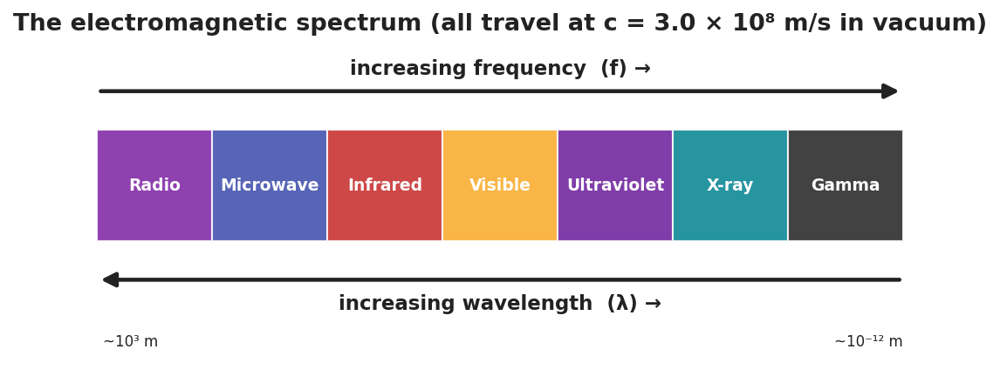

# The Electromagnetic Spectrum — Student Worksheet

**Unit: Waves — Lesson 07**
Name: _______________________  Date: __________  Period: ____

---

## Phenomenon

Look around the room. The speaker plays music (radio waves), the microwave heats lunch (microwaves), the remote changes the channel (infrared), your eyes read the board (visible light), sunscreen blocks sunburn (ultraviolet), and a nurse can take an X-ray. Every one of these is the *same kind* of wave, all traveling at the same speed.

**Driving question:** If all these waves travel at the same speed, what makes a radio wave different from an X-ray?

---

## Notice & Wonder

| I notice… | I wonder… |
|---|---|
|  |  |
|  |  |
|  |  |

**Turn & Talk #1:** If all these waves travel at the same speed, what must be different between a radio wave and a gamma ray?

> _______________________________________________

---

## Initial Model

Make your best guess at the order of the spectrum from **longest wavelength to shortest**. Where does visible light fall? Where would the highest-energy waves go?

> _______________________________________________

---

## Investigation

Work in a group with the seven band cards. Order, flip to check, then reason with v = c.

| Step | Result |
|---|---|
| 1. Our first guess (left → right) |  |
| 2. Re-order by decreasing wavelength |  |
| 3. Highest-frequency band? Shortest wavelength? |  |
| 4. Javalab — is the EM wave transverse? Same speed for all? |  |

Check your order against this chart:

**Key question:** Since v = c is the same for every band, what must be true about frequency and wavelength as you move from radio toward gamma?

> _______________________________________________

---

## Make It Make Sense

1. Which has the longer wavelength: a radio wave or an X-ray? Use v = f·λ to justify your answer.
2. Do microwaves travel faster than visible light in a vacuum? Explain.
3. An FM radio station broadcasts at 100 MHz (1.0 × 10⁸ Hz). Use λ = c/f to find its wavelength. (c = 3.0 × 10⁸ m/s)

---

## Vocabulary in Action

Use each term in a sentence about today's phenomenon.

- **electromagnetic wave:** _______________________________________________
- **spectrum:** _______________________________________________
- **speed of light:** _______________________________________________

---

## Revise Your Model

Return to your guessed order. Correct it using the chart. Add an arrow for "increasing frequency" and one for "increasing wavelength," pointing opposite ways.

> _______________________________________________
> _______________________________________________

---

## Exit Ticket

Use the EM spectrum.

(a) List these in order of increasing frequency: visible light, radio, X-ray, infrared.

(b) A microwave and a gamma ray both travel through a vacuum. Which is faster? Explain.

(c) Ultraviolet light has a higher frequency than visible light. Compare their wavelengths.
