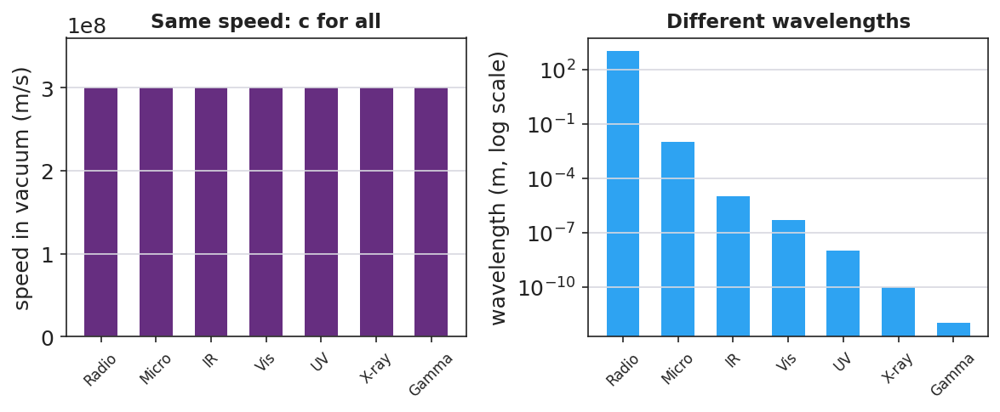

# The Electromagnetic Spectrum — Teacher Guide

## Cover

**Unit: Waves — Lesson 07: The Electromagnetic Spectrum**
East Meadow Schools × Valley Stream Central High School District
Strategy chips: ACTIVE LEARNING

---

## Curated Resources (from East Meadow Scope & Sequence)

### NYSSLS Standards

**HS-PS4-1.** "Use mathematical representations to support a claim regarding relationships among the frequency, wavelength, and speed of waves traveling in various media. *(Cause and Effect)*"

The EM spectrum is the ultimate test of v = f·λ: every band — radio to gamma — travels at the *same* speed c in vacuum, so the bands differ only by frequency and wavelength (which trade off inversely). Naming the order radio → micro → IR → visible → UV → X → gamma is a Cause-and-Effect application of v = f·λ at fixed v = c.

### Phenomenon

- A single classroom "uses" the whole spectrum: the radio plays music (radio waves), the microwave heats lunch (microwaves), the remote works (infrared), you see the board (visible), sunscreen blocks sunburn (ultraviolet), the nurse takes an X-ray, and radiation therapy uses gamma rays: <https://www.youtube.com/watch?v=cfXzwh3KadE>

### Javalab / Labs

- Javalab *Electromagnetic Wave* — a 3D transverse EM wave (electric and magnetic fields perpendicular): <https://javalab.org/en/electromagnetic_wave_en/>

### Assessments

- Card-sort + Javalab check: students order the seven bands by increasing frequency and confirm all share c. Exit ticket below serves as the formative check.

---

## Lesson Overview

| | |
|---|---|
| **Duration** | 42 minutes (1 period) |
| **NYSSLS link** | HS-PS4-1 (all EM waves obey v = f·λ at v = c) |
| **CCC focus** | Cause and Effect — because v = c is fixed for all EM waves, a higher frequency *causes* a proportionally shorter wavelength. |
| **Strategy chips** | ACTIVE LEARNING |
| **Materials** | Seven band cards per group (radio, micro, IR, visible, UV, X-ray, gamma) with one example each; devices for Javalab; whiteboards. |
| **Safety** | None. |
| **Prior knowledge** | Lessons 01–03 — frequency, wavelength, v = f·λ; Lesson 02 — transverse waves. |

**Lesson objectives — students can:**

- State that EM waves are transverse and travel at c = 3.0 × 10⁸ m/s in a vacuum.
- Order the spectrum from radio to gamma by increasing frequency / decreasing wavelength.
- Explain that all EM waves share the same speed, so frequency and wavelength trade off.

---

## Phase 1 · Engage *(0 – 12 min)*

### 0–3 min · Opening Connection (SEL)

Quick check-in: *"Name a device you used this morning that sent or received an invisible signal."* One sentence each. This primes the "invisible waves everywhere" idea.

### 3–8 min · Phenomenon hook — one room, the whole spectrum

**Teacher actions.** Point around the room: the speaker (radio), the microwave (microwaves), the TV remote (IR), your eyes (visible), the sunscreen poster (UV), the X-ray on the screen, the cancer-treatment clip (gamma). Same family of waves, wildly different uses.

**Sample teacher language:**

> "Every one of these — the radio, the remote, your own eyes, an X-ray — is the *same kind* of wave. They all travel at the same speed. So what makes a radio wave different from an X-ray?"

**Anticipated student responses:**

- "They have different energies." — affirm; energy tracks frequency.
- "Different wavelengths." — yes; this is the key sorting variable.
- "Some you can see, some you can't." — true; visible is a tiny slice.

### 8–12 min · Notice & Wonder + Turn-and-Talk #1

Capture columns. Then:

> "Turn to your partner: if all these waves travel at the same speed, what must be different between a radio wave and a gamma ray?"

Target: frequency and wavelength differ (inversely), since speed is the same.

### Bridge to Phase 2

Initial model sentence: "Radio waves and X-rays are the same kind of wave but differ in ______ and ______."

---

## Phase 2 · Explore *(12 – 32 min)*

### 12–17 min · Initial Model (silent / individual)

Prompt:

> *"Make your best guess at the order of the spectrum from longest wavelength to shortest. Where does visible light fall? Where would the highest-energy waves go?"*

### 17–32 min · Investigation — ACTIVE LEARNING: build the spectrum

Groups of 3–4 get seven shuffled band cards (each with an example and, on the back, a wavelength).

1. **Order by use/intuition first.** Lay the cards left-to-right however your group thinks they go.
2. **Check with wavelengths.** Flip the cards. Re-order by decreasing wavelength. Does visible light land between IR and UV?
3. **Apply v = f·λ.** Since v = c for all, rank by *frequency*. Which band has the highest frequency? The shortest wavelength?
4. **Javalab.** View the 3D EM wave; confirm it's transverse and note that all bands share c.

Use this figure as the answer key the groups check against:

This paired bar chart makes the key claim explicit — every band shares the *same* speed c, even though their wavelengths span 15 orders of magnitude:

### Teacher facilitation during Explore

- **What to look for** — groups using v = c (fixed) to argue that higher frequency *must* mean shorter wavelength.
- **What to resist** — don't give the order; let the card-flip and v = f·λ reasoning produce it.
- **What to redirect** — groups who think "different waves go different speeds" should revisit the v = c claim at Javalab.

---

## Phase 3 · Explain *(32 – 37 min)*

### 32–35 min · Turn-and-Talk #2 + class consensus

> "What stays the same across the whole spectrum, and what changes from band to band?"

Target consensus:

> "All EM waves are transverse and travel at the same speed, c, in a vacuum. What changes is the frequency and wavelength — and they trade off inversely (radio = low f / long λ; gamma = high f / short λ)."

### 35–37 min · Vocabulary introduction (≤ 3 terms)

**Sample teacher language:**

> "These are all **electromagnetic waves** — waves of electric and magnetic fields that need no medium. The full ordered family is the **spectrum**. And the speed they all share in a vacuum is the **speed of light**, c = 3.0 × 10⁸ m/s."

### Discussion prompts to deploy here

- "Which has the longer wavelength: a radio wave or an X-ray?"
  - *Sample student response:* "Radio — it has the lowest frequency, so by v = f·λ the longest wavelength."
- "Do microwaves travel faster than visible light in a vacuum?"
  - *Sample student response:* "No — all EM waves travel at c in a vacuum."

---

## Phase 4 · Elaborate *(37 – 40 min)*

### 37–39 min · Revise the model

> *"Return to your guessed order. Correct it using the spectrum chart. Add an arrow for 'increasing frequency' and one for 'increasing wavelength,' pointing opposite ways."*

### 39–40 min · Return to the phenomenon

> "In one sentence, explain to a peer why a radio wave and an X-ray are the 'same kind' of wave, using *electromagnetic wave* and *speed of light*."

Target: "Both are electromagnetic waves that travel at the speed of light; they only differ in frequency and wavelength, with X-rays having far higher frequency and shorter wavelength than radio waves."

---

## Phase 5 · Evaluate *(40 – 42 min)*

### 40–42 min · Exit Ticket + Closing Reflection

> *"Use the EM spectrum.
> (a) List these in order of increasing frequency: visible light, radio, X-ray, infrared.
> (b) A microwave and a gamma ray both travel through a vacuum. Which is faster? Explain.
> (c) Ultraviolet light has a higher frequency than visible light. Compare their wavelengths."*

Expected: (a) radio < infrared < visible < X-ray; (b) neither — both travel at c in vacuum; (c) UV has a shorter wavelength than visible (higher f → shorter λ). See `Answer_Key.docx`.

**Closing Reflection (SEL, 30 seconds):**

> "Which part of the spectrum will you 'see' differently now — and who in your group sorted it best?"

---

## Common Misconceptions

- **Misconception:** "Higher-frequency EM waves travel faster." → **Correction:** All EM waves travel at c in a vacuum; higher frequency means shorter wavelength, not higher speed.
- **Misconception:** "EM waves need a medium like sound does." → **Correction:** EM waves are not mechanical; they travel through a vacuum (that's why sunlight reaches Earth).
- **Misconception:** "Visible light is a big part of the spectrum." → **Correction:** Visible light is a tiny band between infrared and ultraviolet.

---

## Access & Differentiation

- **ELL/ENL supports:** Sentence frame: *"All EM waves travel at ______, so a higher frequency means a ______ wavelength."* Word-choice box: {c / speed of light, shorter, longer, transverse}. Provide a bilingual band-name glossary (radio, micro, IR, visible, UV, X-ray, gamma).
- **IEP/SPED supports:** Provide the seven band cards pre-printed with both the name and a familiar example image; students sequence rather than recall. Color-code the cards to match the spectrum figure.
- **Extensions:** Use c = f·λ to compute the wavelength of a 100 MHz FM radio station (λ = c/f = 3.0×10⁸ / 1.0×10⁸ = 3 m) and compare to an X-ray (~10⁻¹⁰ m).

---

## Strategy Spotlight

**ACTIVE LEARNING.** Groups physically build the spectrum from shuffled cards, first by intuition and then by flipping to reveal wavelengths and reasoning with v = c. The manipulation — argue, flip, re-order, justify — makes the inverse f/λ relationship concrete before it is named. Facilitate with one prompt: *"All the same speed — so what has to be true about frequency and wavelength as you move down the line?"*

---

## NYSSLS Observation Checklist Crosswalk

| # | Checklist item | Where it appears in this lesson |
|---|---|---|
| 1 | Local/relatable phenomenon | Phase 1 — one room uses the whole spectrum |
| 2 | Turn and Talk (2–3×) | Phase 1 (TT#1 — what differs at same speed), Phase 3 (TT#2 — same vs. changing) |
| 3 | Students develop questions/models/procedures | Phase 1 (guessed order), Phase 2 (card sort + Javalab), Phase 4 (revise) |
| 4 | CCC defined and used | Lesson Overview · *Cause and Effect*, restated in Phase 2 |
| 5 | ENL — ≤ 3 vocab, second half | Phase 3 — vocabulary at 35–37 min (electromagnetic wave / spectrum / speed of light) |
| 6 | Revisit phenomenon with evidence | Phase 4 — radio-vs-X-ray explanation |
| 7 | ENL/SPED supports | Access & Differentiation block |
| 8 | Assessment check | Phase 5 — Exit Ticket (order by frequency; same speed) |

---

## Companion Materials

- `Student_Worksheet.docx` — the 5E student investigation (hand out at start of Phase 2)
- `Student_Notes.docx` — guided note-guide for vocabulary and the worked example
- `Answer_Key.docx` — answers to "Make It Make Sense" prompts and the Exit Ticket

---

## Key Vocabulary (max 3)

- **electromagnetic wave** — a transverse wave of oscillating electric and magnetic fields that requires no medium and travels at the speed of light in a vacuum
- **spectrum** — the full ordered range of electromagnetic waves, from radio (low frequency) through gamma rays (high frequency)
- **speed of light** — the speed of all electromagnetic waves in a vacuum, c = 3.0 × 10⁸ m/s
