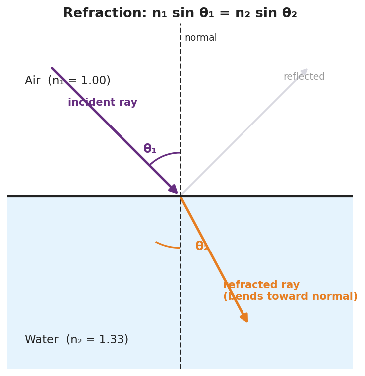

# Refraction and Snell's Law — Student Notes

**Unit: Waves — Lesson 08**
Name: _______________________  Date: __________  Period: ____

---

## Learning Targets

By the end of today's 42 minutes I can:

- Explain that light bends (**refraction**) when its speed changes between media.
- Use the **index of refraction** and **Snell's law** to find an unknown angle or index.
- Describe total internal reflection.

---

## Key Vocabulary

- **refraction** — _______________________________________________
- **index of refraction** — _______________________________________________
- **Snell's law** — _______________________________________________

---

## Guided Notes

**Why light bends.** When light crosses into a new medium, its __________ changes. Its frequency stays the __________, so its wavelength changes — and the ray pivots, bending at the boundary.

- Into a **slower** (higher-n) medium → bends __________ the normal.
- Into a **faster** (lower-n) medium → bends __________ from the normal.

**Index of refraction:** n = c / v.

- Vacuum: n = __________
- Water: n ≈ __________
- Glass: n ≈ __________

**Snell's law (reference table):**

> n₁ sin θ₁ = n₂ sin θ₂

Angles are always measured from the __________ (not the surface).

**Total internal reflection.** Going from a slower to a __________ medium, past a critical angle the light cannot escape and __________ entirely. (This is how fiber-optic cables carry data.)

---

## Worked Example

**Problem.** Light goes from air (n₁ = 1.00) into glass (n₂ = 1.50) at θ₁ = 30°. Find θ₂.

**Solution.**
1. Snell's law: n₁ sin θ₁ = n₂ sin θ₂.
2. sin θ₂ = (n₁ sin θ₁) / n₂ = (1.00 × sin 30°) / 1.50 = (1.00 × 0.500) / 1.50 = __________.
3. θ₂ = sin⁻¹(0.333) ≈ __________°.
4. Check: θ₂ < θ₁, so the ray bent __________ the normal (entered a slower medium). ✓

---

## Summary

Finish the sentence (Because / But / So):

> A pencil looks broken in a glass of water
> because __________________________________________,
> but __________________________________________,
> so __________________________________________.
