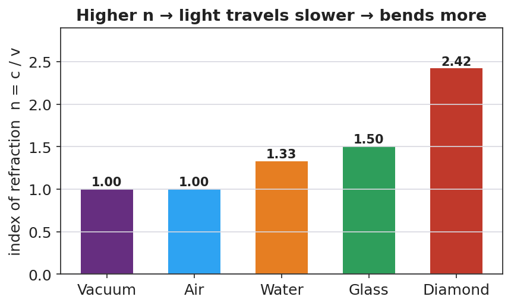

# Refraction and Snell's Law — Teacher Guide

## Cover

**Unit: Waves — Lesson 08: Refraction and Snell's Law**
East Meadow Schools × Valley Stream Central High School District
Strategy chips: HOCHMAN

---

## Curated Resources (from East Meadow Scope & Sequence)

### NYSSLS Standards

**HS-PS4-6 (NYS).** "Use mathematical models to determine relationships among the size and location of images, size and location of objects, and focal lengths of lenses and mirrors."

Refraction is the bending of light that makes lenses and mirrors form images at all, so this lesson is the conceptual and mathematical entry to HS-PS4-6 (developed fully in Lesson 09). Students apply the mathematical model **Snell's law, n₁ sin θ₁ = n₂ sin θ₂**, to relate the index of refraction and the bending angle — a direct Cause-and-Effect link between a change in speed and a change in direction.

### Phenomenon

- A laser beam bends as it crosses from air into water; a pencil looks "broken" at the surface of a glass; a Pyrex stirrer "disappears" when placed in cooking oil of matching index: <https://www.youtube.com/watch?v=y55tzg_jW9I>

### Javalab / Labs

- PhET *Bending Light* — fire a ray at a boundary, vary the angle and the media, and read both angles: <https://phet.colorado.edu/en/simulations/bending-light>

### Assessments

- PhET Snell's-law lab: students collect (θ₁, θ₂) pairs for air→water and confirm n₁ sin θ₁ = n₂ sin θ₂. Numeric exit ticket below serves as the formative check.

---

## Lesson Overview

| | |
|---|---|
| **Duration** | 42 minutes (1 period) |
| **NYSSLS link** | HS-PS4-6 (NYS) — mathematical model for light at a boundary |
| **CCC focus** | Cause and Effect — a *change in light's speed* when it enters a new medium *causes* it to bend (refract). |
| **Strategy chips** | HOCHMAN |
| **Materials** | Laser pointer + clear tank of water (or video); a pencil in a glass of water; protractors; calculators with sin/sin⁻¹; PhET on devices. |
| **Safety** | Never aim a laser at eyes; keep beams below eye level and pointed into the tank. |
| **Prior knowledge** | Lessons 01–03 — v = f·λ; Lesson 07 — light is an EM wave that travels at c in vacuum (slower in matter). |

**Lesson objectives — students can:**

- Explain that light bends when it changes media because its speed changes.
- Use the index of refraction n and **Snell's law (n₁ sin θ₁ = n₂ sin θ₂)** to solve for an unknown angle or index.
- Describe total internal reflection and when it occurs.

---

## Phase 1 · Engage *(0 – 12 min)*

### 0–3 min · Opening Connection (SEL)

Quick check-in: *"Name a time something looked different from how it really was."* One sentence each. This primes the "your eyes are fooled by bending light" idea.

### 3–8 min · Phenomenon hook — the broken pencil and the bending laser

**Teacher actions.** Put a pencil in a glass of water — it looks broken at the surface. Fire a laser into a tank of water (or play the clip) so students see the beam kink at the boundary.

**Sample teacher language:**

> "The pencil isn't broken and the laser isn't crooked. Yet the beam clearly bends the instant it hits the water. What changes for the light right at that surface?"

**Anticipated student responses:**

- "The water bends it." — affirm; we'll explain *why*.
- "Light slows down in water." — excellent; this is the cause.
- "It's like a lens." — good; foreshadows Lesson 09.

### 8–12 min · Notice & Wonder + Turn-and-Talk #1

Capture columns. Then:

> "Turn to your partner: the laser only bends *at the boundary*, not inside the water. What does that tell you about what causes the bend?"

Target: something changes exactly at the boundary — the light's speed — and that causes the direction change.

### Bridge to Phase 2

Initial model sentence: "Light bends at the boundary because its ______ changes when it enters a new ______."

---

## Phase 2 · Explore *(12 – 32 min)*

### 12–17 min · Initial Model (silent / individual)

Prompt:

> *"Draw a ray hitting the water at an angle. Draw the normal (perpendicular to the surface). Predict: does the ray bend toward the normal or away from it when it slows down?"*

### 17–32 min · Investigation — PhET *Bending Light* (Snell's law lab)

Pairs at PhET:

1. **See the bend.** Fire air→water at 45°. Note that the refracted ray bends *toward* the normal (water is slower).
2. **Collect data.** Record (θ₁, θ₂) for several incident angles. Compute sin θ₁ and sin θ₂.
3. **Find the pattern.** Compute the ratio sin θ₁ / sin θ₂. Compare to n₂/n₁ (≈ 1.33 for air→water).
4. **Total internal reflection.** Now go water→air and increase the angle. Find the angle past which the ray *cannot* leave — it reflects entirely.

Use this ray diagram to fix the geometry and the equation:

This chart of indices explains *how much* light bends in each material — the higher the index, the slower the light and the stronger the bend:

### Teacher facilitation during Explore

- **What to look for** — pairs discovering that sin θ₁ / sin θ₂ is constant (= n₂/n₁) — the data form of Snell's law.
- **What to resist** — don't write Snell's law first; let the constant ratio emerge from their (θ₁, θ₂) data.
- **What to redirect** — students who measure angles from the *surface* instead of the *normal* should re-read where the protractor's zero goes.

---

## Phase 3 · Explain *(32 – 37 min)*

### 32–35 min · Turn-and-Talk #2 + class consensus

> "Why does light bend toward the normal entering water, and what stays constant in your data?"

Target consensus:

> "Light slows in water, so it bends toward the normal. The ratio sin θ₁ / sin θ₂ stays constant — it equals the ratio of the indices, which is the math behind the bending."

### 35–37 min · Vocabulary introduction (≤ 3 terms) + the HOCHMAN sentence

**Sample teacher language:**

> "The bending of light when it changes media is **refraction**. How much a material slows light is its **index of refraction**, n = c/v (n = 1 in vacuum, 1.33 in water, ~1.5 in glass). The rule relating angles and indices is **Snell's law**: n₁ sin θ₁ = n₂ sin θ₂."

**HOCHMAN Because/But/So expansion** (model aloud, then students write):

> "Light bends toward the normal when it enters water **because** the water slows it down, **but** its frequency stays the same, **so** its wavelength shortens and the wavefronts pivot, changing the ray's direction."

### Discussion prompts to deploy here

- "Light goes from air (n = 1.00) into glass (n = 1.50) at θ₁ = 30°. Find θ₂."
  - *Sample student response:* "sin θ₂ = (1.00·sin30°)/1.50 = 0.333 → θ₂ ≈ 19.5°."
- "When does total internal reflection happen?"
  - *Sample student response:* "Going from a slower (higher-n) medium to a faster one, past the critical angle — the light can't escape, so it all reflects."

---

## Phase 4 · Elaborate *(37 – 40 min)*

### 37–39 min · Revise the model

> *"Return to your prediction. Label the incident angle θ₁, the refracted angle θ₂, and the normal. Write your Because/But/So sentence and confirm: into a slower medium, the ray bends toward the normal."*

### 39–40 min · Return to the phenomenon

> "Explain in one sentence why the pencil looks broken, using *refraction* and *index of refraction*."

Target: "Light from the underwater part of the pencil refracts (bends) as it leaves the higher-index water into the lower-index air, so your eye traces it back to the wrong spot and the pencil looks broken."

---

## Phase 5 · Evaluate *(40 – 42 min)*

### 40–42 min · Exit Ticket + Closing Reflection

> *"Light travels from air (n = 1.00) into water (n = 1.33).
> (a) The incident angle is 40°. Use Snell's law to find the angle of refraction. Show your work.
> (b) Does the ray bend toward or away from the normal? Why?
> (c) The Pyrex stirrer 'disappears' in oil of the same index. Explain why, in one sentence."*

Expected: (a) sin θ₂ = (1.00·sin40°)/1.33 = 0.483 → θ₂ ≈ 28.9°; (b) toward the normal (entering a slower, higher-n medium); (c) equal indices mean no speed change, so no refraction or reflection at the boundary — the light passes straight through, making the glass invisible. See `Answer_Key.docx`.

**Closing Reflection (SEL, 30 seconds):**

> "What's one illusion in your daily life you can now explain with refraction?"

---

## Common Misconceptions

- **Misconception:** "Light bends because the water 'pushes' it." → **Correction:** Light bends because its *speed* changes at the boundary; the frequency stays the same and the wavelength changes.
- **Misconception:** "Angles are measured from the surface." → **Correction:** Incident and refracted angles are measured from the *normal* (perpendicular to the surface).
- **Misconception:** "Light always bends the same way." → **Correction:** Entering a slower medium it bends toward the normal; entering a faster medium it bends away (and can totally internally reflect).

---

## Access & Differentiation

- **ELL/ENL supports:** Sentence frame: *"When light enters a ______ medium, it slows down and bends ______ the normal."* Word-choice box: {slower, faster, toward, away, normal}. Provide a worked Snell's-law example with each calculator key labeled (sin, ×, ÷, sin⁻¹).
- **IEP/SPED supports:** Provide the ray diagram pre-drawn with the normal; students measure θ₁ and θ₂ with a protractor rather than constructing rays. Give a Snell's-law "plug-in" template with the unknown isolated.
- **Extensions:** Fiber optics — explain how total internal reflection keeps a light pulse trapped inside a glass fiber, enabling internet data transmission (links to Lesson 10).

---

## Strategy Spotlight

**HOCHMAN.** The causal mechanism is captured in one **Because / But / So** sentence: *light slows in water (because), its frequency is unchanged (but), so its wavelength shortens and the ray pivots toward the normal (so).* This sentence does the heavy lifting of separating cause (speed change) from the constant (frequency) and the result (direction change). Model it, have students write, then refine — many will first say "the water bends it"; push them to name the speed change as the cause.

---

## NYSSLS Observation Checklist Crosswalk

| # | Checklist item | Where it appears in this lesson |
|---|---|---|
| 1 | Local/relatable phenomenon | Phase 1 — broken pencil, bending laser; disappearing Pyrex in Phase 5 |
| 2 | Turn and Talk (2–3×) | Phase 1 (TT#1 — bend only at boundary), Phase 3 (TT#2 — why toward normal) |
| 3 | Students develop questions/models/procedures | Phase 1 (prediction), Phase 2 (PhET Snell's-law data), Phase 4 (revise) |
| 4 | CCC defined and used | Lesson Overview · *Cause and Effect*, restated in Phase 2 |
| 5 | ENL — ≤ 3 vocab, second half | Phase 3 — vocabulary at 35–37 min (refraction / index of refraction / Snell's law) |
| 6 | Revisit phenomenon with evidence | Phase 4 — broken-pencil explanation |
| 7 | ENL/SPED supports | Access & Differentiation block |
| 8 | Assessment check | Phase 5 — numeric Exit Ticket (air→water; Pyrex) |

---

## Companion Materials

- `Student_Worksheet.docx` — the 5E student investigation (hand out at start of Phase 2)
- `Student_Notes.docx` — guided note-guide for vocabulary and the worked example
- `Answer_Key.docx` — answers to "Make It Make Sense" prompts and the Exit Ticket

---

## Key Vocabulary (max 3)

- **refraction** — the bending of light (or any wave) as it passes from one medium into another because its speed changes
- **index of refraction** — a number n = c/v that tells how much a medium slows light (n = 1 in vacuum, 1.33 in water, ≈ 1.5 in glass)
- **Snell's law** — the mathematical model relating the angles and indices at a boundary: n₁ sin θ₁ = n₂ sin θ₂
