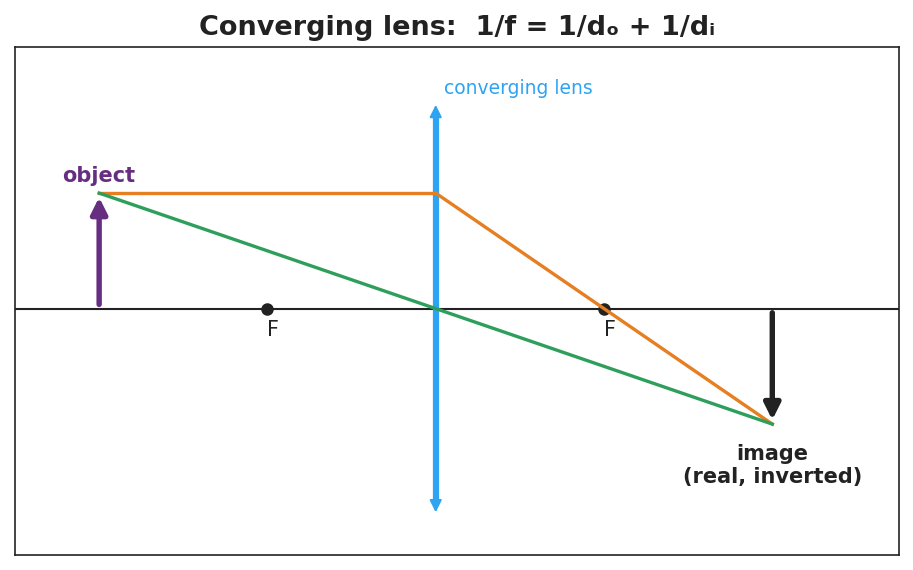
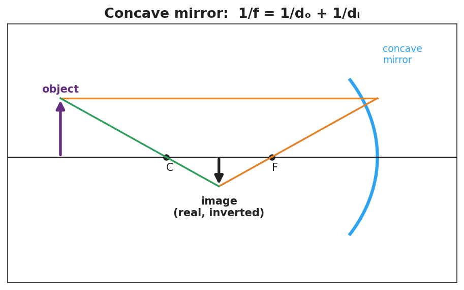

# Optics: Lenses and Mirrors — Student Notes

**Unit: Waves — Lesson 09**
Name: _______________________  Date: __________  Period: ____

---

## Learning Targets

By the end of today's 42 minutes I can:

- Identify a **converging lens** / concave mirror and its focal point.
- Draw principal rays to locate an **image** and label it real or virtual.
- Use 1/f = 1/dₒ + 1/dᵢ to solve for f, dₒ, or dᵢ.

---

## Key Vocabulary

- **focal length** — _______________________________________________
- **converging lens** — _______________________________________________
- **image** — _______________________________________________

---

## Guided Notes

**Focal point and focal length.** Parallel rays hitting a converging lens (or concave mirror) meet at the __________ point. The distance to it is the __________ length, f.

**Three principal rays (converging lens):**

1. A ray parallel to the axis refracts through the far __________.
2. A ray through the __________ of the lens goes straight.
3. Where the rays cross is the __________.

**Real vs. virtual images.**

- Object **beyond** the focal length → image is __________ and inverted; can be __________ on a screen.
- Object **inside** the focal length → image is __________ and upright; can only be __________ through the lens (magnifier).

**The thin-lens / mirror equation (reference table):**

> 1/f = 1/dₒ + 1/dᵢ

---

## Worked Example

**Problem.** A converging lens has f = 10 cm. An object sits dₒ = 30 cm away. Find the image distance.

**Solution.**
1. 1/dᵢ = 1/f − 1/dₒ = 1/10 − 1/30.
2. Common denominator: 3/30 − 1/30 = __________ /30 = 1/15.
3. dᵢ = __________ cm.
4. Since dₒ > f, the image is __________ and inverted. ✓

---

## Summary

Finish the sentence (Because / But / So):

> A magnifying glass can make an image either upright or upside-down
> because __________________________________________,
> but __________________________________________,
> so __________________________________________.
