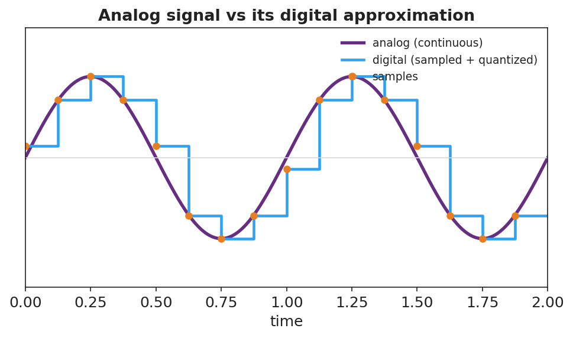
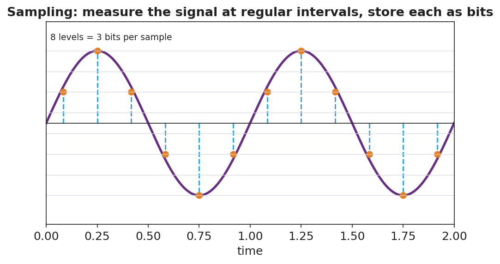

# Digital Technologies and Information — Teacher Guide

## Cover

**Unit: Waves — Lesson 10: Digital Technologies and Information**
East Meadow Schools × Valley Stream Central High School District
Strategy chips: BTC

---

## Curated Resources (from East Meadow Scope & Sequence)

### NYSSLS Standards

**HS-PS4-2.** "Evaluate questions about the advantages of using a digital transmission and storage of information. *(Stability and Change)*"

This closing lesson asks students to *evaluate* why modern technology encodes information digitally. Waves (the whole unit) are how signals travel; here students compare an **analog** wave to its **digital** (sampled, bit-encoded) version and weigh the advantages — robustness to noise, exact copying, and easy storage. The Crosscutting Concept is **Stability and Change**: digital encoding keeps information *stable* as it is transmitted and copied.

### Phenomenon

- A scratchy vinyl record (analog) vs. a crisp streamed song (digital); a blurry, pixelated photo "cleaning up" as more data loads; a tenth-generation photocopy vs. a re-printed PDF: <https://www.youtube.com/watch?v=Hh-qWaMG6Sw>

### Javalab / Labs

- Javalab *Analog vs Digital Signal* — toggle between a smooth wave and its sampled, quantized version and add "noise": <https://javalab.org/en/analog_digital_signal_en/>

### Assessments

- Telephone-game data activity + Javalab noise test: students pass an analog vs. a digital "message" down a line and measure which survives copying. Exit ticket below serves as the formative check.

---

## Lesson Overview

| | |
|---|---|
| **Duration** | 42 minutes (1 period) |
| **NYSSLS link** | HS-PS4-2 (advantages of digital transmission/storage) |
| **CCC focus** | Stability and Change — digital encoding keeps information *stable* against noise and repeated copying. |
| **Strategy chips** | BTC (Building Thinking Classrooms) |
| **Materials** | Vertical non-permanent surfaces + markers; graph paper; an old photocopy + a fresh PDF print (demo); devices for Javalab. |
| **Safety** | None. |
| **Prior knowledge** | Lessons 01–07 — waves carry information as signals; amplitude/frequency encode a message. |

**Lesson objectives — students can:**

- Distinguish an analog signal (continuous) from a digital signal (discrete samples encoded as bits).
- Explain how sampling and bits represent a wave, and that more bits / faster sampling means higher fidelity.
- Evaluate, with reasoning, why digital transmission and storage are more robust to noise and easier to copy than analog.

---

## Phase 1 · Engage *(0 – 12 min)*

### 0–3 min · Opening Connection (SEL)

Quick check-in: *"Name a message that got 'garbled' on the way to you — a bad photocopy, a frozen video call, a misheard rumor."* One sentence each. This primes the noise/fidelity idea.

### 3–8 min · Phenomenon hook — vinyl crackle vs. clean stream

**Teacher actions.** Play a few seconds of a scratchy vinyl/old tape recording, then the same song streamed. Show a tenth-generation photocopy next to a freshly printed PDF. Old analog copies degrade; digital copies don't.

**Sample teacher language:**

> "Copy a copy of a copy on this photocopier and it turns to mush. But I can copy this PDF a million times and the millionth is identical to the first. Why does one survive copying and the other doesn't?"

**Anticipated student responses:**

- "The digital one is just numbers." — excellent; capture this.
- "The analog one picks up noise." — yes; noise accumulates.
- "Computers can fix errors." — good; digital is correctable.

### 8–12 min · Notice & Wonder + Turn-and-Talk #1

Capture columns. Then:

> "Turn to your partner: what is it about storing something as *numbers* (digital) that lets it survive copying perfectly?"

Target: a digital signal only has to decide between a few exact values, so small noise can be cleaned back to the nearest value.

### Bridge to Phase 2

Initial model sentence: "A digital copy survives because the signal is stored as ______ instead of a continuous ______."

---

## Phase 2 · Explore *(12 – 32 min)*

### 12–17 min · Initial Model (silent / individual)

Prompt:

> *"Draw a smooth wave (analog). Now show how you would store it using only a few measured points (samples). What information do you lose? What do you gain?"*

### 17–32 min · Investigation — BTC: random groups, vertical surfaces

Form **visibly random groups of 3** at **vertical non-permanent surfaces**, one marker each. Escalating thin-slice tasks:

1. **Sample it.** Given a printed analog wave, mark sample points at regular intervals and round each to the nearest grid line (quantize). Draw the resulting stair-step.
2. **More vs. fewer samples.** Redraw with twice as many samples. Which stair-step matches the original better?
3. **Add noise.** Add a small random wobble to both an analog wave and a digital stair-step. After "cleaning" (rounding to nearest level), which one recovers the original exactly?
4. **Evaluate (the HS-PS4-2 question).** List two advantages of digital over analog for *transmitting* and *storing* a song. Is there any disadvantage?

Confirm at Javalab, then compare to these figures:

### Teacher facilitation during Explore

- **What to look for** — groups reasoning that small noise on a digital signal rounds back to the correct level, while noise on analog is indistinguishable from the real signal.
- **What to resist** — don't define analog/digital/bit first; let "smooth vs. stair-step" and "numbers vs. continuous" emerge.
- **What to redirect** — groups who claim digital is "always better/perfect" should be pushed to find the cost (lost detail between samples; needs enough bits/sampling rate).

---

## Phase 3 · Explain *(32 – 37 min)*

### 32–35 min · Turn-and-Talk #2 + class consensus

> "Why does digital information survive transmission and copying better than analog?"

Target consensus:

> "An analog signal is continuous, so any noise becomes part of the signal and builds up with each copy. A digital signal is a set of exact numbers (bits); small noise can be cleaned back to the nearest value, so copies stay identical."

### 35–37 min · Vocabulary introduction (≤ 3 terms)

**Sample teacher language:**

> "A continuous, smoothly varying signal is **analog**. A signal stored as discrete sampled values is **digital**. The smallest unit of digital information — a single 0 or 1 — is a **bit**; more bits per sample means more levels and higher fidelity."

### Discussion prompts to deploy here

- "Why does a digital photo copied 100 times look identical, but a photocopied photo degrades?"
  - *Sample student response:* "The digital photo is exact numbers that get reproduced perfectly; the photocopy adds a little noise each time."
- "What's a disadvantage of digital?"
  - *Sample student response:* "You lose the detail between samples unless you sample fast enough and use enough bits."

---

## Phase 4 · Elaborate *(37 – 40 min)*

### 37–39 min · Revise the model

> *"Return to your sampled wave. Label the smooth curve *analog* and the stair-step *digital*. Add a one-sentence evaluation: why is digital better for sending a song across the world?"*

### 39–40 min · Return to the phenomenon

> "Explain in one sentence why the streamed song stays crisp but the vinyl gets scratchier, using *analog*, *digital*, and *noise*."

Target: "Vinyl is analog, so every scratch adds noise to the continuous groove; a streamed song is digital — stored as bits — so noise can be removed by rounding to the nearest value and every copy stays identical."

---

## Phase 5 · Evaluate *(40 – 42 min)*

### 40–42 min · Exit Ticket + Closing Reflection

> *"A friend says, 'Records sound warmer, so analog must be better in every way.'
> (a) Define analog and digital signals.
> (b) Give two advantages of digital for transmitting and storing music.
> (c) Evaluate the friend's claim: name one thing analog might do well and one clear advantage of digital they're overlooking."*

Expected: (a) analog = continuous signal, digital = discrete sampled values stored as bits; (b) robust to noise / identical copies / easy to store and compress; (c) analog can capture continuous nuance, but digital resists noise and copies perfectly — the friend overlooks robustness/fidelity in transmission. See `Answer_Key.docx`.

**Closing Reflection (SEL, 30 seconds):**

> "After this whole Waves unit, what's one wave idea you'll carry with you — and how did this class help you 'tune in'?"

---

## Common Misconceptions

- **Misconception:** "Digital signals are perfect with no information loss." → **Correction:** Sampling and quantization discard detail between samples; fidelity depends on sampling rate and bit depth.
- **Misconception:** "Analog is old and useless." → **Correction:** Analog captures continuous variation; the lesson is about trade-offs, especially digital's robustness to noise.
- **Misconception:** "A bit is the same as a byte / a sample." → **Correction:** A bit is a single 0/1; multiple bits encode one sample's level (e.g., 3 bits = 8 levels).

---

## Access & Differentiation

- **ELL/ENL supports:** Sentence frame: *"An analog signal is ______; a digital signal is ______. Digital survives noise because ______."* Word-choice box: {continuous, discrete/sampled, rounded to the nearest value, bits}. Provide the analog-vs-digital figure with both labeled.
- **IEP/SPED supports:** Provide graph paper with an analog wave already drawn and grid levels marked; students place sample dots and round to the nearest line. Offer the photocopy-degradation demo as a concrete anchor for "noise builds up."
- **Extensions:** Estimate the bits needed for CD audio (16 bits/sample × 44,100 samples/s × 2 channels) and discuss why higher sampling rates and bit depths improve fidelity but increase file size.

---

## Strategy Spotlight

**BTC (Building Thinking Classrooms).** Use **visibly random groups of 3** at **vertical non-permanent surfaces**, one marker per group. The escalating thin slices — sample, refine, add noise, then *evaluate* — culminate in the HS-PS4-2 evaluation question, which is genuinely open and benefits from public, erasable thinking. Defer vocabulary to Phase 3 and circulate with one prompt: *"After adding noise, which signal can you clean back to the original — and why?"*

---

## NYSSLS Observation Checklist Crosswalk

| # | Checklist item | Where it appears in this lesson |
|---|---|---|
| 1 | Local/relatable phenomenon | Phase 1 — vinyl vs. stream; photocopy vs. PDF |
| 2 | Turn and Talk (2–3×) | Phase 1 (TT#1 — why numbers survive copying), Phase 3 (TT#2 — why digital is robust) |
| 3 | Students develop questions/models/procedures | Phase 1 (initial model), Phase 2 (BTC sampling + noise tasks + Javalab), Phase 4 (revise) |
| 4 | CCC defined and used | Lesson Overview · *Stability and Change*, restated in Phase 2 |
| 5 | ENL — ≤ 3 vocab, second half | Phase 3 — vocabulary at 35–37 min (analog signal / digital signal / bit) |
| 6 | Revisit phenomenon with evidence | Phase 4 — vinyl-vs-stream explanation |
| 7 | ENL/SPED supports | Access & Differentiation block |
| 8 | Assessment check | Phase 5 — Exit Ticket (evaluate the "analog is better" claim) |

---

## Companion Materials

- `Student_Worksheet.docx` — the 5E student investigation (hand out at start of Phase 2)
- `Student_Notes.docx` — guided note-guide for vocabulary and the worked example
- `Answer_Key.docx` — answers to "Make It Make Sense" prompts and the Exit Ticket

---

## Key Vocabulary (max 3)

- **analog signal** — a continuous, smoothly varying signal that can take any value (e.g., a vinyl groove, a sound wave in air)
- **digital signal** — a signal represented by discrete sampled values encoded as bits, taking only specific levels
- **bit** — the smallest unit of digital information, a single 0 or 1; more bits per sample give more levels and higher fidelity
