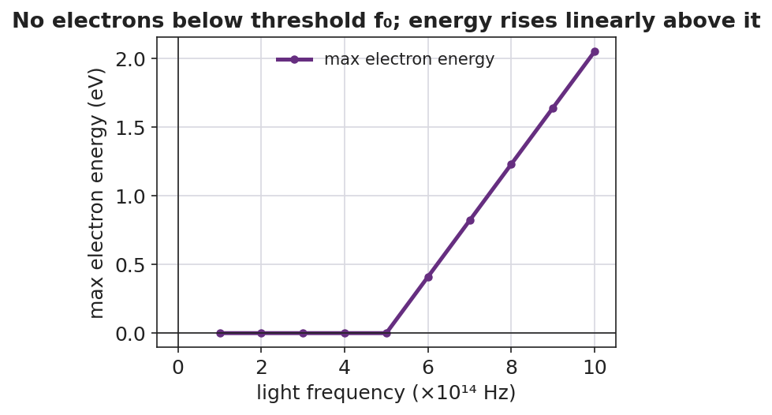

# The Photoelectric Effect — Student Notes

**Unit: Modern Physics — Lesson 01**
Name: _______________________  Date: __________  Period: ____

---

## Learning Targets

By the end of today's 42 minutes I can:

- Describe light as a stream of energy packets (**photons**) whose energy depends on frequency.
- Explain why electrons are ejected only above a **threshold frequency**, no matter the brightness.
- Use E = h·f to calculate a photon's energy.

---

## Key Vocabulary

- **photon** — _______________________________________________
- **photoelectric effect** — _______________________________________________
- **threshold frequency** — _______________________________________________

---

## Guided Notes

**Big idea:** Light is not only a wave — it also arrives in __________ packets called **photons**.

- The energy of one photon: **E = h·f**, where h = __________ J·s (Planck's constant) and f is the __________.
- Higher frequency → __________ energy per photon. (Violet photons carry more energy than red photons.)
- **Brightness** = how __________ photons arrive each second (the *number*), not how much energy each one has.

**The photoelectric effect (one photon, one electron):**

- One photon hits one __________. If that single photon's energy is high enough, the electron is __________.
- The lowest frequency that can eject any electron is the **threshold frequency**.
  - Below threshold: __________ electrons leave, no matter how bright.
  - Above threshold: raising brightness adds __________ electrons; raising frequency adds __________ to each electron.

The graph below shows it: no electron energy below the threshold frequency f₀, then a straight line rising with frequency.

---

## Worked Example

**Problem.** Find the energy of one photon of green light with frequency 5.5×10¹⁴ Hz. (h = 6.63×10⁻³⁴ J·s.)

**Solution.**
1. Write the formula: E = h·f.
2. Substitute: E = (6.63×10⁻³⁴ J·s)(5.5×10¹⁴ Hz).
3. Multiply: E = __________ J ≈ 3.6×10⁻¹⁹ J.
4. A violet photon (higher f) would have __________ energy; a red photon (lower f) would have __________ energy.

---

## Summary

Finish the sentence (Because / But / So):

> A very bright red light cannot eject electrons
> because __________________________________________,
> but a dim violet light can
> because __________________________________________,
> so __________________________________________.
