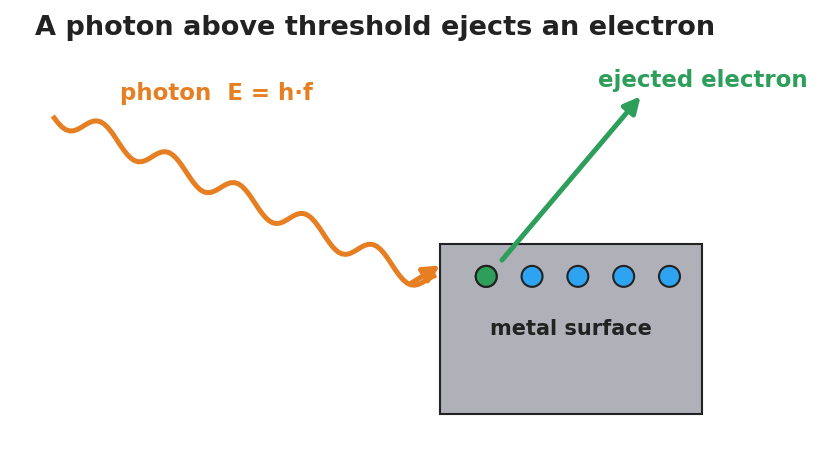

# The Photoelectric Effect — Student Worksheet

**Unit: Modern Physics — Lesson 01**
Name: _______________________  Date: __________  Period: ____

---

## Phenomenon

A very bright **red** laser shines on a metal surface — and nothing happens. Then a dim **violet** light hits the same surface and electrons fly off instantly. Turning the red light brighter still does nothing.

**Driving question:** What decides whether light can knock electrons off a surface — how bright it is, or its color (frequency)?

---

## Notice & Wonder

| I notice… | I wonder… |
|---|---|
|  |  |
|  |  |
|  |  |

**Turn & Talk #1:** What does changing the *brightness* of light do? What does changing the *color* do? Which one do you predict controls electron ejection?

> _______________________________________________

---

## Initial Model

Draw the light hitting the metal. Show what you think "brighter" does and what "higher frequency (more violet)" does. Then predict which change will start ejecting electrons.

> _______________________________________________
> My prediction: _______________________________

---

## Investigation

Use the PhET *Photoelectric Effect* simulation. The diagram shows one photon striking the metal and ejecting one electron — use it as your model of a single ejection event.

| Test | What I changed | Electrons ejected? (Y/N) | What changed about them (number / energy) |
|---|---|---|---|
| 1. Red light, brightness to MAX |  |  |  |
| 2. Raise frequency slowly |  |  | (record the frequency where ejection starts) |
| 3. Above threshold, raise frequency more |  |  |  |
| 4. Above threshold, raise brightness |  |  |  |

**Key question:** Below the ejecting frequency, does turning up the brightness ever start ejecting electrons?

> _______________________________________________

---

## Make It Make Sense

1. A bright red beam ejects no electrons, but a dim violet beam does. What does this tell you about how light delivers its energy?
2. Above the threshold, turning up the brightness adds more electrons but does not speed them up. Turning up the frequency speeds them up. Explain why, using the idea of a photon.
3. A photon's energy is E = h·f. If you wanted to give each photon more energy, what would you change?

---

## Vocabulary in Action

Use each term in a sentence about today's phenomenon.

- **photon:** _______________________________________________
- **photoelectric effect:** _______________________________________________
- **threshold frequency:** _______________________________________________

---

## Revise Your Model

Return to your Initial Model. Using *photon* and *threshold frequency*, rewrite your explanation of why brightness failed but color succeeded.

> _______________________________________________
> _______________________________________________

---

## Exit Ticket

A metal has a threshold frequency of 5.0×10¹⁴ Hz. (Reference table: E = h·f, h = 6.63×10⁻³⁴ J·s.)

(a) Find the energy of one photon of light at 6.0×10¹⁴ Hz.

(b) Will that light eject electrons from this metal? Explain.

(c) Light at 4.0×10¹⁴ Hz is made twice as bright. What happens to the ejected electrons? Why?
