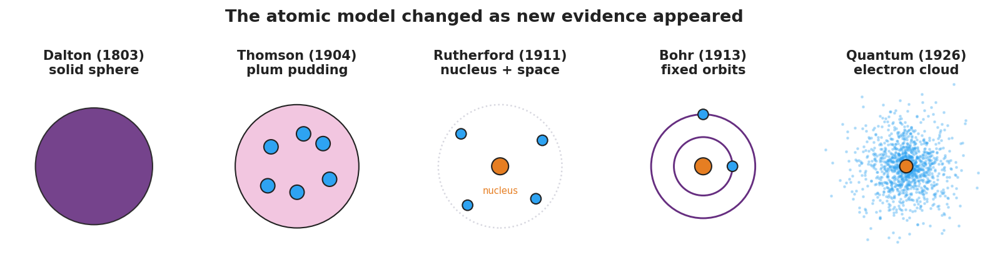
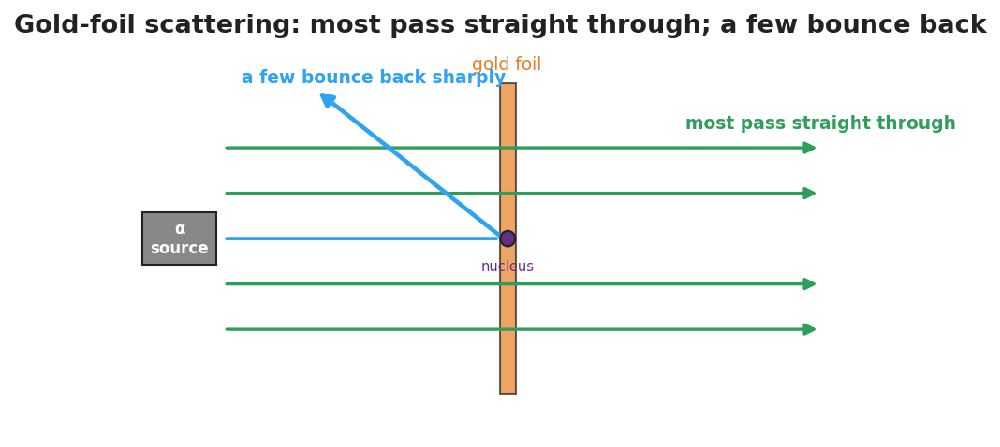

# Models of the Atom — Student Worksheet

**Unit: Modern Physics — Lesson 02**
Name: _______________________  Date: __________  Period: ____

---

## Phenomenon

Scientists fired tiny positive "bullets" (alpha particles) at an ultra-thin sheet of gold. They expected all of them to sail straight through. Almost all did — but a tiny fraction bounced **straight back**, as if they had hit something small and hard.

**Driving question:** What does the gold-foil result tell us about what is inside an atom — and why did the atomic model keep changing?

---

## Notice & Wonder

| I notice… | I wonder… |
|---|---|
|  |  |
|  |  |
|  |  |

**Turn & Talk #1:** If most bullets pass straight through but a few bounce hard, what must the inside of the atom look like — solid, empty, or something in between?

> _______________________________________________

---

## Initial Model

Draw what you think the inside of a gold atom looks like, based on the scattering result. Mark where the "hard" part is and how much of the atom is empty.

> _______________________________________________
> My idea: _______________________________

---

## Investigation

Your group has model cards and evidence cards. The figures below show the model progression and the gold-foil setup.

1. Order the model cards from **oldest to newest**.
2. Match each model to the evidence that **supported** it and the evidence that **broke** it.

| Model | What it got right | The evidence that broke it |
|---|---|---|
| Dalton (solid sphere) |  |  |
| Thomson (plum pudding) |  |  |
| Rutherford (nucleus) |  |  |
| Bohr (orbits) |  |  |
| Quantum (electron cloud) |  | (current best model) |

**Key question:** What did it take, every single time, to make scientists change the atomic model?

> _______________________________________________

---

## Make It Make Sense

1. Why couldn't Thomson's plum-pudding model explain the alpha particles that bounced straight back?
2. The atom is mostly empty space, yet it has nearly all its mass in one tiny spot. Where is that mass, and what is that spot called?
3. Is the quantum (electron-cloud) model "the final truth," or could it change? Explain.

---

## Vocabulary in Action

Use each term in a sentence about today's phenomenon.

- **nucleus:** _______________________________________________
- **electron:** _______________________________________________
- **atomic model:** _______________________________________________

---

## Revise Your Model

Return to your Initial Model. Redraw the gold atom using the words *nucleus* and *electron*, with the correct proportions (tiny dense center, lots of empty space).

> _______________________________________________
> _______________________________________________

---

## Exit Ticket

(a) Which atomic model first included a tiny, dense **nucleus**, and which experiment supported it?

(b) Name one thing the Thomson (plum-pudding) model got right.

(c) Why do scientists change a model like the atom over time?
