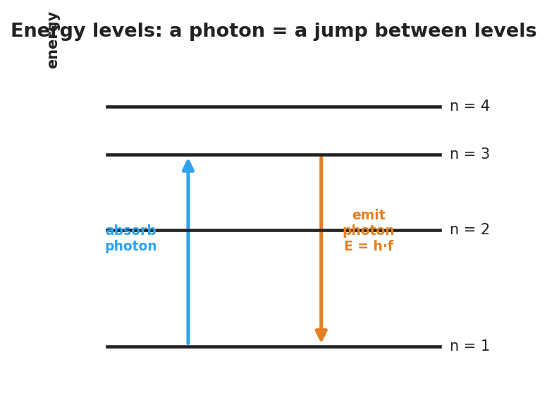
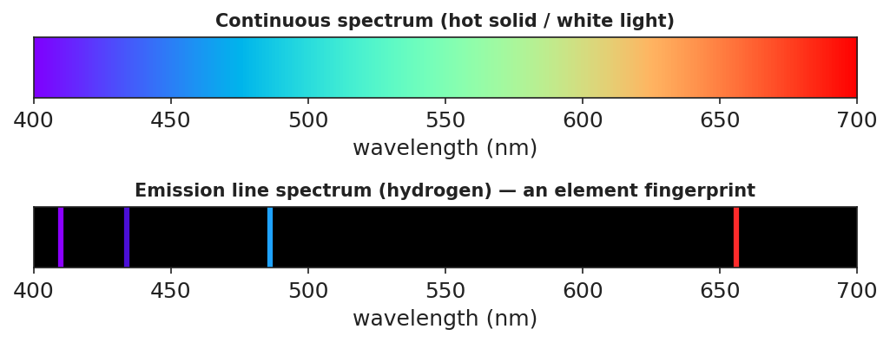

# Energy-Level Diagrams and Spectra — Teacher Guide

## Cover

**Unit: Modern Physics — Lesson 03: Energy-Level Diagrams and Spectra**
East Meadow Schools × Valley Stream Central High School District
Strategy chips: BTC

---

## Curated Resources (from East Meadow Scope & Sequence)

### NYSSLS Standards

This lesson develops the model that supports the **HS-ESS1-2** connection: *"Construct an explanation of the big bang theory based on astronomical evidence of light spectra, motion of distant galaxies, and composition of matter (Energy and Matter)"* — specifically the **connection to wavelength and frequency of light** and the **formation of stars**. Because each element emits a unique set of wavelengths, astronomers read the line spectra in starlight to identify what distant stars are made of. The lesson also extends Lesson 01 (photons, E = h·f) and Lesson 02 (the Bohr model).

### Phenomenon

- Gas-discharge tubes: hydrogen, helium, and neon tubes each glow a different color and, through a diffraction grating, show only a few sharp colored lines — not a full rainbow: <https://www.youtube.com/watch?v=byp3KFwMjW8>

### Javalab / Labs

- ophysics hydrogen spectrum / energy levels: <https://ophysics.com/modern2.html>
- "H Spectrum" lab: measure hydrogen's visible emission lines through a grating and match them to energy-level jumps.

### Assessments

- Exit ticket below (why a line spectrum, and how it fingerprints an element). The energy-level / spectrum matching at the boards in Phase 2 is the formative check.

---

## Lesson Overview

| | |
|---|---|
| **Duration** | 42 minutes (1 period) |
| **NYSSLS link** | HS-ESS1-2 connection (light spectra → composition of stars; star formation) |
| **CCC focus** | Energy and Matter / Patterns — discrete energy levels produce a repeatable pattern of emitted wavelengths. |
| **Strategy chips** | BTC (random groups + vertical non-permanent surfaces, thin-slice problems) |
| **Materials** | Vertical whiteboards/windows + markers; diffraction gratings + discharge tubes if available (or the ophysics sim); the energy-level handout; reference table (E = h·f). |
| **Safety** | Discharge tubes use high voltage — teacher-operated only; the simulation is the safe default. |
| **Prior knowledge** | Photons and E = h·f (Lesson 01); the Bohr model with electrons in fixed levels (Lesson 02); visible-light color ↔ wavelength/frequency. |

**Lesson objectives — students can:**

- Explain that electrons occupy discrete **energy levels** and that a photon is emitted or absorbed when an electron jumps between them.
- Relate the size of an energy jump to the frequency/wavelength (color) of the emitted photon.
- Explain why each element produces a unique **line spectrum** and how astronomers use it to identify stars.

---

## Phase 1 · Engage *(0 – 10 min)*

### 0–2 min · Opening Connection (SEL)

Whip-around (one sentence, pass allowed): *"Name something you can recognize instantly from just a tiny clue — a ringtone, a logo, a friend's footsteps."* Park these; you'll call back to "elements have a fingerprint" in Phase 3.

### 2–7 min · Phenomenon hook — discharge tubes vs. a rainbow

**Teacher actions.** Show a hydrogen tube (or sim) through a grating: only a few sharp colored lines. Then show white light through the same grating: a full continuous rainbow. Switch to helium: a *different* set of lines.

**Sample teacher language:**

> "Sunlight through this grating gives a smooth rainbow — every color. But this glowing hydrogen gives only four sharp lines, always the *same* four. Helium gives a totally different set. Why would a glowing gas pick only certain colors?"

**Anticipated student responses:**

- "The gas only makes some colors." — capture *only certain colors*.
- "Each gas has its own pattern." — gold; we'll name this a fingerprint.
- "It's about the electrons." — capture; connect to Bohr's levels from Lesson 02.

### 7–10 min · Notice & Wonder + Turn-and-Talk #1

> "Turn and talk: a rainbow has *every* color, but hydrogen shows only a few. Using last lesson's idea of electron levels, why would only certain colors come out?"

Target seed: electrons can only sit on certain "steps," so only certain jumps — and only certain photon energies/colors — are possible.

### Bridge to Phase 2

Each student writes a one-sentence **initial model**: "A glowing gas emits only certain colors because ______."

---

## Phase 2 · Explore *(10 – 30 min)*

### 10–13 min · Initial Model (silent / individual)

Prompt:

> *"Draw a few horizontal lines as electron 'energy steps.' Show an electron and use an arrow to show what you think it does to release light."*

### 13–30 min · Investigation — BTC at the boards

Form **visibly random groups of 3** (cards). Each group works a vertical surface through a **thin-sliced** problem set (reveal one at a time):

1. Here is an energy-level diagram. An electron drops from n = 3 to n = 1. Draw the arrow. Does it **absorb** or **emit** a photon?
2. Which drop releases a higher-energy (bluer) photon: n = 4 → n = 2, or n = 3 → n = 2? Why?
3. Match three given drops to three colored lines on a spectrum strip (biggest drop ↔ highest-frequency line).
4. Two unknown gases show different line patterns. Could they be the same element? Explain.

**Teacher facilitation language:**

> "Bigger jump down — bigger energy gap — what does that do to the photon's frequency? Its color?"
> "If the steps are fixed, how many *different* photon energies are even possible?"
> "Defend it to the group at the next board — do they agree which line is the biggest drop?"

Anchor with the energy-level diagram and the spectrum strip:

### Teacher facilitation during Explore

- **What to look for** — groups connecting *bigger energy gap → higher frequency → bluer line*.
- **What to resist** — don't hand out the term "line spectrum" yet; let the pattern emerge.
- **What to redirect** — "the gas just glows that color" → it glows specific colors *because* only specific jumps exist.

---

## Phase 3 · Explain *(30 – 36 min)*

### 30–33 min · Consensus

> "Why only a few lines, and why always the *same* few for a given gas?"

Target consensus:

> "Electrons can only occupy fixed energy levels, so only certain jumps are possible. Each jump emits a photon whose energy — and color — equals the gap. The set of gaps is unique to each element, so each element shows the same fixed set of lines."

### 33–36 min · Vocabulary introduction (≤ 3 terms)

**Sample teacher language:**

> "Each allowed electron 'step' is an **energy level**. When an electron drops to a lower level, it releases a photon — that's **photon emission**, and E = h·f for that photon equals the energy gap. The full set of sharp colored lines a glowing element produces is its **line spectrum** — its fingerprint."

### Discussion prompts to deploy here

- "How can astronomers know a distant star contains hydrogen without ever visiting it?"
  - *Sample student response:* "The starlight shows hydrogen's exact line pattern — its fingerprint — so we know hydrogen is there."
- "Why is a star's light evidence used in the Big Bang explanation?"
  - *Sample student response:* "Spectra tell us what stars are made of and (with shifts) how they move — evidence for how matter and the universe formed."

---

## Phase 4 · Elaborate *(36 – 39 min)*

### 36–38 min · Revise the model

> *"Return to your energy-step drawing. Add labels: which arrow direction emits a photon, and which color comes from the biggest drop? Connect one line in the spectrum strip to one jump in your diagram."*

### 38–39 min · Return to the phenomenon

> "In one sentence, explain why hydrogen shows only a few lines, using *energy level* and *line spectrum*."

Target: "Hydrogen's electrons can only jump between fixed **energy levels**, so only a few photon energies are possible — producing hydrogen's unique **line spectrum**."

---

## Phase 5 · Evaluate *(39 – 42 min)*

### 39–42 min · Exit Ticket + Closing Reflection

> *"(a) White light makes a continuous rainbow, but glowing hydrogen makes only a few sharp lines. Explain why, using energy levels.
> (b) An electron drops from n = 4 → n = 1 (a big drop) and from n = 2 → n = 1 (a small drop). Which emitted photon has the higher frequency? Why?
> (c) How can astronomers tell what a distant star is made of?"*

Expected: (a) electrons occupy only discrete levels, so only certain jumps/photon energies (colors) are possible; (b) the n = 4 → n = 1 drop — larger energy gap → higher-frequency photon (E = h·f); (c) by matching the star's line spectrum to known element fingerprints. See `Answer_Key.docx`.

**Closing Reflection (SEL, 30 seconds):**

> "What clicked for you at the boards today, and who helped it click?"

---

## Common Misconceptions

- **Misconception:** "Atoms can emit any color of light." → **Correction:** Only colors matching the gaps between fixed energy levels are emitted, so each element gives a few specific lines.
- **Misconception:** "Bigger energy jump = redder light." → **Correction:** Bigger energy gap = higher-energy photon = higher frequency = bluer light (E = h·f).
- **Misconception:** "Line spectra and continuous rainbows are the same thing." → **Correction:** A hot solid/white light gives a continuous spectrum; a glowing low-density gas gives discrete lines.

---

## Access & Differentiation

- **ELL/ENL supports:** Sentence frame: *"When an electron drops to a ___ energy level, it ___ a photon; a bigger drop makes a ___-frequency color."* Word box: {lower, emits, higher, energy level, line spectrum}. Pair *jump* with a stair-step hand gesture.
- **IEP/SPED supports:** Provide a pre-drawn energy-level diagram with the arrows already drawn; students label "emit/absorb" and "bigger/smaller gap." Offer color chips to physically match to spectrum lines.
- **Extensions:** Give students hydrogen's four visible wavelengths and have them order the jumps by energy, then research why these are called the Balmer series.

---

## Strategy Spotlight

**BTC (Building Thinking Classrooms).** Use visibly random groups of three and vertical non-permanent surfaces so thinking is public and mobile. Deliver the problems as a **thin-sliced** sequence — each problem a small step harder than the last — and circulate without giving answers, redirecting groups to defend their reasoning to the next board. The vertical surfaces let you see, in one glance, which groups have connected "bigger gap → bluer line," so you know exactly when to pull the class to consensus.

---

## NYSSLS Observation Checklist Crosswalk

| # | Checklist item | Where it appears in this lesson |
|---|---|---|
| 1 | Local/relatable phenomenon | Phase 1 — discharge tubes vs. rainbow; starlight fingerprints |
| 2 | Turn and Talk (2–3×) | Phase 1 (TT#1 — why only some colors), Phase 3 (consensus discussion) |
| 3 | Students develop questions/models/procedures | Phase 1 (initial model), Phase 2 (board work), Phase 4 (revise model) |
| 4 | CCC defined and used | Lesson Overview · *Energy and Matter / Patterns*, restated in Phase 3 |
| 5 | ENL — ≤ 3 vocab, second half | Phase 3 — vocabulary at 33–36 min (energy level / photon emission / line spectrum) |
| 6 | Revisit phenomenon with evidence | Phase 4 — re-explain hydrogen lines; starlight in Phase 3 |
| 7 | ENL/SPED supports | Access & Differentiation block |
| 8 | Assessment check | Phase 5 — Exit Ticket (line spectra + starlight) |

---

## Companion Materials

- `Student_Worksheet.docx` — the 5E student investigation with the board-work problems (hand out at start of Phase 2)
- `Student_Notes.docx` — guided note-guide for energy-level jumps and the worked example
- `Answer_Key.docx` — answers to "Make It Make Sense" prompts and the Exit Ticket

---

## Key Vocabulary (max 3)

- **energy level** — one of the fixed, allowed energies an electron can have in an atom (its allowed "steps")
- **photon emission** — the release of a photon when an electron drops to a lower energy level; the photon's energy equals the gap (E = h·f)
- **line spectrum** — the unique set of sharp colored lines a glowing element emits; it acts as the element's fingerprint
