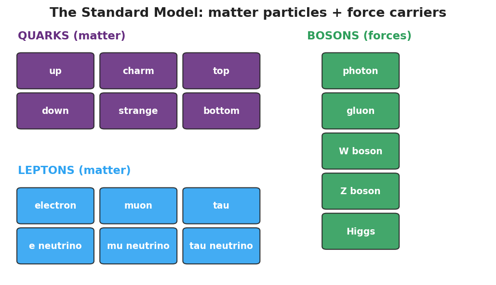
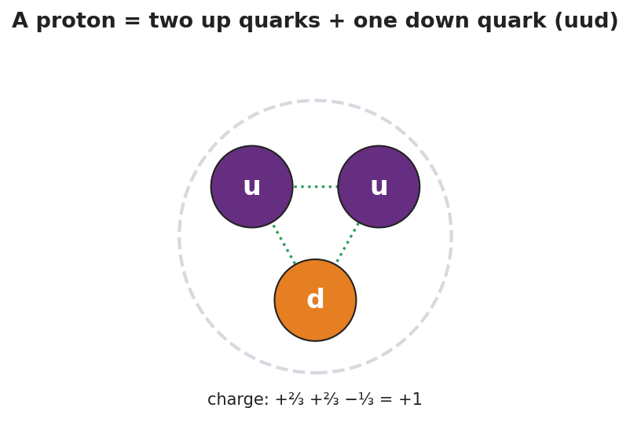

# The Standard Model — Teacher Guide

## Cover

**Unit: Modern Physics — Lesson 04: The Standard Model**
East Meadow Schools × Valley Stream Central High School District
Strategy chips: HOCHMAN

---

## Curated Resources (from East Meadow Scope & Sequence)

### NYSSLS Standards

This is a conceptual model-building lesson anchored to the SEP **Developing and Using Models**. The Standard Model is the modern answer to "what is everything made of?" — it organizes all known matter particles (quarks and leptons) and force carriers (bosons) into a single chart, exactly as the periodic table organizes elements. It extends the atomic-structure work of Lesson 02 (electrons and nuclei) down to the next level and sets up the nuclear changes of Lesson 05 (protons and neutrons are made of quarks).

### Phenomenon

- Cassiopeia Project: "The Standard Model" — a clear visual tour of quarks, leptons, and the forces between them: <https://www.youtube.com/watch?v=Unl1jXFnzgo>
- The driving puzzle: if atoms are made of protons, neutrons, and electrons — what are *those* made of?

### Javalab / Labs

- Particle Adventure (interactive Standard Model explorer): <https://www.particleadventure.org/>

### Assessments

- Exit ticket below (classify particles; build a proton from quarks). The "build-a-particle" sort in Phase 2 is the formative check.

---

## Lesson Overview

| | |
|---|---|
| **Duration** | 42 minutes (1 period) |
| **NYSSLS link** | SEP: Developing and Using Models (organizing matter; supports HS-PS1-8 in Lesson 05) |
| **CCC focus** | Systems and System Models / Patterns — a small set of fundamental particles, organized like a periodic table, builds everything. |
| **Strategy chips** | HOCHMAN (Because/But/So + appositive on quark / lepton) |
| **Materials** | Projector for the Cassiopeia clip; particle cards (quarks u/d, electron, neutrino, photon, gluon); the Standard-Model chart handout; whiteboards. |
| **Safety** | None — video and paper-based. |
| **Prior knowledge** | Atoms = protons + neutrons + electrons (Lessons 02–03); the periodic table as an organizing tool. |

**Lesson objectives — students can:**

- State that all matter is built from two families of **fundamental particles**: **quarks** and **leptons**.
- Explain that protons and neutrons are made of quarks (a proton = up-up-down) and that forces are carried by bosons.
- Use the Standard-Model chart as a model that organizes particles, the way the periodic table organizes elements.

---

## Phase 1 · Engage *(0 – 10 min)*

### 0–2 min · Opening Connection (SEL)

Whip-around (one sentence, pass allowed): *"What is the smallest 'building block' you can think of that bigger things are made from?"* (Lego bricks, pixels, letters in words.) Park these; you'll call back to "a few blocks build everything" in Phase 3.

### 2–7 min · Phenomenon hook — "what is everything made of?"

**Teacher actions.** Play the Cassiopeia Standard Model clip (first few minutes). Pose the chain: a chair → atoms → protons, neutrons, electrons → and then?

**Sample teacher language:**

> "We zoomed in: the chair is atoms, the atom is a nucleus plus electrons, the nucleus is protons and neutrons. So I'll keep zooming — what is a *proton* made of? Is there a bottom to this, or does it go forever?"

**Anticipated student responses:**

- "Smaller protons." / "It goes forever." — reframe: scientists found it *does* bottom out.
- "Quarks!" (if seen before) — capture; we'll organize them.
- "Electrons are already smallest." — affirm partly: electrons *are* fundamental; protons are not.

### 7–10 min · Notice & Wonder + Turn-and-Talk #1

> "Turn and talk: scientists found a *small set* of particles that everything is built from. Why might it help to organize them into a chart, like the periodic table?"

Target seed: a chart reveals patterns and families, and shows what's fundamental vs. built-from-parts.

### Bridge to Phase 2

Each student writes a one-sentence **initial model**: "I think a proton is made of ______."

---

## Phase 2 · Explore *(10 – 30 min)*

### 10–13 min · Initial Model (silent / individual)

Prompt:

> *"Draw a proton. If it has smaller parts inside, draw them and label what you'd call them."*

### 13–30 min · Investigation — build-a-particle sort

Groups get particle cards and the Standard-Model chart. Tasks:

1. Sort the cards into **matter particles** (quarks + leptons) and **force carriers** (bosons).
2. Within matter, separate **quarks** (up, down, …) from **leptons** (electron, neutrino).
3. Build a **proton** and a **neutron** from quark cards. (Proton = up + up + down; neutron = up + down + down.) Check the charges add up (+⅔ +⅔ −⅓ = +1 for the proton; +⅔ −⅓ −⅓ = 0 for the neutron).
4. Where does the familiar **electron** sit? (It's a lepton — already fundamental, not made of quarks.)

**Teacher facilitation language:**

> "Add the quark charges in your proton — do they land on +1?"
> "Which of your cards is already fundamental — has nothing smaller inside?"
> "What's the boson's job? It's not matter — it carries a force between matter particles."

Anchor with the chart and the proton diagram:

### Teacher facilitation during Explore

- **What to look for** — groups checking that quark charges sum to the right particle charge.
- **What to resist** — don't over-detail the second/third generations or color charge; keep it to the organizing idea.
- **What to redirect** — "electrons are made of quarks" → no, electrons are leptons, already fundamental.

---

## Phase 3 · Explain *(30 – 36 min)*

### 30–33 min · Consensus

> "What is the smallest level we found, and how is it organized?"

Target consensus:

> "Everything is built from a small set of fundamental particles: **quarks** make up protons and neutrons, and **leptons** include the electron. Forces between them are carried by **bosons**. The Standard-Model chart organizes them the way the periodic table organizes elements."

### 33–36 min · Vocabulary introduction (≤ 3 terms)

**Sample teacher language:**

> "A **quark** is a fundamental matter particle; protons and neutrons are each made of three quarks. A **lepton** is the other family of matter particles — the electron is a lepton. Both quarks and leptons are **fundamental particles**: as far as we know, they have no smaller parts inside."

### Discussion prompts to deploy here

- "How is the Standard Model like the periodic table?"
  - *Sample student response:* "Both organize the basic pieces into families that show patterns; the table organizes elements, the Standard Model organizes the particles inside them."
- "Why isn't a proton on the chart of fundamental particles?"
  - *Sample student response:* "A proton is made of quarks, so it's not fundamental — only its quarks are."

---

## Phase 4 · Elaborate *(36 – 39 min)*

### 36–38 min · Hochman Because/But/So + revise the model

Students complete the stem (modeled, then independent):

> "A proton is **not** a fundamental particle **because** ______, **but** an electron **is** **because** ______, **so** the truly fundamental matter particles are the ______ and the ______."

Coach the appositive: *"A quark, a fundamental building block of protons and neutrons, carries a fractional charge."*

### 38–39 min · Return to the phenomenon

> "Restate the 'what is everything made of?' chain in one sentence using *quark* and *fundamental particle*."

Target: "Everything is built from **fundamental particles** — **quarks** (which make protons and neutrons) and leptons (like the electron)."

---

## Phase 5 · Evaluate *(39 – 42 min)*

### 39–42 min · Exit Ticket + Closing Reflection

> *"(a) Name the two families of fundamental matter particles.
> (b) A proton is made of two up quarks and one down quark. Is a proton a fundamental particle? Explain.
> (c) The electron belongs to which family — quarks or leptons?"*

Expected: (a) quarks and leptons; (b) no — it is made of smaller particles (quarks), so it is not fundamental; (c) leptons. See `Answer_Key.docx`.

**Closing Reflection (SEL, 30 seconds):**

> "What's one question about the universe you now want to ask?"

---

## Common Misconceptions

- **Misconception:** "Protons and neutrons are the smallest particles." → **Correction:** They are made of quarks; quarks (and leptons like the electron) are the fundamental particles.
- **Misconception:** "Electrons are made of quarks too." → **Correction:** Electrons are leptons — already fundamental, with no quarks inside.
- **Misconception:** "Bosons are matter." → **Correction:** Bosons are force carriers (like the photon), not matter particles.

---

## Access & Differentiation

- **ELL/ENL supports:** Sentence frame: *"A ___ is a fundamental particle, but a ___ is made of smaller parts, so the ___ is fundamental and the ___ is not."* Word box: {quark, proton, electron, lepton, fundamental}. Pair *fundamental* with "can't break it smaller" and a closed-fist gesture.
- **IEP/SPED supports:** Provide pre-grouped card sets (matter vs. force already separated); students only build the proton/neutron. Give a partially completed chart to fill the last few tiles.
- **Extensions:** Have students build a neutron (udd), verify its zero charge, and explain why a free neutron's beta decay (Lesson 05) changes a down quark into an up quark.

---

## Strategy Spotlight

**HOCHMAN (literacy).** The Because/But/So in Phase 4 forces students to coordinate a contrast — fundamental (electron/quark) vs. composite (proton) — in one complex sentence, the heart of the lesson's conceptual distinction. Model one, then release. The appositive drill — *"A quark, a fundamental building block of protons and neutrons, carries a fractional charge"* — gives students a compact academic structure for defining a new term in place, transferable to any content area.

---

## NYSSLS Observation Checklist Crosswalk

| # | Checklist item | Where it appears in this lesson |
|---|---|---|
| 1 | Local/relatable phenomenon | Phase 1 — "what is everything made of?" zoom-in from a chair to quarks |
| 2 | Turn and Talk (2–3×) | Phase 1 (TT#1 — why organize into a chart), Phase 3 (consensus discussion) |
| 3 | Students develop questions/models/procedures | Phase 1 (initial model), Phase 2 (build-a-particle sort), Phase 4 (revise model) |
| 4 | CCC defined and used | Lesson Overview · *Systems and System Models / Patterns*, restated in Phase 3 |
| 5 | ENL — ≤ 3 vocab, second half | Phase 3 — vocabulary at 33–36 min (quark / lepton / fundamental particle) |
| 6 | Revisit phenomenon with evidence | Phase 4 — restate the "what is everything made of?" chain |
| 7 | ENL/SPED supports | Access & Differentiation block |
| 8 | Assessment check | Phase 5 — Exit Ticket (classify particles; proton from quarks) |

---

## Companion Materials

- `Student_Worksheet.docx` — the 5E student investigation with the build-a-particle sort (hand out at start of Phase 2)
- `Student_Notes.docx` — guided note-guide for the particle families and the worked example
- `Answer_Key.docx` — answers to "Make It Make Sense" prompts and the Exit Ticket

---

## Key Vocabulary (max 3)

- **quark** — a fundamental matter particle; protons and neutrons are each built from three quarks (a proton is up-up-down)
- **lepton** — the other family of fundamental matter particles; the electron is a lepton
- **fundamental particle** — a particle with no smaller parts inside, as far as we know (quarks and leptons are fundamental; protons are not)
