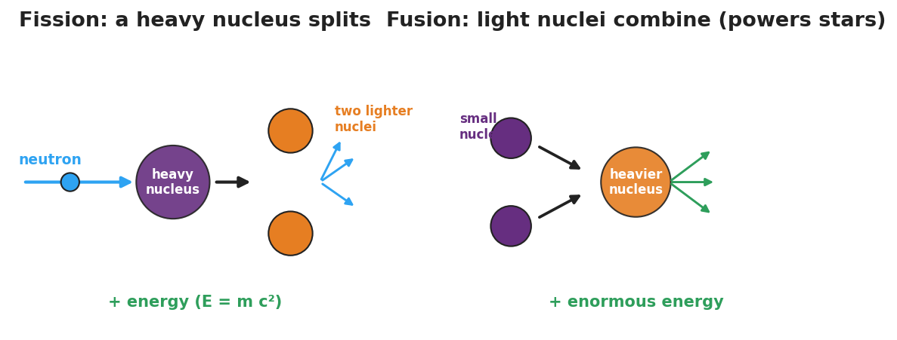
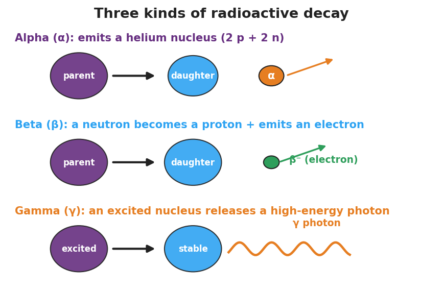

# Fusion, Fission, and Radioactive Decay — Student Notes

**Unit: Modern Physics — Lesson 05**
Name: _______________________  Date: __________  Period: ____

---

## Learning Targets

By the end of today's 42 minutes I can:

- Tell apart **fission**, **fusion**, and **radioactive decay** by how the nucleus changes.
- Explain why nuclear changes release enormous energy (E = mc², scale only).
- Connect fusion to **star formation** and decay to uses like carbon dating.

---

## Key Vocabulary

- **fission** — _______________________________________________
- **fusion** — _______________________________________________
- **radioactive decay** — _______________________________________________

---

## Guided Notes

**Big idea:** In a nuclear change, the **nucleus** itself changes, and a tiny amount of mass becomes a huge amount of energy.

- **Fission** — a heavy nucleus __________ into lighter nuclei (+ extra neutrons + energy). Used in nuclear __________ plants.
- **Fusion** — light nuclei __________ into a heavier nucleus (+ enormous energy). Powers the __________ and forms elements in stars.

**Radioactive decay** — an unstable nucleus emits radiation on its own:

- **Alpha (α)** — emits a __________ nucleus (2 protons + 2 neutrons).
- **Beta (β)** — a neutron becomes a proton and emits an __________.
- **Gamma (γ)** — emits a high-energy __________ (no change in protons/neutrons).

**Why so much energy?** A small amount of __________ is converted to energy. Because **E = mc²** and c (the speed of light) is __________, even a tiny mass gives an enormous energy — far more than burning fuel. *(Scale idea only — no calculation.)*

---

## Worked Example

**Problem.** A campfire lasts one night, but the Sun has shone for billions of years. Why can the Sun outlast any chemical fire?

**Solution.**
1. A campfire is a __________ reaction (rearranging atoms/bonds) — relatively little energy.
2. The Sun runs on nuclear __________ — combining hydrogen nuclei into heavier ones.
3. A tiny amount of mass turns into energy, and E = mc² (huge c) makes that energy __________ — so the Sun's fuel lasts far longer.

---

## Summary

Finish the sentence (Because / But / So):

> A campfire burns out in one night
> because __________________________________________,
> but the Sun has shone for billions of years
> because __________________________________________,
> so __________________________________________.
