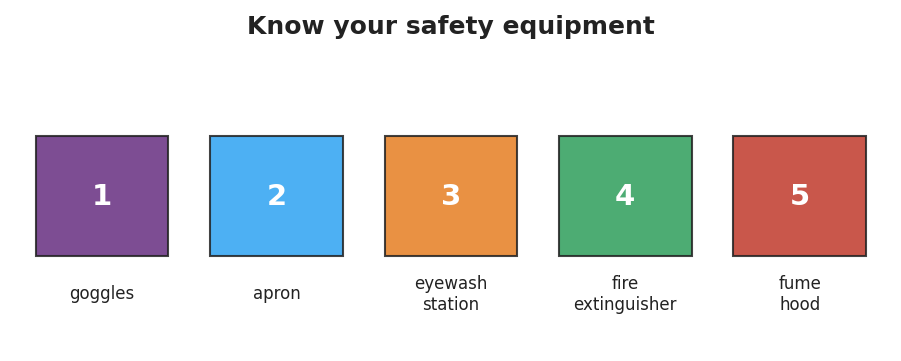

# Lab Safety & Working Like a Scientist — Teacher Guide

## Cover

**Unit: Safety and Measurement — Lesson 01: Lab Safety & Working Like a Scientist**
East Meadow Schools × Valley Stream Central High School District
Strategy chips: RESTORATIVE CIRCLE

---

## Curated Resources (from East Meadow Scope & Sequence)

### NYSSLS Standards

Foundational lab-safety and SEP practice (Planning & Carrying Out Investigations). No content performance expectation — this lesson establishes the safe-investigation routines that every later HS-PS1 lab depends on. Students practice SEP-3 (Planning & Carrying Out Investigations) by identifying hazards, selecting appropriate PPE, and interpreting a Safety Data Sheet. This is the entry point for science-and-engineering practice in the course: students learn the non-negotiables of the lab environment before any chemistry content begins.

### Phenomenon

A student skips the safety checklist before a chemical procedure: goggles pushed up on their forehead, wrong gloves, fume hood sash left open. When a small splash of acid contacts the unprotected eye area, the lesson turns from chemistry to first aid. Now replay the same procedure, this time with goggles seated correctly, the appropriate apron, and the fume hood running — the identical splash is deflected harmlessly by the goggles. Same chemical, same action, entirely different outcome. The contrast is striking and visceral without being gory: safety gear does not make the hazard disappear, it makes the cause→effect chain break before harm reaches the student.

### Javalab / Labs

- Safety-equipment scavenger hunt: students locate each piece of equipment from `figures/safety_equipment.png` in the actual classroom/lab space and write its purpose in their own words.
- SDS (Safety Data Sheet) interpretation: using a printed or projected SDS for a common reagent (e.g., hydrochloric acid or hydrogen peroxide), students find the hazard statement, the required PPE, and the first-aid response. No external URL is required; a generic SDS from the school's chemical supplier works well. For a digital interactive option, the NYSED-aligned PhET Chemistry lab-safety module or a brief Javalab "lab tour" walkthrough can precede the hands-on hunt.

### Assessments

- Lab safety quiz / safety contract sign-off (district standard — distribute and collect by end of period or beginning of next period; student keeps a copy).
- The Exit Ticket below is the formative check for this lesson: it asks students to name two PPE items, identify where to look up a substance's hazards, and write one sentence connecting safety routines to the Cause-and-Effect CCC.

---

## Lesson Overview

| | |
|---|---|
| **Duration** | 42 minutes (1 period) |
| **NYSSLS link** | SEP-3 (Planning & Carrying Out Investigations) — foundational; no content PE |
| **CCC focus** | Cause and Effect — unsafe action → predictable hazard; control measure (PPE, SDS, ventilation) → prevention. Students see that the cause→effect chain is *predictable*, which is why safety routines exist. |
| **Strategy chips** | RESTORATIVE CIRCLE (unit-opening circle: share a time you had to be careful with something) |
| **Materials** | Safety contract (one per student), goggles and aprons for demonstration, a sample SDS (printed or projected), the classroom safety-equipment map/poster, `figures/safety_equipment.png` projected on screen. |
| **Safety** | This lesson *is* about safety — but the teacher demo of goggles off vs. goggles on should use water, not acid. Keep the scenario verbal/visual; no actual hazardous chemicals are needed for Engage. |
| **Prior knowledge** | None required — this is the opening lesson of the course. Students bring prior experiences from middle school and everyday life. |

**Lesson objectives — students can:**

- Identify and explain the purpose of five core pieces of lab safety equipment: goggles, apron, eyewash station, fire extinguisher, and fume hood.
- Define SDS, PPE, and hazard in their own words and use each in a sentence.
- Locate the hazard statement and first-aid instructions on a Safety Data Sheet.
- Explain, using the Cause-and-Effect CCC, why safety routines prevent lab accidents.

---

## Phase 1 · Engage *(0 – 10 min)*

### 0–3 min · Opening Circle + Do Now

Begin with the **Restorative Circle** (see Strategy Spotlight). Everyone in the room — teacher included — briefly answers: *"Share a time you had to be extra careful with something. What made it feel worth being careful?"* One round, every voice, no judgment. This grounds the lesson in real life and builds the social trust that makes students willing to ask safety questions later. Keep it to 2–3 minutes: a sentence each.

Then post the **Do Now**: *"Look at the two images your teacher is showing. In one sentence: what is different between the two students, and what might happen differently to each one?"*

Project or sketch two side-by-side stick figures: one with goggles seated correctly and apron tied, one with goggles pushed up and no apron.

**Anticipated student responses to Do Now:**

- "One has goggles on and one doesn't." — capture; ask *what difference that might make*.
- "The one without goggles could get hurt." — affirm; ask *hurt how*.
- "I don't know what the apron is for." — validate; say "we'll find out together."

### 3–8 min · Phenomenon hook — the two procedures

**Teacher actions.** Tell the story in two acts. Act 1: a student in a rush skips the pre-lab checklist — goggles up, standard rubber gloves instead of acid-resistant ones, fume hood sash left open. They're heating a solution that can splash. It does splash. Without goggles, the liquid reaches the eye area. Act 2: the same student, same task, but goggles down, apron on, fume hood running. The identical splash hits the goggle lens and wipes off. Same chemistry — completely different outcome.

**Sample teacher language:**

> "Nothing about the liquid changed between Act 1 and Act 2. The same amount splashed the same direction. So why did one student end up at the eyewash station and the other one just wiped their goggles and kept working?"

**Anticipated student responses:**

- "Because they were wearing goggles." — capture; we will sharpen this into the Cause-and-Effect language in Phase 3.
- "The fume hood stopped them from breathing it." — good; validate and note it.
- "They should have been more careful." — agree, and ask: "What does *being careful* actually look like, specifically?" That question drives the whole lesson.

**Driving question** (post on the board and leave it there):

> *What routines let chemists work with dangerous substances and stay safe?*

### 8–10 min · Notice & Wonder + Turn-and-Talk #1

Two columns on the board: **I notice… / I wonder…**

Collect 3–4 responses. Then:

> "Turn to your partner: the splash happened both times. So what's actually stopping the harm in Act 2? Try to name the specific thing — not just 'safety gear.'"

Target insight (leave open if no one lands it yet): a physical barrier between the hazard and the body. That is the concept of **PPE** — and we'll name it formally in Phase 3.

---

## Phase 2 · Explore *(10 – 30 min)*

### 10–15 min · Initial Model (silent / individual)

Prompt on the board:

> *"Before we name anything, draw or write your best guess: what are the most important safety items in a chemistry lab, and what does each one protect? List at least three. You can look around the room."*

Students write/draw silently for 3–4 minutes. This surface prior knowledge and activates curiosity before the scavenger hunt. Collect the range: some students will know "goggles" and "fire extinguisher"; few will know "fume hood" or have thought about the eyewash station. That gap is instructional gold.

### 15–28 min · Investigation Part 1 — Safety Equipment Scavenger Hunt

Hand out (or project) the worksheet. Students locate each of the five items from the figure below in the actual room and write one sentence about each item's purpose.

**Items and their purposes (your answer-key reference):**

1. **Goggles** — seal around the eyes to protect against splashes, flying particles, and fumes.
2. **Apron** — protects skin and clothing from chemical splashes and spills.
3. **Eyewash station** — delivers a continuous low-pressure stream of water to flush the eye for 15 minutes after chemical contact.
4. **Fire extinguisher** — smothers or cools a small fire before it spreads; know the type in your room (CO₂ for chemical fires).
5. **Fume hood** — draws air away from the work surface and exhausts it outside, preventing inhalation of vapors.

**Teacher facilitation language:**

> "Find each one. Don't just point — stand next to it and write what you think it does before you look at the label. We're building our knowledge, not copying it."

### 28–30 min · Investigation Part 2 — SDS Interpretation

Distribute (or project) the sample SDS. Students find and record:
- The **hazard statement** (e.g., "Causes serious eye irritation; harmful if inhaled").
- The **required PPE** listed in Section 8.
- The **first-aid measure** for eye contact (Section 4).

**Teacher facilitation language:**

> "An SDS can look overwhelming at first — sixteen sections of fine print. But Section 2 tells you the hazard, Section 4 tells you what to do if something goes wrong, and Section 8 tells you what to wear. Find those three sections and you have everything you need to work safely."

**Anticipated student responses:**

- "There's so much text. Where do I look?" — guide to Section 2, 4, and 8 by number.
- "It says 'causes serious eye damage.' Does that mean this is really dangerous?" — affirm: that's exactly why we wear goggles. The SDS makes the cause→effect visible.
- "What's an H-statement?" — H-statements are UN-standard hazard codes. They don't need to memorize H-codes; knowing where to find the plain-English translation is enough.

---

## Phase 3 · Explain *(30 – 36 min)*

### 30–33 min · Turn-and-Talk #2 + class consensus

> "Look at your scavenger-hunt list and your SDS notes. Turn to a partner: what is the *pattern*? What is every safety rule actually trying to do?"

Target consensus:

> "Every rule is trying to break the connection between the hazard and the person — either by removing the hazard (fume hood, proper storage), shielding the body (PPE), or knowing what to do if contact happens anyway (SDS first aid)."

### 33–36 min · Vocabulary introduction (exactly 3 terms)

**Sample teacher language:**

> "Let's name what we've been doing all period. The things that can cause harm — the splash, the vapor, the fire — those are **hazards**. A hazard is something with the *potential* to cause harm. It doesn't mean harm has happened; it means it *could*. The gear that puts a barrier between the hazard and your body — goggles, gloves, apron — that's called **PPE: personal protective equipment**. And the document we just read — all sixteen sections of it — is the **SDS: Safety Data Sheet**. Every chemical in this room has one. The SDS is how you find out what the hazard is and what PPE you need."

Post the three terms on the board. Students fill them in on their notes.

**Discussion prompts to deploy here:**

- "If goggles are PPE, is the fume hood also PPE?" — *Expected response:* No — it's an engineering control, not personal gear. The SDS distinguishes these; Section 8 lists both. Accept either answer and clarify the distinction as a bonus.
- "You read on the SDS that eye contact 'causes serious eye damage.' What is the cause in that sentence, and what is the effect?" — *Expected response:* cause = chemical contact with the eye; effect = serious eye damage. That's exactly the Cause-and-Effect CCC at work.

---

## Phase 4 · Elaborate *(36 – 40 min)*

### 36–39 min · Revise the model + Cause-and-Effect expansion

Students return to their Initial Model (the list of safety items they drew in Phase 2). They revise it by adding: (a) any items they missed, (b) one cause→effect statement per item (what happens if you skip it). Then run a **Because/But/So** sentence:

> *"A student heats a liquid without goggles."*
> *"This is dangerous **because** ______, **but** _______, **so** _______."*

Model one aloud:

> "This is dangerous **because** the liquid can splash and contact the eye, **but** goggles create a physical barrier between the splash and the eye, **so** wearing goggles breaks the cause→effect chain before harm reaches the student."

Then have students try one for the fume hood.

### 39–40 min · Return to the phenomenon

> "Return to our opening story. In Act 2, the student wiped the splash off their goggles and kept working. Can you now explain, in one sentence using the word *hazard*, why the goggles made that possible?"

Target: "The goggles put a barrier between the hazard (the splash) and the body, so the potential harm never became actual harm."

---

## Phase 5 · Evaluate *(40 – 42 min)*

### 40–42 min · Exit Ticket + Closing Reflection

Post or read aloud:

> *"A lab calls for heating a liquid that can splash."*
> *(a) Name two pieces of PPE required and explain why each one.*
> *(b) Where would you look up the liquid's specific hazards and first-aid steps?*
> *(c) In one sentence, explain why following the safety routine matters.*

Expected answers are in `Answer_Key.docx`.

**Closing Reflection (SEL, 30 seconds):**

> "What is one thing you'll do differently in this lab room because of today? Who — a person or an idea — helped you land on that?"

Collect safety contracts if signed; otherwise note the deadline.

---

## Common Misconceptions

- **Misconception:** "Safety rules are just rules — following them doesn't actually change what happens." → **Correction:** Safety equipment works by physically interrupting the cause→effect chain. Goggles do not eliminate the splash; they redirect its effect away from the eye. This is a falsifiable, empirical claim — and the SDS first-aid section exists precisely because the equipment isn't magic.
- **Misconception:** "The SDS is for emergencies only — I don't need it before I start." → **Correction:** The SDS tells you what PPE to wear *before* the experiment. Section 8 is pre-work, not post-accident reading.
- **Misconception:** "I've used this chemical before and nothing happened." → **Correction:** The hazard is always present; harm just didn't result that time. A hazard is potential harm — the absence of an accident is not evidence the hazard is gone.
- **Misconception:** "Goggles are the only PPE." → **Correction:** PPE is matched to the specific hazard. A splash hazard needs goggles *and* apron (skin protection). A vapor hazard adds ventilation. The SDS specifies the right combination.

---

## Access & Differentiation

- **ELL/ENL supports:** Sentence frames for the scavenger hunt and Exit Ticket: *"Before I ___, I must put on ___ because ___."* and *"If ___ happens, I should ___ because ___."* Word-choice box displayed on the board throughout the lesson: {goggles, apron, SDS, hazard, PPE, eyewash station, fume hood}. Pair vocabulary terms with gestures: tap the eye for goggles, sweep hand away from face for fume hood. The SDS labels are in English — allow students to use a bilingual dictionary for Section headings, but ask them to record their findings in English.
- **IEP/SPED supports:** Provide a pre-filled scavenger-hunt checklist with item names and a checkbox; the student's task is to locate each item (not recall its name) and write one purpose sentence. Assign clear partner roles for the scavenger hunt: one student navigates, one writes. For the SDS, pre-highlight Sections 2, 4, and 8 so students scan a manageable portion. Offer sentence starters for the Exit Ticket.
- **Extensions:** (1) Write a three-step safe procedure for a given mini-task (e.g., "you need to smell a liquid in a small beaker — describe the safe technique"). (2) Find one pictogram icon on the SDS (Section 2 GHS symbols) and write a sentence explaining what it warns against. (3) Look up the OSHA Hazard Communication Standard and find one way it has changed since 2012 — write a sentence about why the update mattered.

---

## Strategy Spotlight

**RESTORATIVE CIRCLE (unit-opening circle).** A restorative circle at the start of a new unit does two things simultaneously: it gives every student a voice in the first three minutes of chemistry class (the teacher's message: *your experience matters here*) and it surfaces the communal wisdom about careful, intentional action that safety practice draws on.

**How to run it in 2–3 minutes:**

1. Everyone stands or pushes chairs back so the room has a loose circle feel — even if you stay at your desks.
2. Pose the prompt: *"Share a time you had to be extra careful with something. What made it feel worth being careful?"*
3. Go around once, including yourself. One sentence is enough. Pass is allowed.
4. After the round, name the pattern aloud: *"Every one of those stories had a hazard — something with the potential to cause harm — and a choice to control it. That is exactly what we are doing in chemistry every day."*

This circle is not graded, not timed pressure, and not about chemistry content — it is about relationship and trust. Research on CRSE-aligned classrooms (Ladson-Billings; the East Meadow restorative-practice framework) consistently finds that brief community-building rituals reduce off-task behavior during the riskier parts of a lab lesson. The three minutes are worth it.

**Connection to Hochman literacy:** the circle primes Because/But/So writing in Phase 4, because students have just named a *cause* (the hazard), a *contrast* (but I was careful), and a *consequence* (so nothing bad happened) in their own words. When they see the B/B/S structure on paper, they recognize their own story.

---

## NYSSLS Observation Checklist Crosswalk

| # | Checklist item | Where it appears in this lesson |
|---|---|---|
| 1 | Local/relatable phenomenon | Phase 1 — safe-vs-unsafe procedure contrast; return in Phase 4 with goggles/fume-hood scenarios |
| 2 | Turn and Talk (2–3×) | Phase 1 (TT#1 — what's stopping harm in Act 2?), Phase 3 (TT#2 — what is every safety rule trying to do?) |
| 3 | Students develop questions/models/procedures | Phase 2 initial model (list safety items from memory); scavenger hunt and SDS interpretation; Phase 4 model revision |
| 4 | CCC defined and used | Lesson Overview · *Cause and Effect*, explicit in Phase 3 discussion prompt and Phase 4 B/B/S expansion |
| 5 | ENL — ≤ 3 vocab, second half | Phase 3 — vocabulary introduced at 33–36 min: hazard / PPE / SDS |
| 6 | Revisit phenomenon with evidence | Phase 4 — students return to opening story armed with vocab and scavenger-hunt evidence to explain *why* Act 2 was safe |
| 7 | ENL/SPED supports | Access & Differentiation block: sentence frames, word-choice box, pre-filled checklist, partner roles |
| 8 | Assessment check | Phase 5 — Exit Ticket (PPE names, SDS reference, one Cause-and-Effect sentence) |

---

## Companion Materials

- `Student_Worksheet.docx` — the 5E student investigation (hand out at start of Phase 2)
- `Student_Notes.docx` — guided note-guide for vocabulary and the worked SDS example
- `Answer_Key.docx` — answers to "Make It Make Sense" prompts and the Exit Ticket

---

## Key Vocabulary (max 3)

- **SDS (Safety Data Sheet)** — a document listing a substance's hazards, safe handling procedures, required PPE, and first-aid steps; the primary reference for working safely with any chemical
- **PPE (personal protective equipment)** — gear worn to protect the body from hazards, including goggles (eyes), apron (skin and clothing), and gloves (hands)
- **hazard** — something with the potential to cause harm; a hazard does not guarantee an injury, but it demands a control measure
