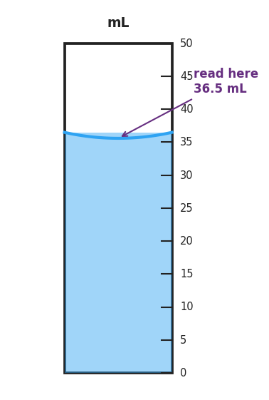

# Measurement & SI Units — Student Worksheet

**Unit: Safety and Measurement — Lesson 02**
Name: _______________________  Date: __________  Period: ____

---

## Phenomenon

In 1999, NASA's Mars Climate Orbiter was lost because one engineering team reported thruster force data in pound-force while another team's software expected newtons. The numbers were calculated correctly — but the units did not match. The spacecraft burned up in the Martian atmosphere instead of entering orbit. $125 million, gone.

**Driving question:** Why does the whole world's science agree on one set of units?

---

## Notice & Wonder

| I notice… | I wonder… |
|---|---|
|  |  |
|  |  |
|  |  |

**Turn & Talk #1:** The engineers both did their math correctly. In one sentence, describe what actually happened to the spacecraft — without using the word "units."

> _______________________________________________
> _______________________________________________

---

## Initial Model

Before your teacher explains anything, write your best guess: what measurements will you take in chemistry class this year? For each one, list the unit you'd use and the tool you'd use to take it. Include at least four rows.

| Quantity I'll measure | Unit I'd use (guess) | Tool I'd use (guess) |
|---|---|---|
|  |  |  |
|  |  |  |
|  |  |  |
|  |  |  |
|  |  |  |

---

## Investigation

### Measurement Stations — Data Table

Record every measurement with its number **and** its unit. A number without a unit is not a measurement.

**Station 1 — Volume (graduated cylinder)**

First, examine the figure below and record what you read.

Figure reading: _____________ mL

Now take three independent readings of the real graduated cylinder at your station. Read the **bottom of the meniscus**. Do not look at your partner's reading before you write your own.

| Reading | Value (mL) |
|---|---|
| Trial 1 |  |
| Trial 2 |  |
| Trial 3 |  |

**Station 2 — Mass (balance)**

Zero the balance before each measurement. Record in grams, then convert the largest mass to kilograms.

| Object | Mass (g) |
|---|---|
| Small rock |  |
| Pencil |  |
| Eraser |  |

Largest mass in kilograms: _____________ kg  (show conversion below)

**Station 3 — Temperature (thermometer)**

Read at eye level. Record in both °C and K. (Use your Reference Table for the conversion.)

| Sample | Temperature (°C) | Temperature (K) |
|---|---|---|
| Room-temperature water |  |  |
| Ice water |  |  |

**Station 4 — Length (metric ruler)**

Measure to the nearest millimeter.

| Object | Measurement (mm) | Convert to cm |
|---|---|---|
| Width of this worksheet |  |  |
| Length of your pencil |  |  |

---

## Make It Make Sense

1. Match each quantity to its SI unit and the instrument used to measure it. Draw a line or fill in the table.

| Quantity | SI unit | Instrument |
|---|---|---|
| Mass | ___________ | ___________ |
| Volume | ___________ | ___________ |
| Length | ___________ | ___________ |
| Temperature | ___________ | ___________ |

2. A graduated cylinder is filled with liquid. The meniscus curves downward (concave). A student reads 38.0 mL at the top edge where the liquid touches the glass, but the bottom of the curve reads 37.2 mL. Which reading is correct, and why?

   Correct reading: _____________ mL

   Why: _______________________________________________
   _______________________________________________

3. Two students measure the same object repeatedly. Student A gets: 14.1 g, 14.2 g, 14.1 g, 14.2 g. Student B gets: 14.1 g, 11.8 g, 15.3 g, 13.0 g. The true mass is 17.5 g.

   Classify each student's data:

   | Student | Precise? (yes/no) | Accurate? (yes/no) |
   |---|---|---|
   | Student A |  |  |
   | Student B |  |  |

   Look at the figure below. Which dartboard best represents Student A's data? ___________

   Which best represents Student B's data? ___________

   

---

## Vocabulary in Action

Use each term in a sentence about today's phenomenon or investigation. Do not copy the definition — use the word to describe something you observed or did.

- **SI unit:** _______________________________________________
  _______________________________________________

- **precision:** _______________________________________________
  _______________________________________________

- **accuracy:** _______________________________________________
  _______________________________________________

---

## Revise Your Model

Return to your Initial Model. Update the unit column with the official SI unit for each quantity. Circle any row where your original guess was different from the SI unit.

Then finish this Because / But / So sentence:

> A measurement recorded as "5.2" with no unit is not a complete measurement
> because __________________________________________,
> but __________________________________________,
> so __________________________________________.

---

## Exit Ticket

A student measures the same liquid four times: 24.9 mL, 25.0 mL, 24.8 mL, 25.1 mL. The true value is 30.0 mL.

(a) Is the data precise? Explain in one sentence.

> _______________________________________________
> _______________________________________________

(b) Is the data accurate? Explain in one sentence.

> _______________________________________________
> _______________________________________________

(c) In one sentence, explain the difference between precision and accuracy. You may use the word "dartboard" or the word "true value."

> _______________________________________________
> _______________________________________________
