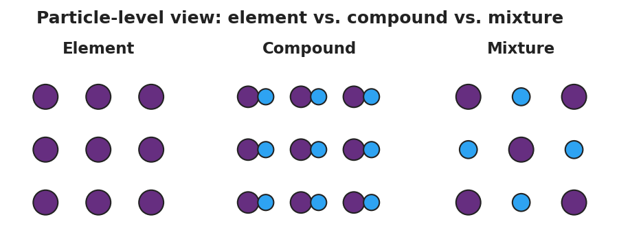

# Classification of Matter — Student Worksheet

**Unit: Physical Behavior of Matter — Lesson 01**
Name: _______________________  Date: __________  Period: ____

---

## Phenomenon

Four samples are on the front bench: a strip of copper wire, a jar of distilled water, a cup of saltwater, and a spoonful of trail mix. Each one is matter — but is each made of just *one* substance, or *many* substances mixed together? The trail mix is obviously many things. But the distilled water and the saltwater look identical — two clear, colorless liquids — and yet one is a single substance and the other is a mixture. Appearance alone won't tell you which is which.

**Driving question:** How can we tell whether a sample is one substance or many?

---

## Notice & Wonder

| I notice… | I wonder… |
|---|---|
|  |  |
|  |  |
|  |  |

**Turn & Talk #1:** The distilled water and the saltwater look identical. What test — *not just looking* — could you actually do to find out which one is a single substance and which one is a mixture?

> _______________________________________________
> _______________________________________________

---

## Initial Model

Before your teacher names anything, sort the ten samples below into groups that make sense to **you**. You decide the rule. Then, in the last column, write a short note on what each group has in common.

Samples: copper, oxygen gas (O₂), distilled water, table salt (NaCl), saltwater, air, trail mix, sand + iron filings, carbon dioxide (CO₂), brass.

| Sample | My group (1, 2, 3, or 4) | My rule — what does this group have in common? |
|---|---|---|
| copper |  |  |
| oxygen gas (O₂) |  |  |
| distilled water |  |  |
| table salt (NaCl) |  |  |
| saltwater |  |  |
| air |  |  |
| trail mix |  |  |
| sand + iron filings |  |  |
| carbon dioxide (CO₂) |  |  |
| brass |  |  |

---

## Investigation

### Part 1 — Re-sort into four bins

Now re-sort using this rule. **First** decide if each sample is a PURE substance (cannot be physically separated) or a MIXTURE (can be physically separated). **Then** split each into two. Don't worry about the names yet — just get the four piles right.

| Bin | Rule for this bin | Samples I placed here |
|---|---|---|
| Bin A | Pure — one kind of atom |  |
| Bin B | Pure — two or more kinds of atoms bonded together |  |
| Bin C | Mixture — looks uniform all the way through |  |
| Bin D | Mixture — you can see the separate parts |  |

### Part 2 — Mystery Samples

Your teacher will give you 3–4 numbered unknown samples. For each one, observe its appearance, try a physical separation (evaporate a drop, filter, or test with a magnet), and classify it.

| Sample # | Looks uniform or non-uniform? | What happened when you tried to separate it? | Pure substance or mixture? |
|---|---|---|---|
| 1 |  |  |  |
| 2 |  |  |  |
| 3 |  |  |  |
| 4 |  |  |  |

**Key question:** Two of the bench samples — distilled water and saltwater — look identical. Which physical test would separate one of them but leave the other unchanged, and what would that prove?

> _______________________________________________
> _______________________________________________

### Part 3 — Draw the particle models

Look at the figure below. In the boxes, draw your own particle diagrams: an **element** (one kind of atom), a **compound** (two kinds of atoms bonded), and a **mixture** (two kinds of atoms, not bonded). Label each one.

| My ELEMENT drawing | My COMPOUND drawing | My MIXTURE drawing |
|---|---|---|
|  |  |  |
|  |  |  |

(a) How many *kinds* of atoms are in your element drawing? _______________

(b) What is the difference between your compound drawing and your mixture drawing?

> _______________________________________________
> _______________________________________________

---

## Make It Make Sense

For each sample below, classify it as fully as you can and give a particle-level reason. Use the words pure substance, mixture, element, compound, homogeneous, and heterogeneous where they fit.

1. **Copper wire.** A strip of clean, shiny copper.

   - Pure substance or mixture? _______________________________________________
   - If pure: element or compound? _______________________________________________
   - Particle-level reason: _______________________________________________

2. **Saltwater.** A clear, colorless liquid made by dissolving table salt in water.

   - Pure substance or mixture? _______________________________________________
   - If a mixture: homogeneous or heterogeneous? _______________________________________________
   - How could you physically separate it? _______________________________________________

3. **Trail mix.** Raisins, peanuts, and chocolate pieces in a bag.

   - Pure substance or mixture? _______________________________________________
   - If a mixture: homogeneous or heterogeneous? _______________________________________________
   - How do you know without any test? _______________________________________________

4. **Carbon dioxide (CO₂).** A colorless gas.

   - Pure substance or mixture? _______________________________________________
   - If pure: element or compound? _______________________________________________
   - How many *kinds* of atoms are in one CO₂ particle? _______________________________________________

---

## Vocabulary in Action

Use each term in a sentence about today's investigation. Do not copy the definition — describe something you actually sorted, observed, or tested.

- **pure substance:** _______________________________________________
  _______________________________________________

- **mixture:** _______________________________________________
  _______________________________________________

- **homogeneous:** _______________________________________________
  _______________________________________________

---

## Revise Your Model

Return to your four-bin sort. Now that you have the vocabulary, re-label each bin with the correct term:

- Bin A = _______________   (Pure — one kind of atom)
- Bin B = _______________   (Pure — two or more kinds of atoms bonded)
- Bin C = _______________   mixture   (looks uniform)
- Bin D = _______________   mixture   (you can see the parts)

Then finish this Because / But / So sentence about the opening phenomenon:

> Distilled water and saltwater look identical
> because __________________________________________,
> but __________________________________________,
> so __________________________________________.

---

## Exit Ticket

(a) Classify **helium gas (He)**. Is it a pure substance or a mixture? An element or a compound? Explain your reasoning at the particle level.

> _______________________________________________
> _______________________________________________

(b) Classify a bottle of **Italian salad dressing that has separated** into an oil layer and a vinegar-and-herb layer. Pure substance or mixture? Homogeneous or heterogeneous? Explain.

> _______________________________________________
> _______________________________________________

(c) In one sentence, explain how a **homogeneous mixture** (like saltwater) is different from a **compound** (like water), even though both can look like a single clear liquid.

> _______________________________________________
> _______________________________________________
