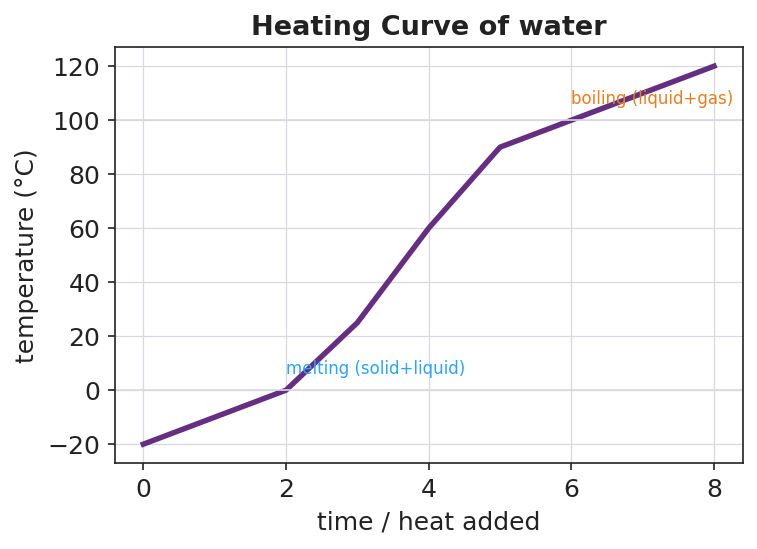

# States of Matter & Phase Changes — Student Notes

**Unit: Physical Behavior of Matter — Lesson 02**
Name: _______________________  Date: __________  Period: ____

---

## Learning Targets

By the end of today's 42 minutes I can:

- Describe and draw the particle arrangement and motion in a **solid**, a **liquid**, and a **gas**.
- Name the six phase changes (melting, freezing, vaporization, condensation, **sublimation**, deposition) and state whether energy is absorbed or released.
- Explain, in terms of **kinetic energy** and particle motion, why adding energy changes a substance's state without changing the substance.
- Use Energy and Matter to explain why dry ice sublimes directly from solid to gas while water ice melts first.

---

## Key Vocabulary

- **phase change** — _______________________________________________
  _______________________________________________

- **sublimation** — _______________________________________________
  _______________________________________________

- **kinetic energy** — _______________________________________________
  _______________________________________________

---

## Guided Notes

**The big idea — Energy and Matter:** Every phase change is driven by __________. Adding energy makes particles move __________ and spread __________ apart (toward gas). Removing energy makes particles move __________ and pack __________ together (toward solid). Through it all, the __________ stays the same — only its state changes. Matter is conserved; energy moves.

**The three states — fill in the particle model:**

| State | Particle arrangement | Particle motion | Shape / Volume |
|---|---|---|---|
| Solid |  |  | definite / definite |
| Liquid |  |  | takes container / definite |
| Gas |  |  | takes container / takes container |

**The figure — particle arrangement in the three states:**

From the figure: as you move solid → liquid → gas, the space between particles gets __________ and the particle motion gets __________.

**The six phase changes — fill in the name and the energy direction:**

| Starting → Ending | Phase change | Energy (in / out) |
|---|---|---|
| solid → liquid | __________ | __________ |
| liquid → solid | __________ | __________ |
| liquid → gas | __________ | __________ |
| gas → liquid | __________ | __________ |
| solid → gas | __________ | __________ |
| gas → solid | __________ | __________ |

**Pattern to remember:** changes that move *toward gas* (more spread out) __________ energy; changes that move *toward solid* (more packed) __________ energy.

**The heating curve:**

- The two **flat plateaus** are where a __________ is happening. The temperature stays steady because the added energy is used to __________ the particles, not to speed them up.
- The first plateau (0 °C for water) is __________; the second plateau (100 °C for water) is __________.

**The Hochman appositive definition:**

> Sublimation — _________________________ — is exactly what dry ice does.

---

## Worked Example

**Scenario:** A teacher places solid carbon dioxide (dry ice, CO₂) in a warm room. It gives off thick white fog and shrinks, but the tray under it stays completely dry — no liquid ever appears.

**Work through the reasoning:**

1. **Starting state of the CO₂:** _______________  **Ending state:** _______________

2. **Name the phase change:** _______________________________________________

3. **Is energy absorbed or released?** _______________  Where does that energy come from? _______________________________________________

4. **What happens to the particles?** As the CO₂ particles gain __________ energy, they move __________ and spread __________ apart — jumping straight from the tightly packed solid arrangement to the far-apart gas arrangement.

5. **Why is there no puddle?** Unlike water, carbon dioxide has no stable __________ state at normal room pressure, so the solid goes directly to __________.

6. **Because / But / So:** Dry ice never leaves a puddle
   **because** _______________________________________________,
   **but** _______________________________________________,
   **so** _______________________________________________.

*Check your reasoning:* "because" should describe the particles gaining energy and spreading out; "but" should note that CO₂ has no stable liquid state; "so" should conclude that it sublimes (solid → gas) and stays dry.

---

## Summary

Complete the appositive sentence:

> A phase change — _________________________ — never changes _________________________.

Complete the Because / But / So sentence:

> Adding energy to a solid can turn it into a gas
> because __________________________________________,
> but __________________________________________,
> so __________________________________________.

**Reminder:** A phase change is a *physical* change — the substance is conserved. Ice, liquid water, and steam are all H₂O. Dry ice and CO₂ gas are both carbon dioxide. Only the energy and arrangement of the particles change, never the identity of the matter.

**Key idea (Energy and Matter):**
- Energy **in** → particles speed up and spread out → toward gas.
- Energy **out** → particles slow down and pack together → toward solid.
- Matter is **conserved** through every phase change.
