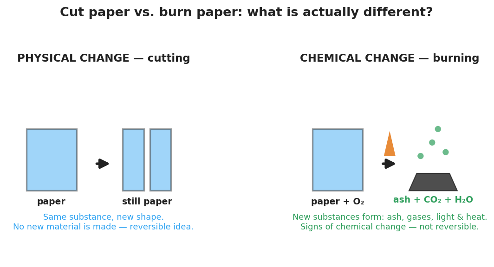

# Physical vs. Chemical Properties & Changes — Student Notes

**Unit: Physical Behavior of Matter — Lesson 03**
Name: _______________________  Date: __________  Period: ____

---

## Learning Targets

By the end of today's 42 minutes I can:

- Distinguish a **physical change** from a **chemical change** and justify the call using observable evidence.
- Name the five common **signs of chemical change** and identify them in a new scenario.
- Classify a property as **intensive** (independent of amount) or **extensive** (depends on amount).
- Explain, using Cause and Effect, why a chemical change produces a *new substance* while a physical change does not.

---

## Key Vocabulary

- **physical change** — _______________________________________________
  _______________________________________________

- **chemical change** — _______________________________________________
  _______________________________________________

- **intensive property** — _______________________________________________
  _______________________________________________

---

## Guided Notes

**The big idea — Cause and Effect:** A change is an *effect* caused by some input (cutting, heating, igniting). To classify it, ask one question: **is it still the same substance?**

- If the substance keeps its identity → __________ change (only the form changed).
- If one or more __________ substances form → __________ change.

**Physical change — what happens to the particles:**

Adding energy can re-space or rearrange particles **without** breaking the bonds inside them. Examples:

| Example | Why it is physical |
|---|---|
| Cutting paper |  |
| Melting ice |  |
| Dissolving salt in water |  |

**Chemical change — the five signs:**

When enough __________ is added to break and remake bonds, the atoms recombine into new substances. Watch for these clues:

1. __________ change (a new color appears)
2. __________ produced (bubbles or a new odor — not from boiling)
3. __________ or __________ released or absorbed (light, or the container warms/cools)
4. a __________ forms (a solid appears in a liquid)
5. the change is hard to __________

**Warning — these can fool you:**

- Bubbles from **boiling** are just water becoming vapor → __________ change.
- A bubble counts as a chemical-change sign only when the gas is a __________ substance.

**Intensive vs. extensive properties:**

| | Depends on amount? | Examples |
|---|---|---|
| **Intensive** property |  | density, color, boiling point, melting point |
| **Extensive** property |  | mass, volume, length |

To **identify** an unknown substance, use __________ properties — they stay the same for any sample size.

**The figure — cut paper vs. burn paper:**

From the figure, fill in:

- The cut paper at the end is still ___________ → __________ change.
- The burned paper becomes ___________, ___________, and ___________ → __________ change.

---

## Worked Example

**Scenario:** A student observes steel wool (mostly iron, Fe) left in vinegar over a class period. The steel wool warms up and turns reddish-brown.

**Step 1 — Ask the key question:** Is it still the same substance?

> _______________________________________________

**Step 2 — Look for signs of chemical change:** List every sign you observe.

> Sign 1: _______________________________________________
> Sign 2: _______________________________________________

**Step 3 — Classify the change:** This is a ___________ change because _______________________________________________.

**Step 4 — Name the new substance idea:** The reddish-brown material is iron oxide (rust), a __________ substance — not the original iron.

**Step 5 — Intensive or extensive?** The *color* of the rust (reddish-brown) is a(n) ___________ property; the *mass* of rust formed is a(n) ___________ property.

**Step 6 — Because / But / So:**

Rusting steel wool is a chemical change
**because** _______________________________________________,
**but** simply *cutting* the steel wool would be _______________________________________________,
**so** _______________________________________________.

*Check your reasoning:* "because" should name a sign of chemical change and the new substance; "but" should contrast a physical change; "so" should state what makes this one chemical.

---

## Summary

Complete the Because / But / So sentence:

> A chemical change makes a new substance but a physical change does not
> because __________________________________________,
> but __________________________________________,
> so __________________________________________.

**Quick reference — the five signs of chemical change:**
color change · gas produced (new gas, not boiling) · light/heat released or absorbed · precipitate forms · hard to reverse

**Remember:** *Intensive* properties (density, color, boiling point) do **not** depend on amount and help you identify a substance. *Extensive* properties (mass, volume, length) **do** depend on amount.
