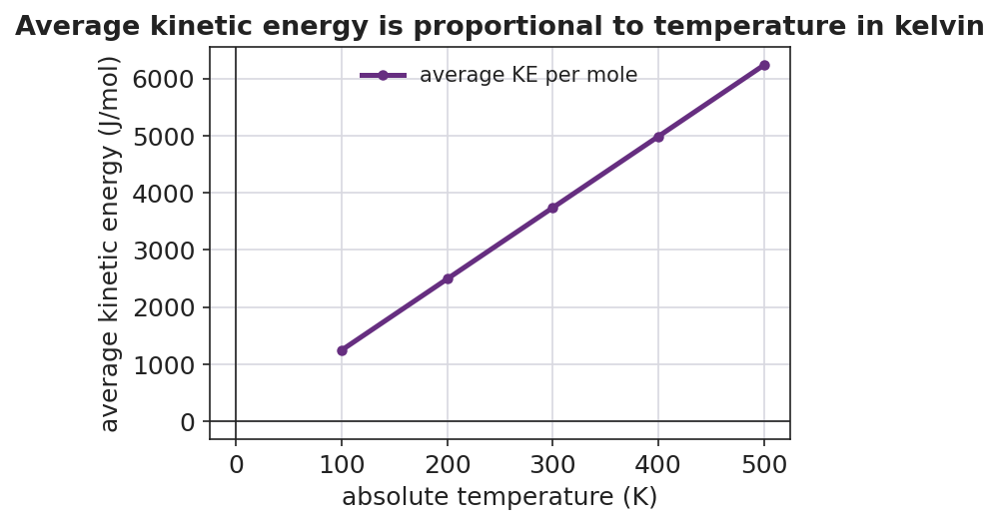

# Kinetic Molecular Theory — Student Notes

**Unit: Gas Laws — Lesson 02**
Name: _______________________  Date: __________  Period: ____

---

## Learning Targets

By the end of today's 42 minutes I can:

- State the main postulates of the **kinetic molecular theory** in my own words.
- Explain that the **temperature** of a gas (in kelvin) measures the average kinetic energy of its particles.
- Explain that **pressure** is caused by gas particles colliding with the walls of their container.
- Use the kinetic molecular theory to explain a real phenomenon — like why a sealed bag of chips puffs up on a mountain.

---

## Key Vocabulary

- **kinetic molecular theory** — _______________________________________________
  _______________________________________________

- **temperature** — _______________________________________________
  _______________________________________________

- **pressure** — _______________________________________________
  _______________________________________________

---

## Guided Notes

**The big idea — Cause and Effect:** A gas is a swarm of tiny particles in constant motion. A change at the __________ scale (faster motion, more collisions) causes a change you can measure (higher __________, a puffed-up bag).

**The postulates of the kinetic molecular theory (fill in the blanks):**

1. A gas is made of many tiny __________ that are very small compared to the space between them — a gas is mostly empty __________.
2. The particles are in constant, __________ motion, moving in straight lines until they collide.
3. Collisions between particles (and with the walls) are __________ — no kinetic energy is lost.
4. The average kinetic energy of the particles depends only on the __________ (in kelvin).

**What temperature really measures:**

Temperature (in kelvin) is a measure of the average __________ __________ of the particles. Higher temperature → particles move __________. At 0 K (absolute zero), particle motion __________.

**What causes pressure:**

Pressure is the force of particle __________ on the walls of the container, per unit area. More collisions, or harder collisions, means __________ pressure.

**The figure — same particles, faster motion at higher temperature:**

From the figure, fill in the blanks:

- The number of particles in each box is the __________ (count them).
- The thing that changes from box to box is how __________ the particles move.
- The box with the longest arrows is the __________ gas (highest temperature).

**The temperature–energy graph:**

- The line goes through the origin (0, 0), which means at 0 K the particles have __________ energy.
- The line is straight, so average kinetic energy is __________ proportional to the kelvin temperature.
- This is why every gas law uses __________, not Celsius.

**The Hochman appositive definition:**

> The kinetic molecular theory — _________________________ — explains pressure and temperature in terms of _________________________.

---

## Worked Example

**Scenario:** A rigid steel tank of air sits in the sun and heats up from 290 K to 320 K. The tank cannot expand. Use KMT to explain what happens to the pressure.

**Step 1 — What changed?** The __________ of the gas increased (290 K → 320 K). No particles were added or removed.

**Step 2 — What does higher temperature do to the particles?**

Higher temperature means higher average __________ __________, so the particles move __________.

**Step 3 — What happens at the walls?**

Faster particles collide with the tank walls __________ often and with __________ energy.

**Step 4 — The tank cannot expand, so what is the only thing that can change?**

The __________ inside the tank goes up.

**Step 5 — Appositive sentence:**

The pressure rose **because** the kinetic molecular theory — a model of a gas as moving particles — predicts that hotter particles _______________________________________________.

**Step 6 — Because / But / So**

Heating the sealed tank raises its pressure
**because** _______________________________________________,
**but** _______________________________________________,
**so** _______________________________________________.

*Check your reasoning:* "because" should name the faster particle motion; "but" should note that the rigid tank cannot expand; "so" should state that the pressure must rise instead.

---

## Summary

Complete the appositive sentence:

> The kinetic molecular theory — _________________________ — explains gas pressure as _________________________.

Complete the Because / But / So sentence:

> A sealed bag of chips puffs up on a mountain
> because __________________________________________,
> but __________________________________________,
> so __________________________________________.

**Reminder:** A gas is mostly empty space filled with tiny, fast-moving particles. **Temperature** tells you how fast they move (their average kinetic energy); **pressure** tells you how their collisions push on the container walls. Both always use the **kelvin** scale in gas-law work.
