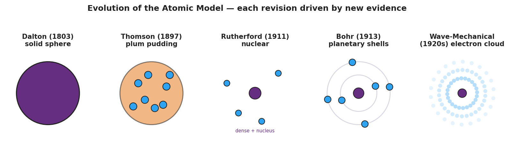

# Evolution of the Atomic Model — Student Notes

**Unit: Atomic Concepts — Lesson 01**
Name: _______________________  Date: __________  Period: ____

---

## Learning Targets

By the end of today's 42 minutes I can:

- Express atomic-scale sizes in **scientific notation** and state how many orders of magnitude separate an atom from things I can see.
- Interpret the gold-foil deflection pattern as **evidence** and reason from it to the structure of the atom (a small, dense, positive **nucleus**; **electrons** outside; mostly empty space).
- Sequence the five atomic models (Dalton → Thomson → Rutherford → Bohr → wave-mechanical) and name the evidence that forced each revision.
- Explain, using Stability and Change, why scientists revise a **model** instead of treating it as permanent truth.

---

## Key Vocabulary

- **nucleus** — _______________________________________________
  _______________________________________________

- **electron** — _______________________________________________
  _______________________________________________

- **model** — _______________________________________________
  _______________________________________________

---

## Guided Notes

**The big idea — Stability and Change:** A scientific model is a __________ explanation of how something works. It stays in use as long as it explains the __________. When new evidence appears that the old model __________ explain, scientists __________ the model. The model is not permanent truth — it changes when evidence demands it.

**The problem: an atom is too small to see.**

- A human hair is about 10⁻⁴ m wide; a single atom is about 10⁻¹⁰ m wide — about __________ powers of ten smaller (roughly a million times smaller).
- No light microscope can photograph an atom, because an atom is smaller than the __________ of visible light.
- So scientists learned about the atom using __________ evidence — they fired particles at atoms and studied the pattern of what bounced back.

**The Rutherford gold-foil experiment — reading the evidence:**

| What the alpha particles did | How often | What it proves |
|---|---|---|
| Passed straight through | the vast majority | the atom is mostly __________ |
| Bounced almost straight back | very rare | there is a tiny, dense, __________ -charged core |

**The structure of the atom (the modern, nuclear model):**

- The __________ is the tiny, dense core. It contains the positive __________ and the neutral __________.
- The negative __________ are found outside the nucleus, in the mostly-empty space.

**The figure — five models, each revised by new evidence:**

Fill in the evidence that forced each revision:

- **Dalton → Thomson:** the discovery of the __________ showed the atom is divisible (it has parts inside).
- **Thomson → Rutherford:** the gold-foil __________ proved the positive charge is concentrated, not spread out.
- **Rutherford → Bohr → Wave-mechanical:** later evidence showed electrons are not in fixed circular orbits but occupy regions of __________ (an electron cloud).

---

## Worked Example

**Scenario:** A pair of students runs the gold-foil simulation. Out of 1000 alpha particles fired at the gold foil, about 985 pass straight through, about 14 deflect at an angle, and exactly 1 bounces almost straight back. They must reason from this evidence to the structure of the atom.

**Step 1 — Interpret the "most pass straight through" result:**

985 of 1000 passed through untouched. This means the atom is mostly _______________________________________________.

**Step 2 — Interpret the rare "bounce straight back" result:**

A fast, positive particle bounces back only if it hits something small, dense, and _______________ -charged. So the atom must contain a _______________.

**Step 3 — Name the structure:**

The tiny dense core is the _______________. It holds the _______________ (positive) and _______________ (neutral). The _______________ are outside it.

**Step 4 — Which model does this data produce?** Circle one: Dalton / Thomson / **Rutherford (nuclear)** / Bohr

**Step 5 — Because / But / So:**

The plum-pudding model had to be replaced
**because** _______________________________________________,
**but** _______________________________________________,
**so** _______________________________________________.

*Check your reasoning:* "because" should name the surprising evidence (the bounce-backs); "but" should explain why pudding could never produce it; "so" should state the new structure (a concentrated nucleus).

---

## Summary

Complete the Because / But / So sentence:

> Scientists keep revising the atomic model
> because __________________________________________,
> but __________________________________________,
> so __________________________________________.

**Key idea to remember:** Scientists cannot photograph an atom, so they build **models** from **indirect evidence**. Each model — Dalton, Thomson, Rutherford, Bohr, wave-mechanical — explained more evidence than the one before it. The modern atom is a tiny **nucleus** of protons and neutrons surrounded by **electrons** in mostly-empty space.

**Key reference (from the 2025 NYS Reference Tables):**
Atom diameter ≈ 1 × 10⁻¹⁰ m  ·  Nucleus diameter ≈ 1 × 10⁻¹⁴ m
The nucleus holds the protons (charge 1+) and neutrons (charge 0); electrons (charge 1−) lie outside it.
