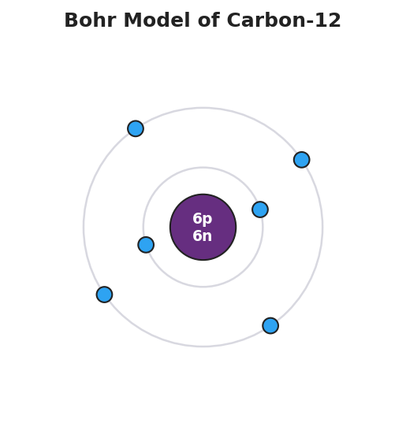

# Evolution of the Atomic Model — Teacher Guide

## Cover

**Unit: Atomic Concepts — Lesson 01: Evolution of the Atomic Model**
East Meadow Schools × Valley Stream Central High School District
Strategy chips: ACTIVE LEARNING, RESTORATIVE CIRCLE

---

## Curated Resources (from East Meadow Scope & Sequence)

### NYSSLS Standards

**HS-PS1-1 (foundation)** — Students develop the structural picture of the atom that the standard names: *a positively-charged nucleus composed of both protons and neutrons, surrounded by negatively-charged electrons.* This lesson is the historical and evidentiary on-ramp to that picture. Rather than handing students the modern atom as a finished fact, the lesson reconstructs how the model was built: Dalton's indivisible sphere, Thomson's discovery of the electron (the "plum pudding"), Rutherford's gold-foil experiment that located the dense, positive nucleus, Bohr's quantized shells, and the wave-mechanical "electron cloud." The throughline is the Science-and-Engineering Practice of *Engaging in Argument from Evidence* and *Developing and Using Models* (SEP-2, SEP-7): each model was the best available explanation until new evidence forced a revision.

The Cross-Cutting Concept of **Structure and Function / Stability and Change** is the explicit lens: a scientific model is not permanent truth — it is a stable structure that *changes* when evidence demands it. By the end, students can place the modern nuclear atom at the end of a chain of evidence-driven revisions, which is exactly the conceptual foundation HS-PS1-1 assumes.

### Phenomenon

A single human hair is about 0.0001 m (1 × 10⁻⁴ m) across — already near the edge of what the unaided eye can resolve. An atom is roughly 1 × 10⁻¹⁰ m across: a *million* times smaller than the width of that hair. No microscope in 1900 — and no ordinary light microscope ever — can form a direct image of a single atom, because atoms are far smaller than the wavelength of visible light. And yet, by 1911, scientists confidently described the inside of the atom: a tiny dense core of positive charge with electrons far outside it.

**The hook:** *How can scientists "see" something far too small to see?* Open with the "Zoom in to a Pinhead" sequence (and/or htwins.net *Scale of the Universe*): start at a pinhead you can hold, then zoom down by powers of ten — skin cells, a strand of DNA, a single atom, the nucleus inside it. The visceral message is the staggering gap in scale. Then pivot: if we cannot *photograph* an atom, how did anyone ever figure out what is inside one? The answer — indirect evidence, interpreted through models — is the whole lesson.

### Javalab / Labs

- **"Zoom in to a Pinhead" / htwins.net Scale of the Universe** (Engage): a powers-of-ten zoom from a pinhead (~1 × 10⁻³ m) down to a single atom (~1 × 10⁻¹⁰ m) and its nucleus (~1 × 10⁻¹⁴ m). Students record each scale in scientific notation and count the powers of ten between a hair and an atom (about 6 orders of magnitude). This builds the measurement/scale/scientific-notation skill the Scope & Sequence calls for and makes the "too small to see" problem concrete.
- **Rutherford gold-foil simulation** (Explore — the core activity): students fire simulated alpha particles at a thin gold foil and record where they land. Most pass straight through; a few deflect at large angles; a very few bounce almost straight back. Students collect the deflection pattern as *data* and then reason backward to what the foil's atoms must look like — exactly as Rutherford did. Use the PhET "Rutherford Scattering" simulation or any Javalab gold-foil module; no specific URL is required.
- **Atomic-model card sort / evidence-to-model match** (Explore, optional extension): cards pair a piece of evidence (e.g., "most particles passed straight through the foil") with the model revision it forced (e.g., "the atom is mostly empty space").

### Assessments

- **Atomic-model timeline** (district-aligned product): students order the five models and annotate each with the evidence that produced it and the limitation that the *next* model fixed. See `figures/atomic_model_timeline.png` as the visual scaffold.
- **Exit Ticket** (Phase 5): an evidence-to-model item (interpret a *new* deflection result) plus a short structure-of-the-atom check, kept deliberately distinct from the worksheet's gold-foil practice. See `Answer_Key.docx`.

---

## Lesson Overview

| | |
|---|---|
| **Duration** | 42 minutes (1 period) |
| **NYSSLS link** | HS-PS1-1 (foundation) — nuclear atom: protons + neutrons in the nucleus, electrons outside; SEP-2 / SEP-7 (models & argument from evidence) |
| **CCC focus** | Stability and Change / Structure and Function — a model is a *stable* explanation that *changes* when new evidence cannot be explained by the old structure |
| **Strategy chips** | ACTIVE LEARNING (students generate the deflection data and reason to the model themselves before any model is named); RESTORATIVE CIRCLE (unit-opening circle for Atomic Concepts) |
| **Materials** | Projector for the "Zoom to a Pinhead" / htwins.net sequence; Rutherford gold-foil simulation (one device per pair, or a single projected run with student data collection); `figures/atomic_model_timeline.png` and `figures/bohr_model_carbon.png` projected; the 2025 NYS Chemistry Reference Tables; calculators (for scientific-notation scale work) |
| **Safety** | No chemicals or hazards — this is a modeling and simulation lesson. Standard digital-device norms apply. |
| **Prior knowledge** | Unit 1 measurement: scientific notation and orders of magnitude (used in the scale zoom). Students need no prior atomic-structure content — building it from evidence is the point. |

**Lesson objectives — students can:**

- Express atomic-scale sizes (hair, cell, atom, nucleus) in scientific notation and state how many orders of magnitude separate an atom from objects we can see.
- Interpret the gold-foil deflection pattern as *evidence* and reason from it to the nuclear structure of the atom (small, dense, positive nucleus; electrons outside; mostly empty space).
- Sequence the five atomic models (Dalton → Thomson → Rutherford → Bohr → wave-mechanical) and name the evidence that forced each revision.
- Explain, using Stability and Change, why scientists revise a model rather than treating it as permanent truth.

---

## Phase 1 · Engage *(0 – 10 min)*

### 0–3 min · Opening Circle + Do Now

Begin with the **Restorative Circle** (see Strategy Spotlight — this is the opening lesson of the Atomic Concepts unit). Everyone in the room — teacher included — briefly answers: *"Tell us about a time you figured out something was there even though you couldn't see it directly — like knowing someone was home from the lights on, or what's in a wrapped gift by shaking it."* One round, one sentence each, pass allowed. This primes the lesson's central move — learning about the unseen through indirect evidence — using students' own lived reasoning.

Then post the **Do Now**:

> *"A human hair is about 0.0001 m wide. An atom is about 0.0000000001 m wide. In one sentence: about how many times smaller is an atom than the width of a hair, and could you ever see a single atom with an ordinary microscope? Why or why not?"*

Give students 2 minutes to write silently, then take two or three responses.

**Anticipated student responses to Do Now:**

- "A lot smaller — like a million times." — affirm; we will pin the exact power of ten during the zoom (it is about 10⁶, a million).
- "No, you can't see it — it's too tiny." — push gently: *too tiny* compared to what? Set up the idea that atoms are smaller than the wavelength of visible light, so no light microscope can ever image one.
- "Maybe with a really strong microscope?" — validate the instinct, and note we will see that scientists found a different route entirely: indirect evidence.

### 3–8 min · Phenomenon hook — Zoom to a Pinhead

**Teacher actions.** Run the "Zoom in to a Pinhead" sequence (or htwins.net *Scale of the Universe*). Start with a pinhead you can hold (~1 × 10⁻³ m). Zoom by powers of ten: skin cell (~1 × 10⁻⁵ m), then a strand of DNA, then a single atom (~1 × 10⁻¹⁰ m), then the nucleus inside it (~1 × 10⁻¹⁴ m). Have students call out or jot each scale in scientific notation as you pass it.

**Sample teacher language:**

> "We just dropped from a pinhead you can hold in your fingers down to a single atom — and we crossed about *seven* powers of ten to get there. A hair is 10⁻⁴ meters; an atom is 10⁻¹⁰ meters. That is six zeros of difference — the atom is about a *million* times smaller than the width of one hair. No microscope in 1900 could photograph that. No light microscope ever can, because an atom is smaller than the wavelength of the light we'd use to look at it. So here is the puzzle that built this entire unit: if you can't take a picture of an atom, how do you find out what's inside one?"

**Anticipated student responses:**

- "So how *did* they find out?" — exactly the driving question; tell them they are about to do it themselves with real data.
- "Did they use math?" — yes, and more: they used *indirect evidence* — they fired things at atoms and watched what bounced back.
- "Is the nucleus the small dot in the middle?" — capture it; we will earn that claim from data in Phase 2, not assert it now.

**Driving question** (post on the board and leave it there):

> *How can scientists "see" something far too small to see?*

### 8–10 min · Notice & Wonder + Turn-and-Talk #1

Two columns on the board: **I notice… / I wonder…**

Collect 3–4 responses about the scale zoom. Then:

> "Turn to your partner: if you can't see an atom directly, what could you do *instead* to figure out what's inside it? Think about how you'd learn the shape of something hidden inside a box without opening it."

Target insight (leave open if no one lands it): you could throw or shoot something *through* it and watch how it bounces — the pattern of what comes back tells you about the hidden structure. That is precisely the gold-foil idea, and it is what they will do next.

---

## Phase 2 · Explore *(10 – 30 min)*

### 10–14 min · ABCs Activity — predict before the simulation

**Before any model or vocabulary is introduced**, students commit to a prediction. Project a thin sheet of gold foil and a stream of tiny, fast, positively-charged "bullets" (alpha particles) aimed at it.

**Prompt on the board:**

> *"In 1909, the accepted picture of the atom was a soft, evenly-spread blob of positive charge with electrons stuck in it like raisins in pudding. If that picture were true, and you fired tiny fast positive particles at a sheet of gold atoms, what would happen to the particles? Draw or write your prediction."*

**Anticipated student responses during the ABCs prediction:**

- "They'd all go straight through — pudding is soft, nothing solid to stop them." — perfect; this is exactly what the plum-pudding model predicts, and it sets up the surprise.
- "Maybe they'd slow down a little." — reasonable; capture it.
- "Some might bounce off." — interesting; ask *what* would have to be inside the atom for a fast particle to bounce back hard.

This prediction is the active-learning anchor: students own a hypothesis *before* they see the data, so the result lands as a genuine surprise that demands a model revision.

### 14–26 min · Investigation — Rutherford gold-foil simulation (ACTIVE LEARNING core)

Hand out (or project) the worksheet. Pairs run the gold-foil simulation and tally where the alpha particles end up. If you have one device, run it projected and have every student record the class data.

**Data students collect (record on the worksheet):**

| Outcome | Roughly how often | What it suggests |
|---|---|---|
| Passes straight through, no deflection | the vast majority | the atom is mostly empty space |
| Deflected at a small/large angle | a small fraction | something concentrated and charged is in there |
| Bounces almost straight back | very rare (≈ 1 in 8000 in Rutherford's data) | a tiny, dense, positively-charged core repels the positive particle |

**Teacher facilitation language (circulate — ACTIVE LEARNING):**

> "Don't tell me the answer yet — collect the data first. Out of every hundred particles, roughly how many go straight through? How many bounce way back? Get the *pattern* before you explain it."

> "You predicted they'd all sail through the pudding. Did they? What did the rare bounce-backs do to your prediction? A fast, heavy bullet doesn't bounce off pudding — what would it take to bounce one straight back?"

> "If almost everything passes through untouched, what does that tell you about how much of the atom is actually *stuff* versus empty space?"

**Anticipated student responses:**

- "Almost all of them went straight through!" — yes; reason it out: the atom must be mostly empty.
- "A couple came straight back — that shouldn't happen with pudding." — exactly Rutherford's reaction. He famously said it was as surprising as firing a shell at tissue paper and having it bounce back.
- "So there's something tiny and hard in the middle?" — they have just reconstructed the nucleus from data. Hold the word *nucleus* until Phase 3.

### 26–30 min · Reason from evidence to a new model

Pairs sketch the atom that their data *requires*: mostly empty space, a tiny concentrated core of positive charge (to repel the positive alpha particles that bounce back), with the negative electrons somewhere outside. Compare two or three student sketches under the document camera.

**Teacher facilitation language:**

> "Your data killed the pudding model — you saw it die. The rare straight-back bounces can only happen if the positive charge is squeezed into a tiny, dense spot, not smeared out. So redraw the atom the way your *evidence* demands. Where is the positive charge? How much of the atom is empty?"

This is the evidence-to-model move at the heart of HS-PS1-1: students don't receive the nuclear atom — they derive it.

---

## Phase 3 · Explain *(30 – 36 min)*

### 30–33 min · Turn-and-Talk #2 + class consensus

> "Look at the sketch your data forced you to draw. Turn to your partner: the plum-pudding model wasn't *stupid* — it fit the evidence people had in 1904. So why did scientists throw it out? What exactly did the gold-foil data do to it?"

Target consensus:

> "A model lives as long as it explains the evidence. The plum-pudding model could not explain the bounce-backs — pudding can't deflect a fast bullet. New evidence the old model couldn't explain is what forces a revision. The model didn't fail because someone disliked it; it failed because it made a prediction the data contradicted."

> "So is the nuclear model the final, permanent truth?" — Hold the answer; it sets up the timeline. Even Rutherford's model got revised (Bohr added shells; the wave-mechanical model replaced fixed orbits with a probability cloud).

### 33–36 min · Vocabulary introduction (exactly 3 terms)

**Sample teacher language:**

> "Now let's name what you built from your data. The tiny, dense, positively-charged core that repelled your alpha particles — the thing in the middle that the bounce-backs proved must exist — is the **nucleus**. It holds the positively-charged protons and the neutral neutrons, and it carries almost all the atom's mass in almost none of its volume. The negatively-charged **electrons** are the light particles outside the nucleus, filling the mostly-empty space — they are what later models (Bohr, then wave-mechanical) tried to describe more precisely. And the picture you drew — the simplified representation you reasoned to from data — is a scientific **model**: not a photograph of the atom, but our best explanation that fits all the current evidence and gets revised when new evidence arrives."

Post the three terms — **nucleus, electron, model** — on the board. Students fill them in on their notes. Then project `figures/atomic_model_timeline.png` and `figures/bohr_model_carbon.png`:

![Five-panel timeline of the atomic model: Dalton's solid purple sphere (1803), Thomson's plum-pudding (1897) with blue electrons embedded in a positive orange sphere, Rutherford's nuclear atom (1911) with a tiny dense central nucleus and a few distant electrons in empty space, Bohr's planetary model (1913) with electrons on two defined circular shells around the nucleus, and the wave-mechanical electron-cloud model (1920s) with a fuzzy probability cloud of electrons around the nucleus; a banner reads "each revision driven by new evidence."](figures/atomic_model_timeline.png)

**Discussion prompts to deploy here:**

- "On the timeline, point to the model your gold-foil data produced." — *Expected response:* Rutherford (nuclear) — tiny dense core, mostly empty space.
- "In the carbon Bohr model, where are the protons and neutrons, and where are the electrons?" — *Expected response:* protons (6p) and neutrons (6n) are together in the central nucleus; the 6 electrons are outside, on the shells. That is exactly the structure HS-PS1-1 names.

---

## Phase 4 · Elaborate *(36 – 40 min)*

### 36–39 min · Build the timeline + Because/But/So

Students use `figures/atomic_model_timeline.png` to put the five models in order and pair each with its evidence and its fatal limitation. Walk the chain aloud:

- **Dalton** — atoms are solid, indivisible spheres. *Revised because* Thomson discovered the electron (a piece *inside* the atom) — so atoms are divisible.
- **Thomson (plum pudding)** — electrons embedded in a positive blob. *Revised because* the gold-foil bounce-backs proved the positive charge is concentrated, not spread out.
- **Rutherford (nuclear)** — tiny dense positive nucleus, electrons outside, mostly empty space. *Revised because* it couldn't explain why electrons don't spiral into the nucleus or why elements emit specific colors of light.
- **Bohr (planetary shells)** — electrons in fixed circular orbits/shells. *Revised because* electrons don't travel in neat circles; their exact paths can't be pinned down.
- **Wave-mechanical (electron cloud)** — electrons occupy regions of probability around the nucleus. *Current best model.*

Then run a **Because / But / So** sentence:

> *"Scientists replaced Thomson's plum-pudding model with Rutherford's nuclear model."*

Model one aloud:

> "Scientists replaced the plum-pudding model **because** a few alpha particles bounced almost straight back off the gold foil, **but** a soft, evenly-spread positive blob could never deflect a fast positive particle that hard, **so** the positive charge had to be concentrated in a tiny dense nucleus — a structure the old model didn't contain."

Then have students write their own B/B/S for one of these:

- *"Scientists replaced Dalton's solid-sphere model with Thomson's plum-pudding model…"* (hint: the discovery of the electron)
- *"Scientists replaced Bohr's fixed-orbit shells with the wave-mechanical electron cloud…"* (hint: electron paths can't be pinned down exactly)

### 39–40 min · Return to the phenomenon

> "Return to our driving question: how can scientists 'see' something far too small to see? You never photographed an atom today. But you fired particles at one and watched the pattern of what came back — and from that pattern you reasoned out a nucleus you can't see. In one sentence: how did indirect evidence let you 'see' the inside of the atom?"

Target: "By firing particles at atoms and studying how they deflect, scientists collect indirect evidence that reveals the hidden structure — the bounce-backs prove a tiny dense nucleus exists, even though no one can take its picture."

---

## Phase 5 · Evaluate *(40 – 42 min)*

### 40–42 min · Exit Ticket + Closing Reflection

Post or read aloud:

> *(a) A scientist fires alpha particles at a thin sheet of aluminum foil. She finds that even MORE particles than expected bounce back at large angles compared to gold. What can she conclude — and how does this show that evidence drives the model?*
> *(b) In one or two sentences, describe where the protons, neutrons, and electrons are located in the modern (nuclear) atom.*
> *(c) Explain in one sentence why scientists kept revising the atomic model instead of declaring one version final.*

Expected answers are in `Answer_Key.docx`. (Note: the Exit Ticket uses an *aluminum* deflection scenario, deliberately different from the worksheet's *gold*-foil practice.)

**Closing Reflection (SEL, 30 seconds):**

> "Today you figured out the inside of an atom without ever seeing one. In one sentence: what is one thing that surprised you about how scientists learn about the invisible — and who, a partner or an idea, helped you get there?"

Collect worksheets; flag students who still wrote that the bounce-backs mean "the atom is solid" — they have inverted the empty-space conclusion and need a brief re-check next period.

---

## Common Misconceptions

- **Misconception:** "Scientists can take a picture of an atom, so they just looked." → **Correction:** A single atom (~10⁻¹⁰ m) is smaller than the wavelength of visible light, so no light microscope can ever image one. Atomic structure was — and largely still is — inferred from *indirect* evidence (deflection patterns, spectra), interpreted through models. This is the lesson's whole point.
- **Misconception:** "The plum-pudding model was just wrong/stupid." → **Correction:** It was the best explanation of the evidence available in 1904 (electrons exist; atoms are neutral overall). It was *replaced*, not ridiculed, when the gold-foil data revealed something it could not explain. Good models can still be superseded.
- **Misconception:** "Most alpha particles bouncing back proved the atom is solid." → **Correction:** The opposite. *Most* particles passed straight through — that is the evidence the atom is mostly empty space. Only a tiny fraction bounced back, and *that* rare event revealed the small, dense nucleus. Students often invert which result means what.
- **Misconception:** "The Bohr model (electrons in neat circles) is the current, correct model." → **Correction:** The Bohr model is a useful teaching picture, but the current model is wave-mechanical: electrons occupy regions of *probability* (an electron cloud), not fixed circular orbits. The timeline ends with the cloud, not with Bohr.
- **Misconception:** "Because the model keeps changing, scientists don't really know anything." → **Correction:** Revision is a strength, not a weakness. Each model explained more evidence than the last; the modern nuclear atom is extremely well supported. Stability and Change: the model is stable until evidence demands an improvement — that is how science earns reliable knowledge.

---

## Access & Differentiation

- **ELL/ENL supports:** Sentence frames for the evidence-to-model reasoning: *"Most particles ___, which shows the atom is ___."* and *"A few particles ___, which shows there is a ___."* Word-choice box displayed throughout: {nucleus, electron, proton, neutron, model, evidence, empty space, deflect}. Pair vocabulary with gestures: a tight fist for the dense nucleus, fingers spread wide for the mostly-empty electron region. Allow students to label the timeline panels in their home language first, then translate the key term to English.
- **IEP/SPED supports:** Provide a pre-structured data-tally sheet for the gold-foil simulation (three labeled rows: "straight through," "deflected," "bounced back") so the cognitive load is on interpreting the pattern, not designing the table. Pre-print the five timeline model names in order; the student's task is to match each to its one-line evidence card rather than recall the sequence. Offer the Exit Ticket with sentence starters. Calculator permitted for the scientific-notation scale work.
- **Extensions:** (1) Estimate, in scientific notation, how many times larger the whole atom (~10⁻¹⁰ m) is than its nucleus (~10⁻¹⁴ m) — about 10⁴, ten thousand times — and write a sentence on what that ratio says about how empty the atom is. (2) Research the discovery of the neutron (Chadwick, 1932): what evidence revealed a *neutral* particle in the nucleus, and which model did it complete? (3) Look up how a scanning tunneling microscope (1981) finally let scientists "image" atoms — and explain why it is still *indirect* (it maps electron probability, not a photograph).

---

## Strategy Spotlight

**ACTIVE LEARNING — students generate the data and reason to the model themselves.** The defining move of this lesson is that no one tells students what is inside an atom until *after* they have produced the gold-foil deflection pattern and reasoned from it. Active learning means the cognitive work of discovery sits with the student, not the teacher: students predict (plum-pudding → "all pass through"), collect data (the simulation), confront the surprise (rare bounce-backs), and revise the model (a tiny dense nucleus). The teacher's job during the Explore phase is to *withhold the answer* and ask questions that push students to interpret their own evidence.

**How to run it in this lesson (Phase 2):**

1. Lock in a prediction *before* the simulation (the ABCs prompt). A committed prediction makes the contradicting data land as a genuine surprise.
2. Have students collect and tally the deflection pattern as raw data — quantities, not conclusions — before any interpretation.
3. Circulate with questions, never answers: *"What would it take to bounce one straight back?"* Let students say "a tiny hard thing in the middle" themselves.
4. Only in Phase 3 do you name the structure (nucleus) they already built. The vocabulary labels their discovery; it does not deliver it.

Research on active learning in science (Freeman et al., 2014; the East Meadow inquiry framework) consistently finds that students who derive a model from evidence retain the concept and the *reasoning* far better than students who receive the model and then look for confirming examples. The gold-foil experiment is the canonical vehicle for this because the result is genuinely counterintuitive — the surprise is the engine of learning.

**Connection to Hochman literacy:** the active-learning sequence sets up the Because/But/So writing in Phase 4 cleanly, because students have just lived a *cause* (the bounce-back data), a *contrast* (but pudding can't do that), and a *consequence* (so the charge must be concentrated). The B/B/S frame simply names the reasoning they already performed.

**RESTORATIVE CIRCLE (unit opener).** As the first lesson of Atomic Concepts, a 2–3 minute opening circle — *"a time you knew something was there without seeing it directly"* — builds community and surfaces students' intuitive use of indirect evidence, the exact reasoning the gold-foil experiment formalizes.

---

## NYSSLS Observation Checklist Crosswalk

| # | Checklist item | Where it appears in this lesson |
|---|---|---|
| 1 | Local/relatable phenomenon | Phase 1 — "Zoom to a Pinhead" scale gap (hair vs. atom) and the puzzle of seeing the unseen; returns in Phase 4 driving-question close |
| 2 | Turn and Talk (2–3×) | Phase 1 (TT#1 — how could you learn the inside of something hidden?); Phase 3 (TT#2 — why did the plum-pudding model get replaced?) |
| 3 | Students develop questions/models/procedures | Phase 2 ABCs prediction; gold-foil data collection; students sketch the nuclear atom their data requires (model-building) |
| 4 | CCC defined and used | Lesson Overview · *Stability and Change*, explicit in Phase 3 consensus ("a model lives as long as it explains the evidence") and Phase 4 timeline of revisions |
| 5 | ENL — ≤ 3 vocab, second half | Phase 3 — vocabulary introduced at 33–36 min: nucleus / electron / model |
| 6 | Revisit phenomenon with evidence | Phase 4 — students return to "see the unseen" question armed with their own deflection data; build the evidence-to-model timeline |
| 7 | ENL/SPED supports | Access & Differentiation block: sentence frames, word-choice box, pre-structured tally sheet, pre-ordered timeline names, Exit Ticket starters |
| 8 | Assessment check | Phase 5 — Exit Ticket (interpret a *new* aluminum-foil deflection result; locate p/n/e; explain why models are revised) |

---

## Companion Materials

- `Student_Worksheet.docx` — the 5E student investigation (hand out at start of Phase 2)
- `Student_Notes.docx` — guided note-guide for vocabulary, the timeline, and the worked evidence-to-model example
- `Answer_Key.docx` — answers to "Make It Make Sense" prompts and the Exit Ticket

---

## Key Vocabulary (max 3)

- **nucleus** — the tiny, dense, positively-charged core at the center of an atom; it contains the protons (positive) and neutrons (neutral) and holds nearly all of the atom's mass in nearly none of its volume; its existence was revealed by the gold-foil bounce-backs
- **electron** — the negatively-charged particle found outside the nucleus, filling the atom's mostly-empty space; how electrons are arranged is what the Bohr and wave-mechanical models describe
- **model** — a simplified representation (not a photograph) of something too small, large, or hidden to observe directly; a scientific model is the best explanation that fits current evidence and is revised when new evidence cannot be explained by it
