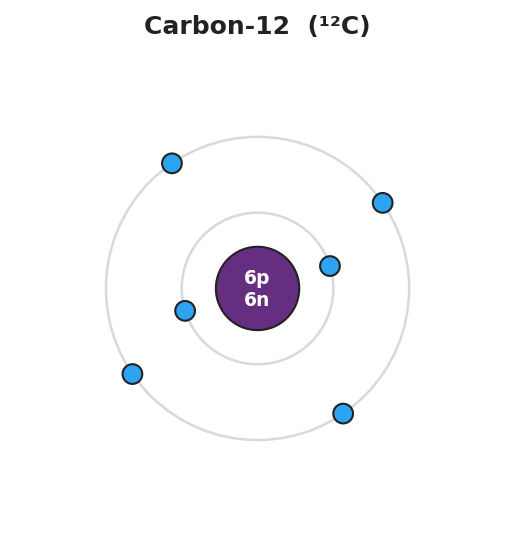

# Determining Number of Subatomic Particles — Student Notes

**Unit: Atomic Concepts — Lesson 02**
Name: _______________________  Date: __________  Period: ____

---

## Learning Targets

By the end of today's 42 minutes I can:

- Read the **atomic number** (Z) and **mass number** (A) of an element and state that the atomic number equals the number of protons.
- Calculate the number of neutrons using neutrons = mass number − atomic number (A − Z).
- Determine the number of electrons in a neutral atom (electrons = protons) and in an ion (electrons = protons − charge).
- Explain, using Patterns, why the number of protons — not neutrons or electrons — fixes the identity of an element.

---

## Key Vocabulary

- **atomic number** — _______________________________________________
  _______________________________________________

- **mass number** — _______________________________________________
  _______________________________________________

- **isotope** — _______________________________________________
  _______________________________________________

---

## Guided Notes

**The big idea — Patterns:** The Periodic Table is ordered by __________ count. The atomic number rises by exactly __________ from one element to the next. Neutron count and electron count can __________ without changing the element, but the proton count __________.

**The three formulas (use these for every atom or ion):**

| Particle | Formula | Where the numbers come from |
|---|---|---|
| Protons | = __________ | atomic number (Periodic Table) |
| Neutrons | = mass number − __________ | A − Z |
| Electrons (neutral) | = __________ | same as protons |
| Electrons (ion) | = protons − __________ | adjust for the charge |

**Reading the symbol notation:**

In a symbol like ³⁹K, the small upper-left number (39) is the __________ number, and the element symbol tells you the __________ number from the Periodic Table.

In an ion like ²⁴Mg²⁺, the **+2** is the __________. A *positive* charge means the atom __________ electrons; a *negative* charge means the atom __________ electrons.

**The Hochman appositive definition:**

> The atomic number — _________________________ — is what determines _________________________.

**The figure — a carbon-12 atom built from its particles:**

From the figure above, fill in the blanks:

- Protons in the nucleus: ___      Neutrons in the nucleus: ___      Electrons around it: ___
- Atomic number of this atom: ___      → therefore the element is: ___________
- Mass number of this atom (protons + neutrons): ___

---

## Worked Example

**Scenario:** Determine the protons, neutrons, and electrons in a magnesium-24 ion, written ²⁴Mg²⁺.

**Step 1 — Read the atomic number from the Periodic Table:**

Mg atomic number (Z) = ___      →      protons = ___

**Step 2 — Read the mass number from the symbol:**

Mass number (A) = ___

**Step 3 — Find the neutrons (A − Z):**

Neutrons = ___ − ___ = ___

**Step 4 — Find the electrons (protons − charge):**

The charge is **+2**, which means the atom **lost** ___ electrons.

Electrons = protons − charge = ___ − 2 = ___

**Step 5 — Appositive sentence:**

The atomic number of magnesium — ___ — tells us this ion still has ___ protons, so it is still magnesium even though it lost two electrons.

**Step 6 — Because / But / So**

A magnesium ion (Mg²⁺) is still magnesium
**because** _______________________________________________,
**but** _______________________________________________,
**so** _______________________________________________.

*Check your reasoning:* "because" should name the unchanged proton count; "but" should name what *did* change (the electrons / charge); "so" should state that the element is unchanged.

---

## Summary

Complete the appositive sentence:

> The atomic number — _________________________ — is what determines _________________________.

Complete the Because / But / So sentence:

> Adding one proton to a carbon atom turns it into nitrogen
> because __________________________________________,
> but __________________________________________,
> so __________________________________________.

**Reminder:** Protons come straight from the atomic number. Neutrons = mass number − atomic number. Electrons = protons (neutral) or protons − charge (ion). Only the **proton count** sets the element's identity.

**Key reference (from the 2025 NYS Reference Tables):**
Atomic number and atomic mass: Periodic Table (Reference Table S)
Particles: proton (+1, in nucleus) · neutron (0, in nucleus) · electron (−1, around nucleus)
