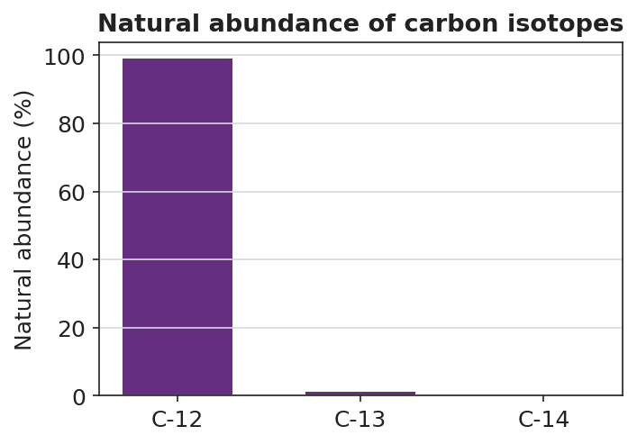

# Isotopes & Average Atomic Mass — Student Worksheet

**Unit: Atomic Concepts — Lesson 04**
Name: _______________________  Date: __________  Period: ____

---

## Phenomenon

Scientists recover an ancient turtle shell from a coastal marsh dig. They cannot read a date off the shell, but by measuring the **carbon-14** inside it they can tell *when the turtle died* — and, by comparing shells from sites up and down the coast, *when an ancient turtle population migrated*. While the turtle was alive and eating, its shell held the same tiny fraction of carbon-14 as the world around it. The moment it died, no new carbon-14 came in, and the carbon-14 already there began ticking down at a fixed, known rate. Measure what's left, and you can read the clock backward.

**Driving question:** How can the kind of carbon atom in a turtle shell tell scientists when that turtle lived and migrated?

---

## Notice & Wonder

| I notice… | I wonder… |
|---|---|
|  |  |
|  |  |
|  |  |

**Turn & Talk #1:** Both diagrams above are carbon — same 6 protons, same 6 electrons. The only difference is the number of neutrons. In one sentence, would the turtle's *body* treat these two kinds of carbon differently, or the same? Why?

> _______________________________________________
> _______________________________________________

---

## Initial Model

Your group has a cup of **pennium** — a fictional element. There are two kinds: a **heavy** kind (pre-1982 pennies) and a **light** kind (post-1982 pennies). They are the same "element" but different masses. Your cup is mostly the **heavy** kind.

You will **not** calculate a number. Predict, then explain:

The average mass of a pennium in your cup will land (circle one):

- closer to the heavy mass
- closer to the light mass
- exactly in the middle

My reasoning (one sentence): _______________________________________________
_______________________________________________

---

## Investigation

### Part 1 — ABCs: Sort, count, and weigh your pennium

Sort your cup into the two kinds. Count each pile. Then weigh one of each kind (or use the masses your teacher gives you).

| Kind of pennium | Count (how many) | Mass of ONE (g) |
|---|---|---|
| Heavy (pre-1982) |  |  |
| Light (post-1982) |  |  |

(a) Which kind is **more abundant** (you have more of) in your cup? _______________

(b) If you grabbed one pennium at random, would you more likely grab the heavy or the light kind? _______________

(c) Does your prediction from the Initial Model still hold? Which mass does the average lean toward, and why?

> _______________________________________________
> _______________________________________________

### Part 2 — From pennium to real carbon

Look at the abundance of carbon's isotopes:

(a) Which isotope is almost all of the carbon in nature? _______________

(b) On the Periodic Table, carbon's **average atomic mass** is about **12.011**. Is that closer to 12 or to 13? _______________

(c) Use the chart to explain *why* carbon's average atomic mass is so close to 12.

> _______________________________________________
> _______________________________________________

### Part 3 — Reasoning about chlorine (no calculator needed)

On the Periodic Table, chlorine's average atomic mass is about **35.5**. Chlorine has two main isotopes: **chlorine-35** and **chlorine-37**.

(a) Is 35.5 closer to 35 or to 37? _______________

(b) Which isotope must be **more abundant**, and how do you know — without calculating?

> _______________________________________________
> _______________________________________________

---

## Make It Make Sense

**1. Are they isotopes?** Two atoms are described below.

- Atom X: 5 protons, 5 neutrons, 5 electrons
- Atom Y: 5 protons, 6 neutrons, 5 electrons

(a) What element are these? (Use the Periodic Table — what has 5 protons?) _______________

(b) Are X and Y isotopes of the same element? Explain using proton and neutron counts.

> _______________________________________________

(c) Write each one's **mass number**:  Atom X = _______   Atom Y = _______

**2. Boron's average atomic mass.** Boron (the element above) has isotopes boron-10 and boron-11. The Periodic Table lists boron's average atomic mass as about **10.81**.

(a) Is 10.81 closer to 10 or to 11? _______________

(b) Which isotope of boron is more abundant? How does the average tell you?

> _______________________________________________
> _______________________________________________

**3. One average, many atoms.** Carbon's average atomic mass is 12.011.

(a) Does any single carbon atom actually weigh 12.011 u? (yes / no) _______________

(b) Explain your answer using the word *isotope* and the word *abundant*.

> _______________________________________________
> _______________________________________________

---

## Vocabulary in Action

Use each term in a sentence about today's phenomenon or investigation. Do not copy the definition — use the word to describe something you observed or did.

- **isotope:** _______________________________________________
  _______________________________________________

- **mass number:** _______________________________________________
  _______________________________________________

- **average atomic mass:** _______________________________________________
  _______________________________________________

---

## Revise Your Model

Return to your Initial Model (the pennium prediction). Add vocabulary labels:

(a) Label the two kinds of pennium as "two ___________ of pennium."

(b) Label each kind's mass with the term that means protons + neutrons: ___________

(c) Label the predicted cup average with the Periodic-Table term it stands for: ___________

Then finish this Because / But / So sentence about the turtle:

> Carbon-12 and carbon-14 are both carbon
> because __________________________________________,
> but __________________________________________,
> so __________________________________________.

---

## Exit Ticket

(a) Two atoms are described below.

- Atom 1: 17 protons, 18 neutrons
- Atom 2: 17 protons, 20 neutrons

Are they isotopes of the same element? Name the element, and write each isotope's mass number.

> Element: _______________   Atom 1 mass number: _______   Atom 2 mass number: _______
> Isotopes? (yes / no) and why: _______________________________________________

(b) Chlorine's average atomic mass on the Periodic Table is about 35.5. Its two isotopes are chlorine-35 and chlorine-37. Which isotope is more abundant, and how do you know — without calculating?

> _______________________________________________
> _______________________________________________

(c) In one sentence, explain why radiocarbon dating of the turtle shell depends on an *unstable* isotope. Try to use the words *stable* and *unstable*, or the word *decay*.

> _______________________________________________
> _______________________________________________
