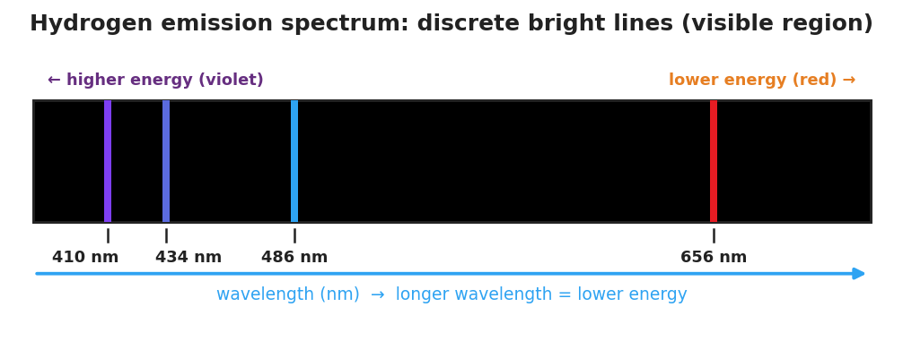

# Emission Spectrum & the Electromagnetic Spectrum — Student Notes

**Unit: Atomic Concepts — Lesson 08**
Name: _______________________  Date: __________  Period: ____

---

## Learning Targets

By the end of today's 42 minutes I can:

- Order the regions of the **electromagnetic spectrum** (radio → gamma) by wavelength, frequency, and energy.
- State the relationship between **wavelength**, **frequency**, and energy: as wavelength decreases, frequency and energy increase.
- Explain, using Energy and Matter, why high-energy radiation (UV, X-ray, gamma) can damage tissue while low-energy radiation (radio, microwave) cannot.
- Interpret an emission spectrum as evidence that electrons occupy fixed energy levels.

---

## Key Vocabulary

- **electromagnetic spectrum** — _______________________________________________
  _______________________________________________

- **wavelength** — _______________________________________________
  _______________________________________________

- **frequency** — _______________________________________________
  _______________________________________________

---

## Guided Notes

**The big idea — Energy and Matter:** All electromagnetic radiation carries __________. When radiation is absorbed by matter, that energy is __________ to the matter. The __________ a wave carries (set by its frequency) decides whether it can break chemical bonds and damage cells.

**The electromagnetic spectrum — one family of waves:**

The whole band — radio, microwave, infrared, visible, ultraviolet, X-ray, gamma — is all the *same kind of thing*: electromagnetic radiation traveling at the speed of light. The regions differ only in three properties:

| Property | Low-energy end (radio) | High-energy end (gamma) |
|---|---|---|
| Wavelength | __________ (long / short) | __________ (long / short) |
| Frequency | __________ (high / low) | __________ (high / low) |
| Energy | __________ (high / low) | __________ (high / low) |

**The relationship to memorize:**

> As wavelength gets **shorter**, frequency gets __________ and energy gets __________.
> (Wavelength moves *opposite* to frequency and energy.)

**The figure — the electromagnetic spectrum:**

From the figure, fill in the blanks:

- Region with the longest wavelength: ___________
- Region with the highest energy: ___________
- The "danger to living tissue" line falls between ___________ and ___________.

**Why UV is dangerous but radio is not:**

Radio waves have a __________ wavelength and __________ energy — not enough to break chemical bonds, so they pass through harmlessly. Ultraviolet light has a __________ wavelength and __________ energy — enough to break the bonds in DNA and skin cells, which is what causes a __________.

**The emission spectrum — evidence for energy levels:**

When an atom is given energy, its electrons jump to a __________ energy level. They cannot stay there, so they fall back. When an electron falls, the atom gives off a __________ (a particle of light) of one specific energy — and therefore one specific __________.

- An emission spectrum is a set of __________ bright lines, NOT a continuous rainbow.
- The lines are discrete because electrons can only occupy __________ energy levels, so only certain drops (and certain colors) are allowed.
- Each element gives a __________ set of lines — a fingerprint of its energy levels.

---

## Worked Example

**Scenario:** Compare two waves in the hydrogen emission spectrum — the red line at 656 nm and the violet line at 410 nm — and decide which carries more energy.

**Step 1 — Compare the wavelengths:**

Red line wavelength = ___ nm  Violet line wavelength = ___ nm

Which is shorter? ___________

**Step 2 — Apply the relationship (shorter wavelength → higher frequency → higher energy):**

The __________ line has the shorter wavelength, so it has the higher frequency and the __________ energy.

**Step 3 — Connect to electron drops:**

A higher-energy photon comes from a __________ (larger / smaller) drop between energy levels. So the violet line came from a __________ electron drop than the red line.

**Step 4 — Appositive sentence:**

The violet line — the hydrogen line with the shortest visible wavelength (410 nm) — carries _______________ because _______________.

**Step 5 — Because / But / So:**

The violet line carries more energy than the red line
**because** _______________________________________________,
**but** _______________________________________________,
**so** _______________________________________________.

*Check your reasoning:* "because" should name the shorter wavelength; "but" should acknowledge that both are just light from hydrogen; "so" should state that the violet line came from a larger electron drop and carries more energy.

---

## Summary

Complete the appositive sentence:

> The electromagnetic spectrum — _________________________ — runs from low-energy radio waves to high-energy gamma rays.

Complete the Because / But / So sentence:

> Ultraviolet light can damage your skin but radio waves cannot,
> because __________________________________________,
> but __________________________________________,
> so __________________________________________.

**Reminder:** For all electromagnetic radiation, wavelength and energy move in **opposite** directions. Shorter wavelength = higher frequency = higher energy = more able to damage matter.

**Key reference (from the 2025 NYS Reference Tables):**
Speed of light: c = f × λ (frequency × wavelength), constant for all EM waves
Energy of a photon increases with frequency (E = hf)
