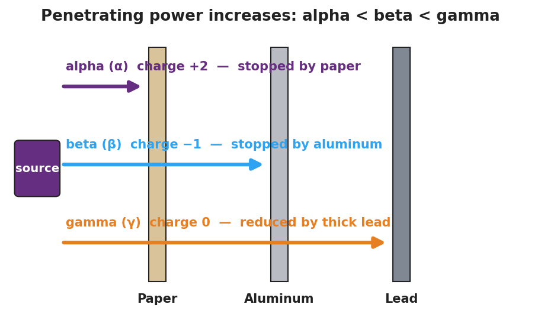
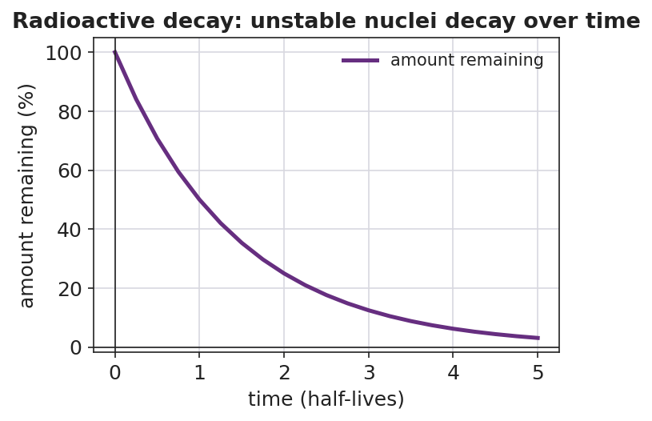

# Radioactivity — Student Notes

**Unit: Nuclear Chemistry — Lesson 01**
Name: _______________________  Date: __________  Period: ____

---

## Learning Targets

By the end of today's 42 minutes I can:

- Identify **alpha** (⁴₂He), **beta** (⁰₋₁e, an electron), **positron** (⁰₊₁e), and **gamma** (⁰₀γ) emissions by symbol, charge, and mass.
- Rank alpha, beta, and gamma by **penetrating power** and match each to what stops it (paper, aluminum, lead).
- Write and balance a **nuclear decay equation** so that mass number (A) and atomic number (Z) are conserved, and name the daughter element by its new proton number.
- Explain, using **Energy and Matter (conservation)**, why an unstable nucleus decays on its own.

---

## Key Vocabulary

- **radioactive decay** — _______________________________________________
  _______________________________________________

- **nuclear radiation** — _______________________________________________
  _______________________________________________

- **parent / daughter nuclide** — _______________________________________________
  _______________________________________________

---

## Guided Notes

**The big idea — Energy and Matter (conservation):** An unstable nucleus changes itself to become more stable. It is __________ — it happens on its own, with no outside trigger (heat, light, or chemicals do not cause it). When it decays it releases a __________ and energy. Across the decay arrow, the total __________ number (top) and total __________ number (bottom) are conserved — nothing is created or destroyed.

**The element's name tag:** An element's identity is set by its number of __________. If the proton number changes during decay, the atom becomes a __________ element.

**The three types of nuclear radiation:**

| Type | Symbol | Mass number | Charge | Stopped by | Penetrating power |
|---|---|---|---|---|---|
| Alpha | ⁴₂He |  |  | paper |  |
| Beta (electron) | ⁰₋₁e |  |  | aluminum |  |
| Positron (beta-plus) | ⁰₊₁e |  |  | aluminum |  |
| Gamma | ⁰₀γ |  |  | thick lead |  |

> Rule of thumb: the **more** mass and charge a particle carries, the **less** it penetrates. So penetrating power increases: alpha ___ beta ___ gamma. (Fill in `<` or `>`.)

**The penetrating-power model:**

From the figure, fill in the blanks:

- The ray stopped by a sheet of **paper** is: ____________
- The ray that even thick **lead** only reduces is: ____________
- The ray stopped by a few mm of **aluminum** is: ____________

**How each emission changes the nucleus** (fill in how the atomic number Z shifts):

- Alpha decay: Z goes __________ by 2 (loses 2 protons).
- Beta-minus decay: a neutron becomes a proton + emitted electron, so Z goes __________ by 1.
- Positron decay: a proton becomes a neutron + emitted positron, so Z goes __________ by 1.
- Gamma decay: Z stays __________ (only energy leaves; same element).

**How to balance a nuclear equation (use this every time):**

1. Write the parent nuclide on the left and the emitted particle on the right.
2. Make the **top** numbers (mass) add up the same on both sides.
3. Make the **bottom** numbers (charge / atomic number) add up the same on both sides.
4. Use the bottom number of the daughter + the Periodic Table to name the __________ element.

**The decay curve (population view):**

- Each decay event removes one __________ nucleus and creates one __________ nucleus.
- Does the amount of parent ever reach exactly zero according to the curve? __________

---

## Worked Example

**Scenario:** Carbon-14 (¹⁴₆C) undergoes **beta-minus decay**. Find the daughter nuclide and write the balanced equation.

**Step 1 — Write what you know:**

> ¹⁴₆C → ____________ + ⁰₋₁e

Parent: mass number A = ___ , atomic number Z = ___ . Emitted particle: ⁰₋₁e (mass ___ , charge ___ ).

**Step 2 — Balance the mass numbers (top):**

Daughter mass = parent mass − particle mass = 14 − ___ = ____________

**Step 3 — Balance the atomic numbers (bottom):**

Daughter charge = parent charge − particle charge = 6 − ( ___ ) = ____________

(Careful with the sign: subtracting −1 means the daughter's atomic number goes **up** by 1.)

**Step 4 — Name the daughter element:**

The daughter has ____ protons. From the Periodic Table, that element is ____________ .

**Step 5 — Write the balanced equation:**

> ¹⁴₆C → ____________ + ⁰₋₁e

**Step 6 — Conservation check:**

- Top: ____ + 0 = 14? ____
- Bottom: ____ + (−1) = 6? ____

**Step 7 — Because / But / So**

A beta-minus emission raises the atomic number even though a negative electron leaves the nucleus
**because** _______________________________________________,
**but** _______________________________________________,
**so** _______________________________________________.

*Check your reasoning:* "because" should explain that a neutron converts into a proton + the emitted electron; "but" should note the electron carries away the −1 charge; "so" should state that Z rises by 1 and the daughter is a new element.

---

## Summary

Complete the sentence:

> Radioactive decay is __________ — it happens with no outside trigger. In every decay equation, the total __________ number and total __________ number are conserved across the arrow, and the daughter is a new element whenever the __________ number changes.

Complete the Because / But / So sentence:

> A uranium-238 nucleus emits an alpha particle and becomes thorium-234
> because __________________________________________,
> but __________________________________________,
> so __________________________________________.

**Reminder — the four emissions at a glance:**

| Emission | Symbol | What changes |
|---|---|---|
| Alpha | ⁴₂He | A − 4, Z − 2 (new element) |
| Beta-minus | ⁰₋₁e | A same, Z + 1 (new element) |
| Positron | ⁰₊₁e | A same, Z − 1 (new element) |
| Gamma | ⁰₀γ | A same, Z same (only energy leaves) |

**Key reference (from the 2025 NYS Reference Tables):**
Symbols used in nuclear chemistry: Reference Table O. Atomic numbers: Periodic Table.
