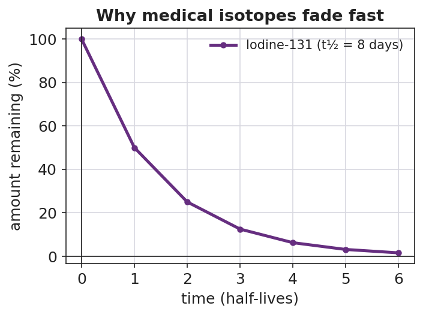

# Benefits & Risks of Nuclear Chemistry — Student Worksheet

**Unit: Nuclear Chemistry — Lesson 04**
Name: _______________________  Date: __________  Period: ____

---

## Phenomenon

An energy company has applied to build a **nuclear power plant 15 miles from our school**, and the town is split. Three sources arrive in the mail and online:

- **Flyer 1 (pro-plant):** carbon-free electricity for 60 years, hundreds of jobs, safety standards stricter than the coal plant it would replace.
- **Flyer 2 (anti-plant):** a photo of the abandoned city of Pripyat near Chernobyl with the caption *"Do you want this next door?"*
- **Source 3 (a hospital):** the radioactive iodine that cured a patient's thyroid cancer comes from the *same* nuclear science that would power the plant.

Every source is about radiation — yet they point to opposite conclusions.

**Driving question:** Should our community accept a nuclear power plant nearby? How do we evaluate the competing claims — benefit and risk — fairly?

---

## Notice & Wonder

| I notice… | I wonder… |
|---|---|
|  |  |
|  |  |
|  |  |

**Turn & Talk #1:** All three sources are about radiation, but they push opposite conclusions. What information would you need to decide whether each flyer's claim is actually *true* — not just loud?

> _______________________________________________
> _______________________________________________

---

## Initial Model

Before reading any case studies, make your best two-column list. Then **circle** the one benefit and the one risk you think matter most for the plant decision.

| Column A — BENEFITS of nuclear chemistry | Column B — RISKS of nuclear chemistry |
|---|---|
|  |  |
|  |  |
|  |  |
|  |  |

---

## Investigation

### Part 1 — Case-Study Jigsaw

Your group is assigned ONE case packet. Read it, then fill in the rating rubric. Score **validity** and **reliability** from 1 (weak) to 3 (strong).

**Case A — Medical isotopes** · **Case B — Power generation** · **Case C — Nuclear weapons**  → circle the case your group has.

The dose chart below helps you put any radiation risk in perspective:

For the medical-isotope case, this decay curve shows why a radioactive isotope used in the body is not a permanent hazard:

| Rubric item | Your answer |
|---|---|
| The **benefit** this source claims | |
| The **risk** this source claims/implies | |
| **Evidence** the source gives | |
| **Validity** (1–3): does the evidence support the claim? | |
| **Reliability** (1–3): is the source trustworthy / repeatable? | |
| The **dose or condition** that decides benefit vs. risk | |

### Part 2 — Cross-Group Share

After the share-out, record the strongest claim from each of the other two cases.

| Case | Strongest benefit claim | Strongest risk claim |
|---|---|---|
| Medical isotopes | | |
| Power generation | | |
| Nuclear weapons | | |

**Key question:** Across all three cases, what is the ONE variable that decides whether radiation helps or harms?

> _______________________________________________

---

## Make It Make Sense

For each claim below, decide whether it is **valid** (evidence supports the conclusion), **reliable** (source is trustworthy/repeatable), explain your reasoning, and name the dose or control idea involved.

1. A flyer reads: *"A nuclear plant uses fission, and an atom bomb uses fission, so a plant is basically a slow-motion bomb that will eventually explode."*

   - Valid? (yes/no) and why: _______________________________________________
   - What about dose/control makes this different? _______________________________________________

2. A hospital page reads: *"Over the past 20 years, radioactive iodine (I-131) treated more than 100,000 of our thyroid patients with a documented success rate; the isotope's 8-day half-life means it clears the body within weeks."*

   - Valid? Reliable? _______________________________________________
   - Using the decay curve, about what percent of the I-131 is left after about 24 days (3 half-lives)? _______________________________________________

3. A news post shows a 1986 photo of abandoned Pripyat and concludes: *"This proves the proposed 2025 plant near us will become a wasteland too."*

   - Is the conclusion **valid**? Why or why not? _______________________________________________
   - What evidence would a *valid* safety argument about the 2025 plant actually need? _______________________________________________

---

## Vocabulary in Action

Use each term in a sentence about today's phenomenon or your case study. Do not just copy the definition — use the word to describe something you read or judged.

- **risk–benefit analysis:** _______________________________________________
  _______________________________________________

- **validity:** _______________________________________________
  _______________________________________________

- **reliability:** _______________________________________________
  _______________________________________________

---

## Revise Your Model

Return to your Initial Model two-column list. Add any benefits or risks you missed from the case studies. Then, for the one benefit and one risk you circled, add a **dose/control note**: what condition turns that radiation from helpful to harmful?

Then finish this Because / But / So sentence:

> A nuclear power plant and a medical scanner both involve ionizing radiation
> because __________________________________________,
> but __________________________________________,
> so __________________________________________.

---

## Exit Ticket

(a) A campaign mailer states: *"A power line near homes emits radiation, so it must cause the same cancers as a nuclear meltdown."* (Power lines emit **low-frequency, non-ionizing** radiation.) In one sentence, judge this claim's **validity** — does the evidence support the conclusion?

> _______________________________________________
> _______________________________________________

(b) A nuclear plant worker's annual occupational dose limit is about **50 mSv**, and one chest CT scan is about **7 mSv**. About how many CT-scans' worth of dose is the yearly worker limit, and is the limit set above or below a single scan?

> Setup: 50 ÷ 7 ≈ ______ CT scans.  The limit is ______ a single scan.

(c) Name one real **benefit** and its paired **risk** of nuclear technology, and in one sentence state what variable decides which one you get.

> Benefit: _________________  Paired risk: _________________

> The variable that decides: _______________________________________________
