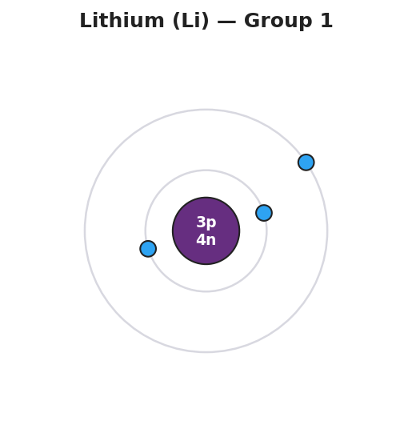
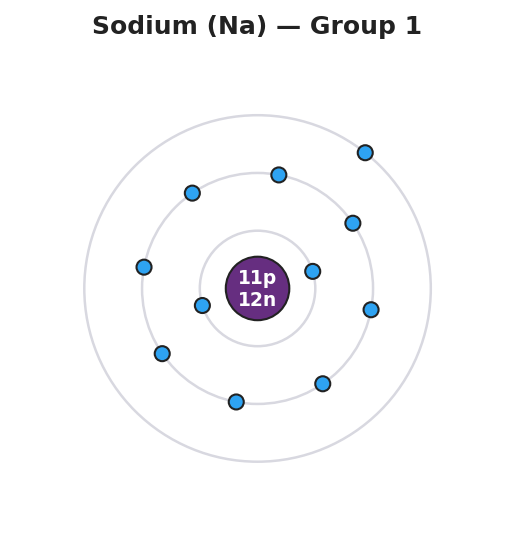
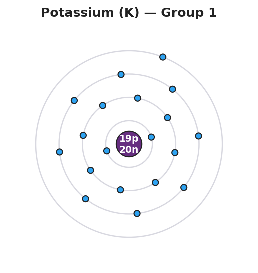

# Electron Configuration & Valence Electrons — Teacher Guide

## Cover

**Unit: The Periodic Table — Lesson 02: Electron Configuration & Valence Electrons**
East Meadow Schools × Valley Stream Central High School District
Strategy chips: HOCHMAN

---

## Curated Resources (from East Meadow Scope & Sequence)

### NYSSLS Standards

**HS-PS1-1** — *"Use the periodic table as a model to predict the relative properties of elements based on the patterns of electrons in the outermost energy level of atoms."* The outermost-shell electrons — the **valence electrons** — are the focus of this lesson. For the 2025 NYSSLS-aligned Regents, students are expected to read an electron configuration from the Periodic Table (Reference Table S, where the configuration is printed below each symbol), identify the number of electrons in the outermost occupied shell, and connect that number directly to the element's group. Per East Meadow guidance, valence-electron fluency is the prerequisite for the next lessons on Lewis structures, ion formation, and bonding — every one of those topics is governed by the outermost electrons.

The Cross-Cutting Concept of **Patterns** is the explicit lens: elements in the same vertical column (group) share the same number of valence electrons, and that shared count is *why* they share chemical properties. The pattern in the periodic table is not an accident of arrangement — it is a pattern in electron structure made visible by the table's layout.

### Phenomenon

On the demonstration table, line up three samples (or three labeled images) of the Group 1 alkali metals: lithium, sodium, and potassium. Tell students these three elements sit in the same column of the periodic table, one stacked above the next. Then show (or describe from the well-known classroom video) what happens when a small piece of each is dropped into water: lithium fizzes steadily, sodium skitters and pops, potassium ignites with a lilac flame. Three different elements — different masses, different melting points, found in different places — and yet all three react with water *in the same way*, just with increasing vigor down the column.

Now ask the question that drives the whole lesson: **why do all the elements in a column behave so similarly?** They are not the same element. They do not have the same number of protons. So what *is* the same about them? The answer is hidden in their electron structure — and by the end of the period, students will be able to draw it.

**Driving question:** Why do all the elements in a column of the periodic table behave so similarly?

### Javalab / Labs

- **Valence electron diagrams (core activity):** Using the Periodic Table (Reference Table S), students draw Bohr-model shell diagrams for Li, Na, and K and circle the outermost-shell electrons. They discover, by drawing, that all three end in a single outer electron. Connect to `figures/bohr_lithium.png`, `figures/bohr_sodium.png`, and `figures/bohr_potassium.png`.
- **Group-property prediction stations:** Set up short stations, each with the electron configuration of an unknown main-group element printed on a card (no name given). At each station, students count the outermost electrons, predict the group, and predict one property (reactive metal? unreactive gas? gains or loses electrons?). They then flip the card to check against the element's identity. A digital alternative: the Javalab "atom builder" or PhET "Build an Atom," where students add electrons shell by shell and watch the outer shell fill.
- **Bar-chart reading:** Students read `figures/valence_by_group.png` to confirm the pattern: Group 1 → 1 valence electron, Group 2 → 2, Groups 13–18 → 3 through 8.

### Assessments

- **Valence electron identification quiz** (district checkpoint, following lesson; see `Assessments/` folder once created): students read an electron configuration from the Periodic Table, state the number of valence electrons, and name the group.
- **Exit Ticket** (Phase 5): three items — give the configuration and valence count for magnesium (Mg); give the configuration and valence count for fluorine (F); and one sentence explaining why all Group 17 elements are highly reactive. The Exit Ticket elements (Mg, F) are deliberately different from the worksheet practice elements (Li, Na, K, O, Cl). See `Answer_Key.docx`.

---

## Lesson Overview

| | |
|---|---|
| **Duration** | 42 minutes (1 period) |
| **NYSSLS link** | HS-PS1-1 (predict properties from outermost-shell electrons; read electron configuration from the Periodic Table) |
| **CCC focus** | Patterns — elements in the same group share the same number of valence electrons, and that shared count is what makes their chemical behavior similar; the table's columns *are* a pattern in electron structure |
| **Strategy chips** | HOCHMAN — appositive sentence to define valence electrons crisply; B/B/S sentence in Phase 4 |
| **Materials** | Periodic Table / 2025 NYS Chemistry Reference Tables (Reference Table S, which prints the electron configuration), the three Bohr-model figures projected, the group-property station cards, colored pencils for drawing shells |
| **Safety** | If demonstrating the alkali-metal-in-water reactions live, this is a teacher-only demo behind a safety shield with very small samples; most classrooms should show the well-known video instead. Standard lab safety applies. No student handling of alkali metals. |
| **Prior knowledge** | Lesson 01 (Placement of Elements) — groups vs. periods, how the table is organized; earlier unit work on atomic structure — protons, neutrons, electrons, and the idea that electrons occupy shells (energy levels) around the nucleus. Students should recognize that the first shell holds up to 2 electrons and the second and third hold up to 8. |

**Lesson objectives — students can:**

- Read the electron configuration of any main-group element from the Periodic Table (Reference Table S) and draw it as a Bohr shell diagram.
- Identify the number of valence electrons (electrons in the outermost occupied shell) from a configuration or a shell diagram.
- State the rule connecting group number to valence electrons for the main groups (Group 1 → 1, Group 2 → 2, Groups 13–18 → 3–8).
- Explain, using the Patterns CCC, why elements in the same group behave so similarly.

---

## Phase 1 · Engage *(0 – 10 min)*

### 0–3 min · Opening Circle + Do Now

Begin with a brief **community-building opening circle** (2–3 min). Everyone — teacher included — answers: *"Think of a group of people who all act alike in some way — a sports team, a family, a friend group. What is the one thing they share that explains why they act alike?"* One round, one sentence each, no judgment. This primes the central idea: shared behavior usually traces back to one shared feature. Today that feature is valence electrons.

Then post the **Do Now**:

> *"Lithium, sodium, and potassium are three different elements stacked in the same column of the periodic table. All three react with water in the same way. Write one sentence: what do you think these three elements have in common that makes them behave so similarly?"*

Give students 2 minutes to write silently, then take two or three responses.

**Anticipated student responses to Do Now:**

- "They're all metals." — affirm; and ask: lots of elements are metals, but these three behave *identically*. What is more specific than just 'metal'?
- "They're in the same column, so the table groups them together." — close; the table groups them for a *reason*. What is that reason? That is exactly today's question.
- "I don't know — they have different numbers of protons, so they should be different." — excellent tension to name; validate: they *are* different in proton count, yet they behave the same. Something other than proton count must be controlling the behavior.

### 3–8 min · Phenomenon hook — three metals, one behavior

**Teacher actions.** Show the three alkali metals (samples, labeled images, or the classic reaction video). Narrate: lithium fizzes, sodium pops and skitters, potassium ignites with a lilac flame. Emphasize: same *kind* of reaction, increasing vigor down the column. Then project the three Bohr-model figures side by side.

**Sample teacher language:**

> "Look at these three diagrams. The nuclei are different — 3 protons, 11 protons, 19 protons. The number of shells is different — two, three, four. But look at the *outermost* shell on each one. Lithium: one electron out there. Sodium: one electron. Potassium: one electron. Three different atoms, three different sizes — and exactly one electron in the outermost shell every single time. That one outer electron is what reacts. That is why all three behave the same."

**Anticipated student responses:**

- "They all have one electron on the outside." — yes — that is the whole answer; we will give that outer electron a name in Phase 3.
- "So the inner electrons don't matter?" — great question; the inner electrons fill up first and are held tightly. It is the outermost electron that gets involved in reactions. We will build that idea today.
- "Why does potassium react harder than lithium if they both have one?" — sharp observation; the outer electron in potassium is farther from the nucleus, so it is easier to lose. Same behavior, stronger because the outer electron is held more loosely. (Foreshadows a later trends lesson — affirm and park it.)

**Driving question** (post on the board and leave it there):

> *Why do all the elements in a column of the periodic table behave so similarly?*

### 8–10 min · Notice & Wonder + Turn-and-Talk #1

Two columns on the board: **I notice… / I wonder…**

Collect 3–4 responses about the three Bohr diagrams. Then:

> "Turn to your partner: the three atoms have different numbers of protons and different numbers of shells. Find the *one thing* that is identical across all three diagrams. Name it as specifically as you can."

Target insight (leave open if no one lands it yet): the number of electrons in the *outermost* shell is exactly one for all three. That outermost-shell count — not proton count, not number of shells — is what they share. We will name it **valence electrons** in Phase 3.

---

## Phase 2 · Explore *(10 – 30 min)*

### 10–15 min · ABCs Activity — draw the shells before naming anything

**Before any formal vocabulary is introduced**, students build intuition by drawing the shell diagrams themselves from the configurations on the Periodic Table.

Each student receives the Periodic Table (Reference Table S). The task:

**Part 1 — Read the configuration, draw the shells:**

> "On Reference Table S, find the electron configuration printed under each element. For lithium it reads 2-1. For sodium, 2-8-1. For potassium, 2-8-8-1. Draw a nucleus, then draw a ring for each number, putting that many electrons on the ring. Do all three."

**Part 2 — Circle the outer ring:**

> "On each of your three drawings, circle the electrons in the *outermost* ring only. Write the count next to the circle. What do you notice across all three?"

**Teacher facilitation language (circulate):**

> "Don't worry about making the drawing perfect — you just need the right number of electrons on the right number of rings. The configuration on the table tells you exactly: each number is one ring, from the inside out."

> "Look at the last number in each configuration — 2-1, 2-8-**1**, 2-8-8-**1**. What is the same about the last number every time? That last number is the count of the outermost electrons."

**Anticipated student responses during ABCs:**

- "They all end in 1." — exactly the pattern we want them to find; affirm and ask them to hold that thought.
- "Do I draw the inner rings too?" — yes; draw every ring in the configuration, but we are most interested in the outer one.
- "Sodium has 11 electrons total but only 1 on the outside?" — correct; 2 + 8 fill the first two shells, and the eleventh electron starts the third shell alone. The configuration 2-8-1 shows exactly that.

### 15–22 min · Initial Model — configuration to valence count

**Prompt on the board:**

> *"Before we name the process: pick oxygen (O) and chlorine (Cl) from Reference Table S. Write each one's electron configuration exactly as printed. Then state how many electrons are in the outermost shell of each."*

Students work individually for 3 minutes, then compare with a partner.

Target answers:

> Oxygen: configuration 2-6 → outermost shell has 6 electrons.
> Chlorine: configuration 2-8-7 → outermost shell has 7 electrons.

**Teacher facilitation language:**

> "The outermost electron count is just the *last number* in the configuration. Oxygen ends in 6, chlorine ends in 7. You do not need to do any math — Reference Table S already did the counting for you."

> "Now look up the group number for each. Oxygen is in Group 16, chlorine is in Group 17. Compare the group number to your outer-electron count. Do you see a relationship?"

**Anticipated student responses:**

- "Oxygen's last number is 6 and it's in Group 16 — the 6 matches the 6 in 16!" — excellent; that is the rule we are about to formalize. For Groups 13–18, the second digit of the group number equals the valence electrons.
- "Chlorine ends in 7, Group 17 — same thing!" — yes; the pattern holds.
- "Does this work for every element?" — for the main-group elements (the tall columns), yes. The middle block — the transition metals — is the exception, and we will set those aside today.

### 22–30 min · Investigation — group-property prediction stations

Students rotate through (or work at their desks with) a set of cards. Each card shows an electron configuration only — no element name. For each card the student fills in: the number of outermost electrons, the predicted group, and one predicted property.

**Station card answer key (your reference):**

| Configuration | Outer-shell electrons | Group | Predicted property | Element |
|---|---|---|---|---|
| 2-8-1 | 1 | 1 | very reactive metal; loses 1 electron easily | Na (sodium) |
| 2-8-2 | 2 | 2 | reactive metal; loses 2 electrons | Mg (magnesium) |
| 2-8-7 | 7 | 17 | very reactive nonmetal; gains 1 electron | Cl (chlorine) |
| 2-8-8 | 8 | 18 | unreactive (noble) gas; full outer shell | Ar (argon) |
| 2-4 | 4 | 14 | shares electrons; forms many compounds | C (carbon) |

**Teacher facilitation prompts (circulate):**

> "You do not know the element's name yet — and you do not need it. Read the last number of the configuration. That tells you how many outer electrons, and that tells you almost everything about how it reacts."

> "If a card ends in 8, what does that tell you? A full outer shell — this element is content and barely reacts. That is a noble gas. If a card ends in 1, the element has a single loose outer electron it wants to get rid of — a very reactive metal."

> "Two cards end in different last numbers but you predicted similar properties — check that. The rule is: same last number means similar behavior. Different last number should mean different behavior."

**Anticipated student responses:**

- "2-8-8 has a full outer shell, so it won't react." — exactly; that is the noble-gas pattern. Affirm strongly.
- "How do I know if it gains or loses electrons?" — elements with a nearly empty outer shell (1, 2, 3) tend to *lose* those electrons; elements with a nearly full outer shell (6, 7) tend to *gain* electrons to fill it. We will deepen this in the bonding unit.
- "2-8-1 and the sodium from the demo — is this the same?" — yes; this card *is* sodium. The configuration you drew in the warm-up is the same one predicting the behavior here.

### 28–30 min · Reconnect + surface the method

Bring the class back together. Ask one student to read a configuration aloud and have the class call out the outer-electron count and predicted group. Then ask:

> "What single number on each card did the prediction depend on? (The last number in the configuration — the outermost-shell count.) And why does that one number predict so much about the element's behavior?"

Surface the key idea: the outermost electrons are the ones that participate in reactions. Two elements with the same number of outermost electrons will react in the same way — which is exactly why a column of the periodic table behaves alike.

---

## Phase 3 · Explain *(30 – 36 min)*

### 30–33 min · Turn-and-Talk #2 + class consensus

> "Look back at your three drawings of Li, Na, and K, and at the station cards. Turn to your partner: in your own words, what is the *one feature* that decides how an element reacts? And why does that mean a whole column of the table behaves the same?"

Target consensus: the number of electrons in the outermost shell decides chemical behavior. Every element in a group has the same outermost count, so the whole column reacts the same way. The periodic table groups elements by this shared electron pattern.

> "If I told you a new, mystery element has the configuration 2-8-8-1, what group is it in, and which of our three demo metals would it act most like?"

Target: it ends in 1 → Group 1 → it would act like Li, Na, and K (this is in fact potassium's configuration, or below it, rubidium). Same last number, same family behavior.

### 33–36 min · Vocabulary introduction (exactly 3 terms)

**Sample teacher language:**

> "Let's name what we have been working with all period. The arrangement of electrons in an atom's shells — the 2-8-1 we read off the table — is the **electron configuration**. It lists how many electrons are in each shell, from the innermost shell outward. The electrons in the *outermost* occupied shell — the ones we kept circling — are the **valence electrons**. Those are the electrons that react. And a vertical column of the periodic table, where every element shares the same number of valence electrons, is a **group**."

> "Here is the Hochman appositive move that will help you write and remember the key definition. An appositive is a phrase set off by dashes that renames or explains the noun next to it. Say this with me:

> *Valence electrons — the electrons in an atom's outermost occupied shell — determine how the element reacts.*

> The phrase between the dashes defines 'valence electrons' inside the same sentence. You will use this structure on the Exit Ticket and in your notes."

Post the three terms on the board. Students fill them in on their notes.

**Discussion prompts to deploy here:**

- "If sodium's electron configuration is 2-8-1, how many valence electrons does it have?" — *Expected response:* one — the last number in the configuration, the count in the outermost shell.
- "Where do you find the electron configuration without doing any counting?" — *Expected response:* it is printed under each element symbol on the Periodic Table (Reference Table S) in the 2025 NYS Chemistry Reference Tables.

---

## Phase 4 · Elaborate *(36 – 40 min)*

### 36–39 min · Revise the model + Appositive + Because/But/So expansion

Students return to their three Bohr drawings (Li, Na, K). They annotate them with vocabulary: label the full ring list "electron configuration," circle and label the outer ring "valence electrons," and write the group number ("Group 1") next to all three. Then they write an appositive sentence.

**Appositive sentence (model on board):**

> *"Valence electrons — the electrons in an atom's outermost occupied shell — determine how the element reacts."*

Ask students to write a parallel appositive for a specific element:

> *"Chlorine's valence electrons — its ___ outermost electrons — make it a very reactive ___ that tends to ___ one electron."*

Then run a **Because / But / So** sentence about the phenomenon. Starter on the board:

> *"Lithium, sodium, and potassium all react with water the same way."*

Model one aloud:

> "Lithium, sodium, and potassium all react with water the same way **because** each one has exactly one valence electron in its outermost shell **but** they have different numbers of protons and different numbers of total shells **so** it is the shared valence-electron count — not the proton count — that controls their shared chemical behavior, which is exactly why the periodic table places them in the same group."

Then have students write their own B/B/S using one of these starters:

- *"Argon (2-8-8) barely reacts with anything…"* (hint: full outer shell of 8 valence electrons)
- *"Oxygen and sulfur are in the same group and react similarly…"* (hint: both have 6 valence electrons)

**Anticipated student responses:**

- "Because argon has 8 valence electrons, a full shell." — good start; push for the So: "so it has no loose outer electron to give away and no room to gain one, which is why it is unreactive."
- "Because oxygen and sulfur both end in 6." — excellent; push for the So: "so they both tend to gain 2 electrons and form similar compounds, which is why they sit in the same group."

### 39–40 min · Return to the phenomenon

> "Return to our opening question: why do all the elements in a column behave so similarly? Lithium, sodium, potassium — three different atoms, all reacting with water the same way. Now you can answer it in one sentence using the word *valence*. Go."

Target: "All three are in Group 1, so all three have exactly one valence electron in the outermost shell, and that single shared outer electron is what reacts — so they all behave the same."

> "That column on the periodic table is not just a list. It is a pattern in electron structure. The table is sorted so that everything in a column shares the same valence-electron count — and that is why the table can predict how an element will behave before you ever test it in a lab."

---

## Phase 5 · Evaluate *(40 – 42 min)*

### 40–42 min · Exit Ticket + Closing Reflection

Post or read aloud:

> *(a) Use the Periodic Table to write the electron configuration of magnesium (Mg). How many valence electrons does it have, and what group is it in?*
> *(b) Use the Periodic Table to write the electron configuration of fluorine (F). How many valence electrons does it have, and what group is it in?*
> *(c) In one sentence, explain why all of the Group 17 elements (fluorine, chlorine, bromine…) are highly reactive.*

Expected answers are in `Answer_Key.docx`. Note: Mg and F are deliberately different from the worksheet practice elements (Li, Na, K, O, Cl) so the Exit Ticket tests transfer, not recall.

**Closing Reflection (SEL, 30 seconds):**

> "Today we found the one hidden feature that explains a whole column of the periodic table. In one sentence: what is one thing that surprised you about how a single number can predict an element's behavior, and who helped you see it?"

Collect worksheets; note which students correctly read the *last* number of the configuration as the valence count versus students who used the total electron count or the period number by mistake. The last-number rule is the main procedural stumbling block — target those students for a brief one-on-one check at the start of the next lesson.

---

## Common Misconceptions

- **Misconception:** "Valence electrons means all the electrons in the atom." → **Correction:** Valence electrons are only the electrons in the *outermost occupied* shell. Sodium has 11 electrons total but only **1** valence electron (configuration 2-8-1; the last number is the valence count). The inner electrons are core electrons and do not normally participate in reactions.
- **Misconception:** "Elements are in the same group because they have the same number of protons or the same mass." → **Correction:** Group membership is set by the number of *valence electrons*, not protons or mass. Lithium (3 protons), sodium (11 protons), and potassium (19 protons) have wildly different proton counts and masses, yet all share one valence electron — which is why they share a group and share chemical behavior.
- **Misconception:** "The number of valence electrons equals the period number (the row)." → **Correction:** The valence count comes from the *group* (column), not the period (row). The period number tells you how many *shells* the atom has (how many rings), but the valence count is the number of electrons in the outermost shell — the last number of the configuration.
- **Misconception:** "More valence electrons always means more reactive." → **Correction:** Reactivity depends on how close the outer shell is to empty or full. Group 1 (1 valence electron) and Group 17 (7 valence electrons) are both highly reactive — one easily loses its single electron, the other easily gains one to fill its shell. Group 18 (8 valence electrons, a full shell) is the *least* reactive. Reactivity is about the distance to a full shell, not simply the count.
- **Misconception:** "The transition metals follow the same group-to-valence rule as the main groups." → **Correction:** The simple rule (Group 1 → 1, Group 2 → 2, Groups 13–18 → 3–8) applies to the main-group elements. The transition metals in the middle block do not follow it cleanly and are set aside in this lesson.

---

## Access & Differentiation

- **ELL/ENL supports:** Shell-diagram template pre-printed with a nucleus circle and blank rings, plus sentence frame: *"The element ___ has ___ valence electrons, so it is in Group ___."* Word-choice box displayed on the board throughout: {electron configuration, valence electrons, group, outermost shell, reactive}. Pair each vocabulary term with a gesture: hold up a fist (nucleus) and circle the outer ring with a finger for valence electrons. Let students read the configuration off Reference Table S rather than calculating it, removing the counting barrier so the focus stays on the valence concept.
- **IEP/SPED supports:** Pre-fill the electron configurations on a card for each practice element (Li = 2-1, Na = 2-8-1, K = 2-8-8-1, O = 2-6, Cl = 2-8-7) so the Reference Table lookup is removed as a barrier; the student's task is to identify the *last number* and the group. Provide a highlighter so the student can highlight only the last number in each configuration before reading it. Offer the one-element-at-a-time station format where the student completes one card before seeing the next. Assign partner roles at the stations: one student reads the configuration aloud, one records the valence count.
- **Extensions:** (1) Predict the charge of the ion each element forms: Group 1 → +1, Group 2 → +2, Group 16 → −2, Group 17 → −1. Connect "how many electrons lost or gained" to the valence count. (2) Find an element whose configuration is 2-8-18-8 and identify its group and predicted behavior (krypton, Group 18, noble gas). (3) Research and explain: why does the simple group-to-valence rule break down for the transition metals in the middle of the table? Write one sentence about what is different about their electron filling.

---

## Strategy Spotlight

**HOCHMAN — Appositive sentence.** The Hochman Writing Method (Judith Hochman and the Writing Revolution) treats sentence-level writing as a thinking tool. For this lesson the featured technique is the **appositive**, a noun phrase set off by dashes (or commas) that renames or defines the noun it follows. The appositive is ideal for vocabulary-heavy science content because it forces the student to embed a definition into a subject-verb sentence rather than writing the definition in isolation.

**The target appositive for this lesson:**

> *Valence electrons — the electrons in an atom's outermost occupied shell — determine how the element reacts.*

This sentence structure does three things simultaneously: (1) names the term, (2) defines it in a concise phrase between the dashes, and (3) states the term's significance (it determines reactivity) in the main clause. Students who can write and say this sentence — not just recite the definition separately — are integrating the term into their active vocabulary.

**How to run it in this lesson (Phase 3 → Phase 4):**

1. Post and read aloud the model appositive sentence together (Phase 3 vocabulary).
2. Ask students to write a parallel appositive for a specific element: *"Chlorine's valence electrons — its ___ outermost electrons — make it a very reactive nonmetal."* This requires them to substitute in the count they read in Phase 2, confirming that the abstract definition connects to their concrete work.
3. In Phase 4, students write their own appositive for an element of their choice and pair it with a Because/But/So sentence about the phenomenon. Cold-call two or three students; ask: does the appositive phrase correctly define the term? Does the main clause state why it matters?

**Why the appositive fits valence electrons:** The term "valence electrons" sounds technical, but the appositive translates it instantly into a definition the student owns: the outermost electrons, the ones that react. Pairing the appositive with the phenomenon (a whole column behaving the same because they share that outer count) lets students see that one well-built sentence can carry the central idea of the entire lesson.

**CRSE connection:** The opening circle prompt (a group of people who act alike because of one shared feature) invites students to bring their own communities — teams, families, friend groups — into the science. It models the lesson's logic in human terms before the chemistry arrives: shared behavior traces to a shared feature. Grounding the abstract idea of "periodic groups" in the relatable idea of human groups honors students' social knowledge and makes the periodic table feel like a story about belonging and pattern rather than a chart to memorize.

---

## NYSSLS Observation Checklist Crosswalk

| # | Checklist item | Where it appears in this lesson |
|---|---|---|
| 1 | Local/relatable phenomenon | Phase 1 — alkali metals (Li/Na/K) react with water the same way; three Bohr-model figures; return in Phase 4 with the one-sentence valence explanation |
| 2 | Turn and Talk (2–3×) | Phase 1 (TT#1 — find the one identical feature across the three diagrams); Phase 3 (TT#2 — what single feature decides reactivity, and why does a column behave alike?) |
| 3 | Students develop questions/models/procedures | Phase 2 ABCs (draw Bohr shells from the configuration before naming anything); Initial Model (read O and Cl configurations, find valence count); group-property prediction stations |
| 4 | CCC defined and used | Lesson Overview · *Patterns*, explicit in Phase 3 consensus (same outer count → same behavior) and Phase 4 B/B/S (column behaves alike) |
| 5 | ENL — ≤ 3 vocab, second half | Phase 3 — vocabulary introduced at 33–36 min: electron configuration / valence electrons / group |
| 6 | Revisit phenomenon with evidence | Phase 4 — students return to the opening question armed with their three Bohr drawings and station evidence to explain *why* Group 1 behaves alike |
| 7 | ENL/SPED supports | Access & Differentiation block: shell-diagram template, sentence frame, word-choice box, pre-filled configurations, highlight-the-last-number scaffold, partner roles |
| 8 | Assessment check | Phase 5 — Exit Ticket (configuration and valence count for Mg and F; one-sentence explanation of Group 17 reactivity) |

---

## Companion Materials

- `Student_Worksheet.docx` — the 5E student investigation (hand out at start of Phase 2)
- `Student_Notes.docx` — guided note-guide for vocabulary and the worked configuration example
- `Answer_Key.docx` — answers to "Make It Make Sense" prompts and the Exit Ticket

---

## Key Vocabulary (max 3)

- **electron configuration** — the arrangement of an atom's electrons among its shells, written as a list of counts from the innermost shell outward (e.g., sodium is 2-8-1); printed under each element on the Periodic Table (Reference Table S); the last number is the count of outermost-shell electrons
- **valence electrons** — the electrons in an atom's outermost occupied shell; the electrons that participate in chemical reactions; equal to the last number of the electron configuration and, for main-group elements, predictable from the group number
- **group** — a vertical column of the periodic table; every element in a group has the same number of valence electrons, which is why elements in the same group share similar chemical properties
