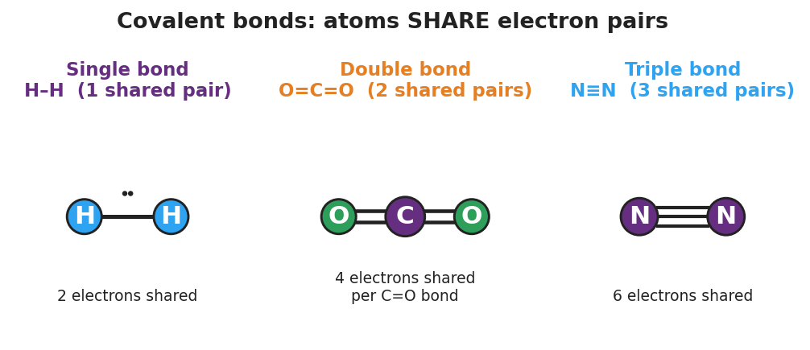

# Covalent Bonding & Organic Structures — Student Worksheet

**Unit: Chemical Bonding — Lesson 05**
Name: _______________________  Date: __________  Period: ____

---

## Phenomenon

Water does three strange things. Overfill a glass and the surface bulges above the rim without spilling — held up by an invisible "skin." Lay a steel paperclip flat on that skin and it floats, even though steel is about 8 times denser than water. Drop an ice cube into a glass of water and it floats — almost nothing else floats in its own liquid. And water stays liquid all the way up to 100 °C, while methane (CH₄), a molecule of similar size, is a gas by −162 °C. All three behaviors trace back to one thing: how the atoms inside a water molecule are bonded together.

**Driving question:** Why does water have such unusual properties — surface tension, floating ice, and a high boiling point?

---

## Notice & Wonder

| I notice… | I wonder… |
|---|---|
|  |  |
|  |  |
|  |  |

**Turn & Talk #1:** Water (H₂O) and methane (CH₄) are both small molecules made of a few nonmetal atoms. Yet water stays liquid until 100 °C and methane is a gas by −162 °C. In one sentence: what might be *different about how the atoms are connected* inside these two molecules?

> _______________________________________________
> _______________________________________________

---

## Initial Model

In the ionic-bonding lesson, a **metal** atom *gave* its electrons away to a nonmetal. But water is made of two **nonmetals** (H and O) — neither one wants to give electrons away.

Draw your best guess: how could two nonmetal atoms that *both* want electrons end up connected? Sketch how you think the hydrogen and oxygen atoms in a water molecule are joined.

> *(sketch here)*
>
>
>

One sentence — what is your guess for how the atoms hold together if neither one gives electrons away?

> _______________________________________________

---

## Investigation

### Part 1 — Build the molecules (model kits)

Build each molecule with your kit. Count the **sticks (bonds)** between each pair of atoms. A stick = a connection between two atoms.

| Molecule | Central atom | Sticks (bonds) to EACH outer atom | Total bonds on central atom |
|---|---|---|---|
| H₂O |  |  |  |
| CH₄ |  |  |  |
| NH₃ |  |  |  |
| CO₂ |  |  |  |

(a) Which molecule needed **more than one stick** between two atoms? _______________

(b) How many sticks did carbon dioxide need between the carbon and *each* oxygen? _______________

(c) Count the total bonds on the carbon atom in CH₄ and in CO₂. Are they the same number? _______________

### Part 2 — Build an organic molecule (carbon chain)

Carbon is special: it makes four bonds and it can bond **to itself**. Connect **two** carbon atoms with one stick, then fill every empty hole with a hydrogen.

(a) How many hydrogen atoms did you need to fill all the empty holes? _______________

(b) What is the formula of the molecule you just built (count C's and H's)? _______________

(c) This is your first **organic** molecule. In one sentence, what makes carbon able to form chains?

> _______________________________________________

### Part 3 — Counting shared pairs

Your teacher will project `figures/covalent_bond_orders.png`. Use it to fill in the table. One stick (one line) = one **shared pair** of electrons = 2 electrons.

| Bond type | Lines drawn | Pairs shared | Electrons shared |
|---|---|---|---|
| Single (H–H) |  |  |  |
| Double (C=O) |  |  |  |
| Triple (N≡N) |  |  |  |

---

## Make It Make Sense

For each molecule below, count the bonds and draw the structural formula. Use one line for each single bond and two lines for each double bond. **These are the molecules you built in the Investigation — confirm your work here.**

1. **Water (H₂O)** — oxygen in the center, one bond to each hydrogen.

   - Number of bonds total: _______________
   - Draw the structural formula (remember: water is bent, not straight):

   > *(draw here)*

2. **Methane (CH₄)** — carbon in the center, one bond to each hydrogen.

   - Number of bonds on carbon: _______________
   - Draw the structural formula:

   > *(draw here)*

3. **Carbon dioxide (CO₂)** — carbon in the center, a double bond to each oxygen.

   - How many shared pairs between carbon and EACH oxygen? _______________
   - Draw the structural formula (use double lines):

   > *(draw here)*

---

## Vocabulary in Action

Use each term in a sentence about today's model-kit investigation. Do not copy the definition — describe something you actually built or counted.

- **covalent bond:** _______________________________________________
  _______________________________________________

- **bond order (single / double / triple):** _______________________________________________
  _______________________________________________

- **structural formula:** _______________________________________________
  _______________________________________________

---

## Revise Your Model

Return to your Initial Model sketch of water. Improve it into a proper **structural formula**:

(a) Put oxygen in the center and draw one line to each hydrogen. Draw the molecule **bent**, not in a straight line.

> *(revised structural formula here)*

(b) Label each line: "_______________________" (what does one line represent?)

(c) Write a revised appositive sentence:

> A covalent bond — _______________________________________________ — holds the atoms together in a molecule.

Then finish this Because / But / So sentence connecting water's **structure** to one of its **properties** (surface tension, floating ice, or high boiling point):

> Water has _______________ (choose a property)
> because its bent structure _______________________________________________,
> but _______________________________________________,
> so _______________________________________________.

---

## Exit Ticket

*(a) Draw the structural formula of carbon tetrachloride, CCl₄. Carbon is the central atom, single-bonded to four chlorine (Cl) atoms. Show each bond as a line.*

> *(draw here)*

*(b) In hydrogen cyanide, written H–C≡N, how many electron pairs are shared between the carbon and the nitrogen? What is that bond called (single, double, or triple)?*

> Pairs shared: _______________   Bond type: _______________

*(c) In one sentence, use Because / But / So to connect the structure of the water molecule to ONE of its unusual properties.*

> _______________________________________________
> _______________________________________________
