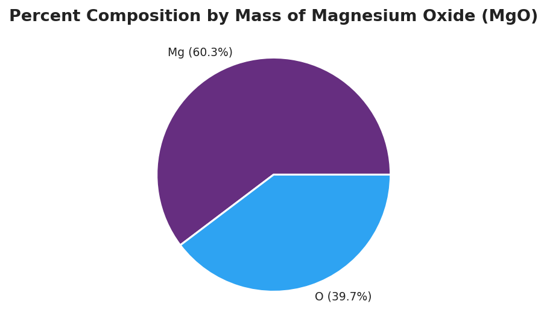

# Empirical & Molecular Formulas — Teacher Guide

## Cover

**Unit: Chemical Reactions & Moles — Lesson 06: Empirical & Molecular Formulas**
East Meadow Schools × Valley Stream Central High School District
Strategy chips: BTC, RESTORATIVE CIRCLE

---

## Curated Resources (from East Meadow Scope & Sequence)

### NYSSLS Standards

This lesson advances **HS-PS1-7** (*"Use mathematical representations to support the claim that atoms, and therefore mass, are conserved during a chemical reaction"*) and leans on the mole reasoning established in Lesson 05 (Defining the Mole). The empirical formula is the bridge between a *measured* lab quantity — a percent composition or a set of combining masses on a balance — and the *symbolic* chemical formula chemists actually write. Per East Meadow guidance, the empirical-formula procedure (percent → grams → moles → ratio → whole-number subscripts) is the single most transferable quantitative routine in the Moles unit: it reappears in hydrate analysis, combustion analysis, and Regents free-response items that supply lab data and ask for a formula.

The Cross-Cutting Concept of **Scale, Proportion, and Quantity** is the explicit lens. A chemical formula is a *ratio* statement — it tells you the proportion of atoms, not the absolute count. Because equal moles of different elements are equal *counts* of atoms (Lesson 05), converting each element's mass to moles converts a mass ratio into an atom ratio. The molecular formula then scales that atom ratio up by a whole-number multiple set by the molar mass. Students should leave able to articulate that the empirical formula is the *simplest whole-number ratio* and the molecular formula is *a whole-number multiple* of it.

### Phenomenon

A chemist is handed a sealed vial of unknown white solid — no label, no formula, nothing but the powder. There is no machine that "reads off" a formula. Yet within an afternoon the chemist writes **MgO** on the vial with confidence. How? They burn a weighed strip of magnesium ribbon in air, weigh the white ash that forms, and find that every 0.243 g of magnesium combines with exactly 0.160 g of oxygen. From two numbers on a balance, the formula appears.

Replay it as a contrast: a student who *guesses* "MgO₂ because there's lots of oxygen in air" gets the formula wrong, while a student who *converts the masses to moles* gets a clean 1-to-1 ratio and writes MgO correctly. Same lab data, same balance — but only the mole conversion turns combining masses into the right subscripts. The formula was hiding inside the masses the whole time; moles are the decoder.

**Driving question:** How can a chemist figure out an unknown compound's formula from nothing but lab data — masses and percentages?

### Javalab / Labs

- **Empirical formula of magnesium oxide lab:** Students mass a clean strip of magnesium ribbon in a pre-massed crucible, heat it to combustion under a lid (lifting periodically to admit air), and re-mass the white magnesium oxide product. Subtracting gives the mass of Mg and the mass of O that combined. Converting each to moles (÷ 24.3 and ÷ 16.0) yields a ratio that rounds to 1 : 1 → **MgO**. This is the hands-on heart of the lesson; the `figures/mgo_percent_composition.png` pie chart is the data summary students predict, then confirm.
- **Percent composition → empirical formula practice:** A structured problem set where students are given the percent-by-mass of each element and run the four-step routine (assume 100 g → mass = percent → moles → divide by smallest → whole-number subscripts). Compounds: a 40.0% C / 6.7% H / 53.3% O sample (→ CH₂O) and a 75% C / 25% H sample (→ CH₄).
- **Empirical vs. molecular comparison:** Using `figures/empirical_vs_molecular_mass.png`, students see that glucose (C₆H₁₂O₆, 180 g/mol) is exactly six empirical units of CH₂O (30 g/mol). Dividing molar mass by empirical mass (180 ÷ 30 = 6) gives the multiplier — the move from empirical to molecular formula.

### Assessments

- **Empirical/molecular formula problem set** (district checkpoint, following lesson; see `Assessments/` folder once created): students derive empirical formulas from percent composition and find the molecular formula given a molar mass, showing the full grams → moles → ratio work.
- **Exit Ticket** (Phase 5): a fresh compound (30.4% N, 69.6% O) for the empirical formula, then its molecular formula given a molar mass of 92 g/mol — values deliberately distinct from the worksheet practice. See `Answer_Key.docx`.

---

## Lesson Overview

| | |
|---|---|
| **Duration** | 42 minutes (1 period) |
| **NYSSLS link** | HS-PS1-7 (mathematical representation of mass relationships; mass conserved as combining masses → formula) |
| **CCC focus** | Scale, Proportion, and Quantity — a formula is an atom *ratio*; converting masses to moles converts a mass ratio into a whole-number atom ratio; the molecular formula scales the empirical ratio by a whole-number multiple |
| **Strategy chips** | BTC — visibly random groups derive the percent → moles → ratio routine on vertical surfaces before it is named; RESTORATIVE CIRCLE — brief unit-window opener |
| **Materials** | 2025 NYS Chemistry Reference Tables (Periodic Table), calculators, vertical non-permanent surfaces (whiteboards/windows) + markers, group randomizer, the MgO lab data card (0.243 g Mg → 0.403 g MgO), `figures/mgo_percent_composition.png` and `figures/empirical_vs_molecular_mass.png` projected |
| **Safety** | If running the live MgO combustion: burning magnesium emits intense UV light — **do not look directly at the flame**; use indirect viewing and tongs; perform under a fume hood or well-ventilated area. The calculation-only version uses pre-collected data and needs no flame. |
| **Prior knowledge** | Lesson 05 (Defining the Mole) — mole as a count, mole = mass ÷ molar mass; Lesson 01–02 of this unit (conservation of mass; combining masses add up). Students should already compute gram formula mass (Unit 1, Lesson 06). |

**Lesson objectives — students can:**

- Convert a percent-composition (or combining-mass) data set into moles of each element using molar masses from the Periodic Table.
- Determine the empirical formula by dividing each mole value by the smallest and expressing the result as the simplest whole-number ratio.
- Find the molecular formula from the empirical formula and a given molar mass by computing the whole-number multiplier (molar mass ÷ empirical mass).
- Explain, using Scale, Proportion, and Quantity, why the empirical formula gives a ratio of atoms while the molecular formula gives the actual count.

---

## Phase 1 · Engage *(0 – 10 min)*

### 0–3 min · Opening Circle + Do Now

Open with a brief **Restorative Circle** (2–3 min; see Strategy Spotlight). Everyone — teacher included — answers in one sentence: *"Think of a time you figured out a hidden recipe or 'what's in it' just from clues — a dish you tasted, a smell, a label you decoded. What was the giveaway?"* One round, pass allowed. This primes the core move of the lesson: a formula is a hidden recipe you can recover from evidence.

Then post the **Do Now**:

> *"A chemist burns a weighed strip of magnesium and finds that 0.243 g of magnesium combines with exactly 0.160 g of oxygen to make a white powder. There is no machine that prints the formula. In one sentence: what could the chemist do with those two masses to figure out the formula of the powder?"*

Give students 2 minutes to write silently, then take two or three responses.

**Anticipated student responses to Do Now:**

- "Just write it as Mg-something-O — maybe the bigger mass is the bigger number." — capture; gently probe: the *mass* isn't the number of atoms. Oxygen atoms are lighter than magnesium atoms, so equal masses are not equal counts. What would turn mass into a count?
- "Use moles — convert each mass to moles." — exactly the target idea; affirm and hold it for Phase 2.
- "I don't think you can — you'd have to already know what it is." — validate the doubt, then reframe: that's the surprising part — the masses really do contain the formula, and today we recover it.

### 3–8 min · Phenomenon hook — the formula hiding in two masses

**Teacher actions.** Hold up (or describe) the sealed vial of unknown white solid. State the problem plainly: no label, no read-out machine — only a balance. Then reveal the lab data: 0.243 g Mg combined with 0.160 g O.

> "Here's what's strange. The formula is not written anywhere. But it is *hiding* inside these two masses. The chemist who knows how to convert mass to moles can pull it out in two minutes. The chemist who guesses from the mass alone gets it wrong. Same numbers — different outcome."

Project `figures/mgo_percent_composition.png`:

**Sample teacher language:**

> "By mass, this white powder is about 60% magnesium and 40% oxygen. Your eye says 'way more magnesium, so the formula should have way more Mg.' But hold that thought — mass and atom count are not the same thing, because a magnesium atom is heavier than an oxygen atom. By the end of today you'll be able to take a percentage like this and recover the exact formula. Spoiler: it is not Mg₂O or MgO₂ — it's something simpler."

**Anticipated student responses:**

- "So the formula is like Mg₃O₂ because 60 to 40 is about 3 to 2?" — excellent, real reasoning — and a perfect trap. That's a *mass* ratio, not an *atom* ratio. We have to convert to moles first. Hold that prediction; we'll test it.
- "Why doesn't more mass mean more atoms?" — because Mg atoms (24.3 g/mol) are heavier than O atoms (16.0 g/mol); a smaller pile of heavy atoms can outweigh a larger pile of light atoms.
- "Where do the percentages come from?" — from the lab masses: 0.243 ÷ 0.403 ≈ 60.3% Mg. We'll connect them in Phase 2.

**Driving question** (post on the board and leave it there):

> *How can a chemist figure out an unknown compound's formula from nothing but lab data — masses and percentages?*

### 8–10 min · Notice & Wonder + Turn-and-Talk #1

Two columns on the board: **I notice… / I wonder…**

Collect 3–4 responses about the pie chart or the lab data. Then:

> "Turn to your partner: the powder is 60% magnesium by mass. If we just trusted the masses, we'd guess there are more magnesium atoms than oxygen atoms. But what if a magnesium atom weighs more than an oxygen atom? How could 60% of the mass still mean an *equal* number of atoms?"

Target insight (leave open if no one lands it): because Mg is heavier per atom, "more mass" does not have to mean "more atoms." Converting mass to moles is the only way to compare counts fairly — that conversion is the whole lesson.

---

## Phase 2 · Explore *(10 – 30 min)*

### 10–14 min · BTC launch — visibly random groups, vertical surfaces

Form **visibly random groups of three** in front of the class (randomizer on screen / dealt cards) so students trust the mix. Each group gets **one marker and one vertical non-permanent surface** (whiteboard, window, or chart paper). Launch the task in one sentence, with minimal instructions — resist naming any procedure:

> *"You have 0.243 g of magnesium and 0.160 g of oxygen stuck together in a powder. Using only your Periodic Table, figure out the ratio of magnesium atoms to oxygen atoms in this powder — and write the simplest formula you can defend."*

Do **not** demonstrate the method. The point of BTC is that groups *build* the percent/mass → moles → ratio routine from the conservation idea they already own. Release the work in **thin slices** (see below). Circulate and ask, never tell.

### 14–22 min · Investigation — the four-step routine emerges on the boards

Groups work the data on their vertical surfaces. Release thin slices, gating each on a neighboring group verifying the last:

**Slice 1 — Make the masses comparable.** Most groups will first try the raw mass ratio (0.243 : 0.160 ≈ 1.5 : 1, or "3 to 2"). Let them write it. Then ask the disrupting question:

> "Is that a ratio of *atoms* or a ratio of *grams*? One magnesium atom and one oxygen atom — do they weigh the same?"

**Slice 2 — Convert to moles.** Steer with a question, not a formula:

> "From Lesson 05, how do you turn a mass into a count of atoms? What do you divide by?"

Target work on the board:

> Mg: 0.243 g ÷ 24.3 g/mol = 0.0100 mol
> O: 0.160 g ÷ 16.0 g/mol = 0.0100 mol

**Slice 3 — Take the ratio.** Divide both mole values by the smaller:

> Mg: 0.0100 ÷ 0.0100 = 1
> O: 0.0100 ÷ 0.0100 = 1
> Ratio Mg : O = 1 : 1 → formula **MgO**

**Slice 4 (extension for fast groups) — percent version.** Give them the pie chart numbers (60.3% Mg, 39.7% O) and ask them to redo it "assuming 100 g of powder." They should get 60.3 ÷ 24.3 = 2.48 mol and 39.7 ÷ 16.0 = 2.48 mol → still 1 : 1 → MgO. Surface that the percent version and the mass version give the *same* formula, because a formula is a ratio and is independent of how much powder you have.

**Teacher facilitation language (circulate — ask, don't tell):**

> "What's the mole count for each element? Are they close to a whole-number ratio?"
> "You wrote 3 : 2 from the masses but 1 : 1 from the moles. Which one is the ratio of *atoms*? Which one would you bet the vial on?"
> "Can you make the formula simpler and still keep the same ratio?"

**Anticipated student responses during the BTC task:**

- "We got Mg₃O₂ from the masses." — affirm the effort and the reasoning, then redirect: that's the mass ratio. Convert each mass to moles first and check what happens to the ratio.
- "Both came out to 0.01 mol — that can't be right, they're the same!" — that *is* right, and it's the punchline: equal moles means equal atom counts, so the ratio is 1 : 1.
- "Do we round 0.0100 to 1?" — you divide both by the smaller mole value; here both divided by 0.0100 give exactly 1. The ratio, not the raw mole number, is the formula.

### 22–28 min · Reconnect — gallery the boards, surface the routine

Bring groups to the boards. Have two or three groups point to their work as they narrate. Ask the class to name the *steps* they all ended up using, in order, even though no one was told them:

1. Start with mass (grams) of each element — from the balance, or from "assume 100 g" if given percents.
2. Divide each mass by that element's molar mass → moles of each element.
3. Divide every mole value by the smallest → a ratio.
4. Round the ratio to the nearest whole numbers → subscripts of the empirical formula.

Write the four steps on the board in the students' own words. Leave the vertical-surface work up — it becomes the shared record for Phase 3.

### 28–30 min · Test the Phase 1 prediction

Return to the Do Now / Notice & Wonder predictions (Mg₃O₂, MgO₂, "more Mg atoms").

> "Phase 1 you predicted more magnesium atoms than oxygen, because there's more magnesium by mass. The moles just told us 1 : 1 — equal atom counts. Why did the mass fool us?"

Target: magnesium atoms are heavier (24.3 vs. 16.0 g/mol), so 60% of the *mass* is still only an *equal number* of atoms. The mass ratio and the atom ratio are different because the atoms have different masses — exactly the Lesson 05 idea.

---

## Phase 3 · Explain *(30 – 36 min)*

### 30–33 min · Turn-and-Talk #2 + class consensus

> "Look at the board. We turned masses into a 1 : 1 atom ratio and wrote MgO. Turn to your partner: would the formula change if the chemist had burned twice as much magnesium ribbon? Why or why not?"

Target consensus: no — doubling the sample doubles both mole counts, so the *ratio* (and the formula) is unchanged. A formula is a ratio statement, not an amount. This is the Scale, Proportion, and Quantity idea made concrete.

> "Now a harder one. Suppose a different compound comes out to a ratio of 1 carbon : 2 hydrogen : 1 oxygen, so CH₂O — but a separate measurement says one mole of the real molecule weighs 180 g, not 30 g. What's going on? Is CH₂O wrong?"

Target: CH₂O is the *simplest ratio* and is correct as a ratio, but the real molecule is bigger. 180 ÷ 30 = 6, so the real molecule is six CH₂O units stacked together → C₆H₁₂O₆. Set up the empirical-vs-molecular distinction for the vocabulary.

### 33–36 min · Vocabulary introduction (exactly 3 terms)

**Sample teacher language:**

> "Let's name what we built. The simplest whole-number ratio of atoms in a compound — the 1 : 1 we found for MgO, or the CH₂O ratio — is the **empirical formula**. 'Empirical' means *from measurement* — you got it from lab data, from the balance. It tells you the proportion of atoms, not necessarily how many are in one molecule."

> "When you scale that ratio up to the *actual* number of atoms in one molecule, you have the **molecular formula**. C₆H₁₂O₆ is the molecular formula for glucose; CH₂O is its empirical formula. For an ionic compound like MgO, the empirical formula *is* the formula — there's no separate molecule to scale up."

> "And the data that started us off — 60.3% Mg, 39.7% O — that's the compound's **percent composition**: the percent by mass contributed by each element. Percent composition is the lab evidence; the empirical formula is what you decode from it."

Post the three terms. Project `figures/empirical_vs_molecular_mass.png` as you connect CH₂O to C₆H₁₂O₆:

> "The tall bar is exactly six times the short bar — that's the whole-number multiplier. molar mass ÷ empirical mass = 180 ÷ 30 = 6. Multiply every subscript in CH₂O by 6 and you get C₆H₁₂O₆."

**Discussion prompts to deploy here:**

- "Is MgO an empirical formula, a molecular formula, or both?" — *Expected response:* for an ionic compound it's the empirical formula and there's no separate molecular formula; the simplest ratio *is* the formula.
- "Where did the percent composition come from in the magnesium lab?" — *Expected response:* from the combining masses on the balance: 0.243 g Mg out of 0.403 g total powder ≈ 60.3% Mg.

---

## Phase 4 · Elaborate *(36 – 40 min)*

### 36–39 min · Revise the model + Because / But / So

Groups return to their vertical surfaces and **revise**: label the mole-conversion step "mass → moles," box the divide-by-smallest step "→ ratio," and write the empirical formula MgO with the word *empirical* next to it. Then they add the molecular-formula move underneath for a *given* molar mass.

Run a **Because / But / So** sentence about the phenomenon. Starter on the board:

> *"A student looks at 'magnesium oxide is 60% magnesium by mass' and guesses the formula is Mg₃O₂."*

Model one aloud:

> "The student guesses Mg₃O₂ **because** magnesium makes up about 60% of the mass and oxygen only 40%, so it looks like there's more magnesium — **but** mass is not the same as atom count, since a magnesium atom (24.3 g/mol) is heavier than an oxygen atom (16.0 g/mol) — **so** when you convert each mass to moles you get an equal 1 : 1 atom ratio, and the correct empirical formula is MgO, not Mg₃O₂."

Then have students write their own B/B/S using one of these starters:

- *"A student finds an empirical formula of CH₂O but is told the real molecule weighs 180 g/mol…"* (hint: divide 180 by 30)
- *"Two students burn different amounts of magnesium ribbon but get the same formula…"* (hint: a formula is a ratio)

**Anticipated student responses:**

- "Because they divided 180 by 30 and got 6." — good start; push for the full frame: "*because* the molecular formula must be a whole-number multiple of the empirical formula, *but* CH₂O only weighs 30 g/mol while the real molecule weighs 180, *so* you multiply every subscript by 180 ÷ 30 = 6 to get C₆H₁₂O₆."
- "Because the ratio doesn't change when you use more magnesium." — excellent; push for the So: "*so* both students correctly get MgO even though they started with different masses."

### 39–40 min · Return to the phenomenon

> "Back to the sealed vial. We had nothing but a balance and two masses: 0.243 g of magnesium, 0.160 g of oxygen. Walk me through it now. What do we divide each mass by? What ratio comes out? What do we write on the vial?"

Target: divide each by its molar mass (24.3 and 16.0) → 0.0100 mol each → 1 : 1 ratio → write **MgO**.

> "The formula was never printed anywhere. It was hiding inside two numbers on a balance, and moles were the decoder. That is how chemists name an unknown — not by guessing, but by converting mass to a count of atoms."

---

## Phase 5 · Evaluate *(40 – 42 min)*

### 40–42 min · Exit Ticket + Closing Reflection

Post or read aloud:

> *A compound is found by analysis to be 30.4% nitrogen and 69.6% oxygen by mass.*
> *(a) Determine the empirical formula. Show the grams → moles → ratio work (assume a 100 g sample).*
> *(b) The compound's molar mass is measured to be 92 g/mol. Determine its molecular formula. Show the multiplier.*
> *(c) In one sentence, explain why the empirical formula gives only a ratio of atoms, while the molecular formula gives the actual number of atoms in one molecule.*

Expected answers are in `Answer_Key.docx`. (These values are deliberately different from the worksheet practice compounds.)

**Closing Reflection (SEL, 30 seconds):**

> "Today we recovered a hidden formula from nothing but lab data. In one sentence: what is one thing that surprised you about how mass and atom-count relate — and who in your group helped you see it?"

Collect worksheets; note which students stopped at the mass ratio versus those who converted to moles before taking the ratio. The mass-vs-mole confusion is the main conceptual stumbling block — flag those students for a quick check at the start of the next lesson.

---

## Common Misconceptions

- **Misconception:** "The empirical formula comes from the mass ratio directly — 60% Mg to 40% O means Mg₃O₂." → **Correction:** Mass ratio is not atom ratio. You must divide each element's mass by its molar mass first, converting grams to moles (a count of atoms). For MgO, 0.243 g ÷ 24.3 and 0.160 g ÷ 16.0 both give 0.0100 mol — a 1 : 1 atom ratio — even though the mass ratio is about 1.5 : 1. Skipping the mole conversion is the single most common error.
- **Misconception:** "Empirical formula and molecular formula are the same thing." → **Correction:** The empirical formula is the *simplest whole-number ratio* of atoms; the molecular formula is the *actual count* in one molecule. They are equal only when the molecule is already in its simplest ratio (e.g., H₂O, CO₂). For glucose the empirical formula is CH₂O but the molecular formula is C₆H₁₂O₆ — six times larger.
- **Misconception:** "You can find the molecular formula from percent composition alone." → **Correction:** Percent composition (or combining masses) gives only the *ratio* — the empirical formula. To get the molecular formula you need an additional piece of data: the molar mass. Divide molar mass by the empirical formula mass to get the whole-number multiplier, then multiply every subscript.
- **Misconception:** "Burning more magnesium would give a different formula." → **Correction:** A formula is a ratio, not an amount. Doubling the sample doubles every mole count, so the ratio — and therefore the formula — is unchanged. MgO is MgO whether you burn 0.243 g or 2.43 g of magnesium.
- **Misconception:** "If the mole ratio comes out to 1 : 1.5, you round 1.5 down to 1." → **Correction:** Non-whole ratios like 1 : 1.5 must be cleared by multiplying *both* numbers by a small integer (here ×2 → 2 : 3), not rounded away. Rounding 1.5 to 1 or 2 changes the compound. (Encountered in the worksheet extension; flag if it appears.)

---

## Access & Differentiation

- **ELL/ENL supports:** Pre-printed four-column routine template (Element | Mass or % | ÷ molar mass = moles | ÷ smallest = ratio) so the procedure is scaffolded as a path, not recalled from memory. Sentence frame: *"The empirical formula of ___ is ___ because the mole ratio of ___ to ___ is ___ to ___."* Word-choice box displayed throughout: {percent composition, mole, empirical formula, molecular formula, ratio, molar mass}. Pair every numeric answer with the pie chart (visual) so students self-check that the larger wedge corresponds to the larger *mass*, not the larger atom count.
- **IEP/SPED supports:** Pre-fill the molar masses used in practice (Mg = 24.3, O = 16.0, C = 12.0, H = 1.0, N = 14.0) on a card so the Periodic Table lookup is removed as a barrier. Provide the routine one step per row, revealing the next row only after the current one is complete. Calculator use expected for all arithmetic; the conceptual targets are choosing to convert to moles and reading the ratio. Offer the "assume 100 g" conversion as a pre-written first step for percent problems.
- **Extensions:** (1) A compound is 92.3% C and 7.7% H by mass; find the empirical formula (→ CH), then the molecular formula if the molar mass is 78 g/mol (→ C₆H₆, benzene). (2) Hydrate analysis: a sample of CuSO₄ hydrate loses 36.1% of its mass as water on heating — how many waters of crystallization per CuSO₄? (3) A mole ratio comes out 1 : 1.33 — show how multiplying both by 3 clears it to 3 : 4, and explain why you may never simply round 1.33 to 1.

---

## Strategy Spotlight

**BTC — Building Thinking Classrooms (Peter Liljedahl).** BTC restructures the room so that *students*, not the teacher, do the thinking. Three core practices anchor this lesson: **visibly random groups** (formed in front of the class so students trust the process and mix with everyone), **vertical non-permanent surfaces** (whiteboards, windows, or chart paper — vertical and erasable, which lowers the stakes of being wrong and makes thinking public), and **a thin-slice task launched with minimal instructions** (the teacher poses the problem in one sentence and asks questions instead of demonstrating the method).

**How to run it in this lesson (Phase 2):**

1. Form visibly random groups of three (randomizer on screen / dealt cards). Each group gets one marker and one vertical surface.
2. Launch the task verbally in one sentence: *"You have 0.243 g of magnesium and 0.160 g of oxygen stuck together — figure out the ratio of magnesium atoms to oxygen atoms and write the simplest formula you can defend."* Resist naming "empirical formula" or showing the mass → moles step — the whole point is that students *derive* the routine from the conservation idea they already own.
3. Release the work in **thin slices**: let groups try the raw mass ratio first (they will), then disrupt it with the question *"is that a ratio of atoms or of grams?"*, then release the mole conversion, then the ratio. A group only advances once a *neighboring* group verifies their current step.
4. Circulate and **ask, never tell**: *"Is that grams or atoms?" "What did you divide by in Lesson 05 to get a count?" "Can you make the formula simpler and keep the ratio?"* When a group is stuck, give a hint that keeps the thinking with them.
5. Use the vertical surfaces as the class's shared thinking record in Phase 3 — groups literally point to the mole values they wrote as the formal terms (empirical formula, percent composition) emerge.

Because the surfaces are non-permanent and public, students revise freely in Phase 4 — crossing out an Mg₃O₂ guess and writing MgO next to the mole work is a low-stakes edit on a board rather than a messy erasure on private paper. Research on BTC (Liljedahl, *Building Thinking Classrooms in Mathematics*, and its cross-disciplinary extensions) finds that random groups plus vertical surfaces sharply increase the proportion of students actively reasoning rather than copying a worked example.

**Connection to Hochman literacy:** the Because/But/So sentence in Phase 4 captures the exact reasoning students just made visible on the board — a *cause* (magnesium is 60% of the mass), a *contrast* (but magnesium atoms are heavier, so mass is not count), and a *consequence* (so the mole ratio is 1 : 1 and the formula is MgO). The vertical-surface argument becomes the sentence.

**RESTORATIVE CIRCLE (unit-window opener).** The opening circle prompt — *a time you decoded a hidden recipe or "what's in it" from clues* — primes the central move of recovering a formula from evidence, while giving every student a voice in the first three minutes. It is not graded; one sentence each, pass allowed. Grounding the atomic-scale routine in everyday "figuring out what's in it" (a recipe, a smell, an ingredient label) honors students' out-of-school reasoning and makes the lab decoding feel continuous with their lived experience.

---

## NYSSLS Observation Checklist Crosswalk

| # | Checklist item | Where it appears in this lesson |
|---|---|---|
| 1 | Local/relatable phenomenon | Phase 1 — sealed unknown vial; MgO combining masses (0.243 g Mg + 0.160 g O); `mgo_percent_composition.png`; return in Phase 4 to decode the vial |
| 2 | Turn and Talk (2–3×) | Phase 1 (TT#1 — can 60% mass still mean equal atom counts?); Phase 3 (TT#2 — does burning more Mg change the formula? CH₂O vs. 180 g/mol?) |
| 3 | Students develop questions/models/procedures | Phase 2 BTC task — groups derive the mass → moles → ratio routine on vertical surfaces before it is named; predictions made in Phase 1 are tested in Phase 2 |
| 4 | CCC defined and used | Lesson Overview · *Scale, Proportion, and Quantity*, explicit in Phase 3 (formula as ratio; ×6 multiplier) and Phase 4 (B/B/S mass-vs-atom-count) |
| 5 | ENL — ≤ 3 vocab, second half | Phase 3 — vocabulary introduced at 33–36 min: percent composition / empirical formula / molecular formula |
| 6 | Revisit phenomenon with evidence | Phase 2 (28–30 min) tests the Phase 1 Mg₃O₂ prediction against the mole ratio; Phase 4 re-decodes the vial masses to MgO |
| 7 | ENL/SPED supports | Access & Differentiation block: four-column routine template, sentence frame, word-choice box, pre-filled molar masses, one-step-per-row reveal, calculator |
| 8 | Assessment check | Phase 5 — Exit Ticket (empirical formula from 30.4% N / 69.6% O; molecular formula from 92 g/mol; ratio-vs-count sentence) |

---

## Companion Materials

- `Student_Worksheet.docx` — the 5E student investigation (hand out at start of Phase 2)
- `Student_Notes.docx` — guided note-guide for vocabulary and the worked empirical/molecular example
- `Answer_Key.docx` — answers to "Make It Make Sense" prompts and the Exit Ticket

---

## Key Vocabulary (max 3)

- **percent composition** — the percent by mass that each element contributes to a compound; e.g., magnesium oxide is 60.3% Mg and 39.7% O by mass; this is the lab evidence (from combining masses on a balance) from which an empirical formula is decoded
- **empirical formula** — the simplest whole-number ratio of atoms in a compound, found by converting each element's mass (or percent) to moles and dividing by the smallest; it gives the *proportion* of atoms, not necessarily the count in one molecule (e.g., CH₂O for glucose; MgO for magnesium oxide)
- **molecular formula** — the actual number of atoms of each element in one molecule; always a whole-number multiple of the empirical formula, found by dividing the molar mass by the empirical formula mass to get the multiplier (e.g., C₆H₁₂O₆ = 6 × CH₂O)
