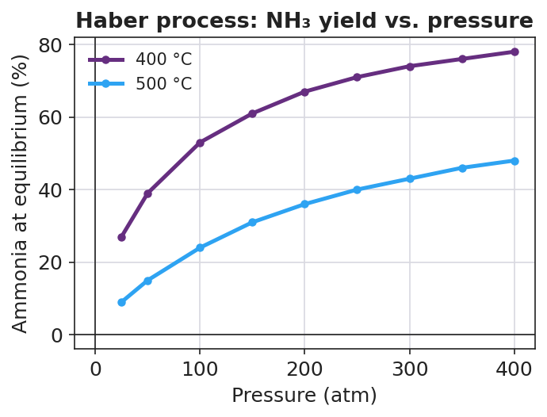

# Le Châtelier's Principle — Student Notes

**Unit: Kinetics & Equilibrium — Lesson 06**
Name: _______________________  Date: __________  Period: ____

---

## Learning Targets

By the end of today's 42 minutes I can:

- State **Le Châtelier's principle** in my own words.
- Predict the direction an equilibrium **shifts** when I change a concentration, a pressure, or a temperature — and justify the prediction.
- Explain why a **catalyst** speeds up the approach to equilibrium but does **not** change the equilibrium position or the yield.
- Refine the conditions of the Haber process to specify changes that increase the equilibrium yield of ammonia.

---

## Key Vocabulary

- **Le Châtelier's principle** — _______________________________________________
  _______________________________________________

- **equilibrium shift** — _______________________________________________
  _______________________________________________

- **stress** — _______________________________________________
  _______________________________________________

---

## Guided Notes

**The big idea — Stability and Change:** A system at equilibrium is __________ — the forward and reverse rates are equal and the amounts stop changing. When a __________ disturbs it, the system __________ in the direction that partially relieves the stress, until it reaches a __________ equilibrium.

**Le Châtelier's principle (write the rule):**

> When a system at equilibrium is disturbed by a stress, the equilibrium shifts in the direction that _______________________________________________.

**The four kinds of stress — and which way the equilibrium shifts:**

| Stress | Direction of shift | Memory hook |
|---|---|---|
| Add a reactant | toward __________ | "use up what you added" |
| Remove a reactant | toward __________ | "replace what you took" |
| Add a product | toward __________ | "use up what you added" |
| Remove a product | toward __________ | "replace what you took" |
| Increase pressure (gas) | toward the side with __________ gas molecules | "relieve the squeeze" |
| Increase temperature | treat __________ as a substance (see below) | "use up the added heat" |
| Add a catalyst | __________ shift | "speed only, not position" |

**Heat is a substance — but which side?**

- If the forward reaction is **endothermic** (ΔH is +): heat is a __________ → adding heat shifts toward __________.
- If the forward reaction is **exothermic** (ΔH is −): heat is a __________ → adding heat shifts toward __________.

**The catalyst rule (write it carefully):** A catalyst lowers the activation energy of the forward *and* reverse reactions by the **same** amount. So it changes how __________ equilibrium is reached, but **not** __________ the equilibrium sits. The yield is unchanged.

**The figure — Haber process yield vs. pressure:**

From the figure, fill in the blanks for **N₂(g) + 3 H₂(g) ⇌ 2 NH₃(g), ΔH = −92 kJ**:

- As pressure increases, the yield goes __________. The product side has __________ gas molecules, so higher pressure shifts the equilibrium toward __________.
- The cooler 400 °C curve is __________ the hotter 500 °C curve, so a lower temperature gives a __________ yield. This is because the forward reaction is __________ (heat is a product), so removing heat shifts toward __________.

---

## Worked Example

**Scenario:** Predict and justify every shift for the FeSCN²⁺ equilibrium.

> **Fe³⁺(aq, pale yellow) + SCN⁻(aq, colorless) ⇌ FeSCN²⁺(aq, deep red)**

**Step 1 — Identify what is on each side.**

Reactants: ___________ and ___________   Product: ___________ (the deep-red color)

**Step 2 — Apply each stress and predict the shift.**

| Stress | Shift direction (← / →) | Predicted color change |
|---|---|---|
| Add more Fe³⁺ |  |  |
| Add more SCN⁻ |  |  |
| Remove Fe³⁺ (add Na₂HPO₄) |  |  |

**Step 3 — State the underlying rule.** In each case the system shifted to __________ the stress: it *used up* what was added (deeper red), or *replaced* what was removed (faded red).

**Step 4 — Because / But / So.**

Adding more Fe³⁺ deepens the red
**because** _______________________________________________,
**but** _______________________________________________,
**so** _______________________________________________.

*Check your reasoning:* "because" should name the stress (added reactant); "but" should note the system can't stay at the old balance once a rate speeds up; "so" should state the shift direction and the color result.

---

## Summary

Complete the rule:

> Le Châtelier's principle — when a system at equilibrium is stressed by a change in __________, __________, or __________ — the equilibrium shifts in the direction that _______________________________________________.

Complete the Because / But / So sentence (the Haber temperature trade-off):

> Lowering the temperature should raise the ammonia yield
> because __________________________________________,
> but __________________________________________,
> so __________________________________________.

**Reminder — the two most common traps:**
1. A **catalyst** changes the *rate*, not the *position* — it never changes the yield.
2. For **temperature**, always check the sign of ΔH first: heat is a reactant for an endothermic forward reaction, but a product for an exothermic one.

**Key reference (from the 2025 NYS Reference Tables):** Table I lists ΔH values; a negative ΔH means the forward reaction is exothermic (heat is released, so heat behaves like a product).
