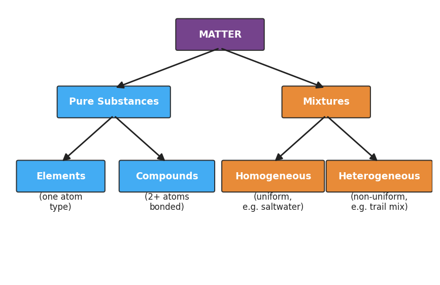

# Cumulative Review — One Story of Matter and Energy — Student Worksheet

**Unit: Regents Review — Lesson 01**
Name: _______________________  Date: __________  Period: ____

---

## Phenomenon

Eleven unit titles are on the board. They look like eleven separate topics to cram. But watch one sugar cube travel the whole course: it can be **classified** (a compound, C₆H₁₂O₆), drawn as **bonded atoms**, given a **gram formula mass** (180 g/mol), **dissolved** into a solution, and **combusted** in a reaction where every atom is conserved and energy is released. One sugar cube touches half the course. The eleven units are not a list — they are one connected story of **matter and energy**.

**Driving question:** How do all the units of chemistry connect into one understanding of matter and energy?

---

## Notice & Wonder

| I notice… | I wonder… |
|---|---|
|  |  |
|  |  |
|  |  |

**Turn & Talk #1:** On the Regents, the same *types* of questions come back every year — a mole problem, a "use this reference table" problem, a balancing problem. In one sentence: if you could recognize the *type* of a question in the first five seconds, what would that do for your speed?

> _______________________________________________
> _______________________________________________

---

## Initial Model

Before we name any test-taking strategy, sketch a quick concept map. Put **MATTER** in the middle. Draw at least four units of this course branching off it. On each branch, write one thing you learned in that unit. Speed over neatness — you have three minutes.

*(Draw your concept map in the space below.)*

> 
> 
> 
> 

---

## Investigation

Rotate through the five stations with your group. **You have 4 minutes per station.** At each station, *first say out loud what TYPE of question it is*, then solve it. Open the answer envelope and self-score **before** you rotate.

### Station 1 — Moles & Gram Formula Mass

(a) Gram formula mass of **CO₂**:

| Element | Atomic mass (g/mol) | Subscript | Mass contribution |
|---|---|---|---|
| C |  | 1 |  |
| O |  | 2 |  |
| **GFM** | | | **___ g/mol** |

(b) How many moles are in **88 g of CO₂**? (Use Table T: moles = mass ÷ GFM.)

> moles = ________ ÷ ________ = ________ mol

### Station 2 — Reference-Table Retrieval

(a) Density of aluminum (Table S): ________ g/cm³

(b) Is silver chloride (AgCl) soluble or insoluble in water (Table F)? ________

(c) Which table gives you the formula for number of moles? ________

### Station 3 — Balancing & Conservation of Mass

Balance the equation, then confirm mass is conserved.

> ___ H₂ + ___ O₂ → ___ H₂O

Atoms of H on each side: ____   Atoms of O on each side: ____
Is mass conserved? ________  Why? _______________________________________________

### Station 4 — Bonding & Classification

(a) Classify each using the concept map (element / compound / homogeneous mixture / heterogeneous mixture):

| Substance | Classification |
|---|---|
| O₂ |  |
| NaCl |  |
| air |  |
| sand stirred into water |  |

(b) Is NaCl ionic or covalent? ________  Why? _______________________________________________

### Station 5 — Mixed Regents Multiple Choice

Circle the best answer. (Answers are in the station envelope.)

1. The gram formula mass of CaCO₃ is closest to:
   - (1) 56 g/mol
   - (2) 68 g/mol
   - (3) 100 g/mol
   - (4) 116 g/mol

2. Which of the following is a chemical change?
   - (1) melting ice
   - (2) dissolving salt in water
   - (3) burning propane
   - (4) boiling water

---

## Make It Make Sense

For each item, name the **question type**, solve it, and (where asked) name the reference table you would use. **These are the same problems you practiced at the stations — confirm your work here.**

**1. Gram formula mass of CO₂, and moles in 88 g.**

- Question type: _______________________________________________
- GFM of CO₂ = ________ g/mol
- Moles in 88 g = ________ ÷ ________ = ________ mol

**2. Reference-table retrieval: density of aluminum; solubility of AgCl.**

- Question type: _______________________________________________
- Density of Al = ________ g/cm³ (Table ___)
- AgCl is ________ in water (Table ___)

**3. Balancing: H₂ + O₂ → H₂O.**

- Question type: _______________________________________________
- Balanced: ___ H₂ + ___ O₂ → ___ H₂O
- Mass is conserved because _______________________________________________

---

## Vocabulary in Action

Use each term in a sentence about today's stations or the Regents. Do not copy the definition — describe something you actually did or noticed.

- **reference table:** _______________________________________________
  _______________________________________________

- **distractor:** _______________________________________________
  _______________________________________________

- **constructed response:** _______________________________________________
  _______________________________________________

---

## Revise Your Model

Return to your Initial Model concept map.

(a) Add any unit you left off.

(b) Draw **at least one connection line between two units** and label what the two share (a tool, an idea, or a thread like "matter" or "energy").

(c) Finish this Because / But / So sentence:

> A student who studies all eleven units as eleven separate lists to memorize finds the Regents harder
> because __________________________________________,
> but __________________________________________,
> so __________________________________________.

---

## Exit Ticket

*(a) Calculate the number of moles in 36 g of water (H₂O). Show the gram formula mass and the Table T setup (moles = mass ÷ GFM).*

| Element | Atomic mass (g/mol) | Subscript | Mass contribution |
|---|---|---|---|
| H |  |  |  |
| O |  |  |  |
| **GFM** | | | **___ g/mol** |

> moles = ________ ÷ ________ = ________ mol

*(b) Using the reference tables: is sodium nitrate (NaNO₃) soluble in water (Table F)? Which table did you use?*

> NaNO₃ is ________ in water.  Table used: ________

*(c) In one sentence, use the word "pattern" to connect any two units of this course into one idea about matter or energy.*

> _______________________________________________
> _______________________________________________
